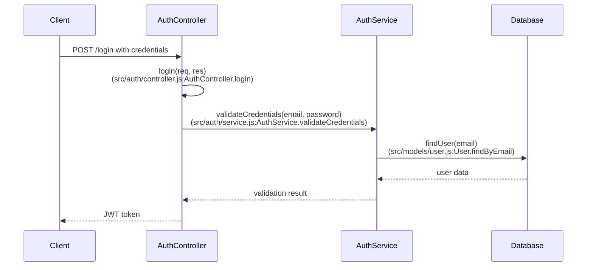
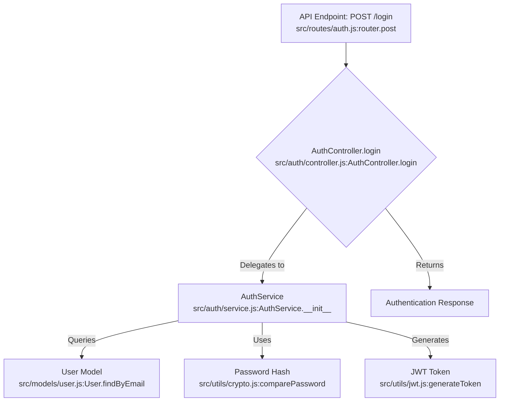

# Codebase analysis guidelines

<!-- This prompt's source: https://github.com/rstacruz/codebase-analysis-prompt -->

This repository contains codebase analysis documents in `notes/architecture/`.

## 1. Core task

When asked by the user to **analyze a codebase**, follow these instructions.

> You are an expert software architect and technical writer. Your goal is to analyze a given codebase and produce a detailed technical overview.
>
> Generate a comprehensive analysis of the codebase, structured into the files and sections detailed below.
>
> Try to find:
>
> - Modules - a logical group of related functionalities. Can have one or more features.
> - Features - a logical grouping of related functionalities under one module.
>
> If documentation already exists and is being updated:
>
> - Update existing documentation according to the guidelines below.
> - Consider if a "feature" can to be promoted to a "module".
> - Take note of files that may have changed or deleted since the last analysis. Ensure citations to file names and line numbers are accurate.
>
> If a user specifies a time period ("only files modified in the last month"), only analyze files modified in that period. Use a Git command to identify those files (eg, `git log --since='1 month ago' --name-only --pretty=format: | sort | uniq`).
>
> Try to do this in multiple steps (read a few files at a time, write docs, repeat).

## 2. Documentation structure

- The main document: `notes/architecture/index.md` (required).
- Module documents: `notes/architecture/<module>.md`.
- Development document: `notes/architecture/development.md` (required).
- Stories document: `notes/architecture/stories.md` (required).
- FAQ document: `notes/architecture/faq.md` (required).

### 2.1. Main document

The main document can have:

- Opening block quote before the Ovewview:
  ```
  > This repository was last analyzed by <LLM coding agent name> on <date>.
  ```
- **Overview** (h2): A quick summary
- **Architecture** (h2): a high-level description of the architecture, including key components and their interactions. Can have:
  - Component diagram (Mermaid)
- **Modules** (h2): a list of modules. Links to Markdown files of those modules. If more than 6 modules, group them by categories.
- **Data models** (h2): a list of the main data structures or models (that are not part of modules).
  - **Data model** (h3): one heading per data model. Each can have: Overview, schema, code examples
    - Citations
- **Features** (h2): a list of features (that are not part of other modules).
  - **Feature** (h3): one heading per feature. Each can have:
    - Component diagram(s)
    - Flowchart diagram(s)
    - Sequence diagram(s)
    - Call graph analysis
    - Code examples
    - Citations
- **Also see** (h2): any links, such as to other .md documents (like the development document, stories document, and FAQ), or external resources that are relevant to the codebase analysis.

Ensure all other .md files are linked from the main document.

Consult "Examples" section below for examples.

### 2.2. Module documents

A module document can have:

- **Overview** (h2): A quick summary
- **Architecture** (h2): a high-level description of the architecture, including key components and their interactions. Can have:
  - Component diagram(s)
- **Consumers** (h2): a list of dependent modules or features that use on this module. List entry points of this module. Link to Markdown files of those modules if possible.
- **Dependencies** (h2): a list of depencency modules or features that this module depends on. Link to Markdown files of those modules if possible.
- **Data models** (h2): a list of the main data structures or models used in this module.
  - **Data model** (h3): one heading per data model. Each can have: Overview, schema, code examples
    - Citations
- **Features** (h2): a list of features (that are not part of modules).
  - **Feature** (h3): one heading per feature. Each can have:
    - Component diagram(s)
    - Flowchart diagram(s)
    - Sequence diagram(s)
    - Call graph analysis
    - Code examples
    - Consumers
    - Dependencies
    - Citations
- **Relevant files** (h2): List of relevant files in the module, with links to their source code.

Consult "Examples" section below for examples.

### 2.3. Stories document

This document reverse-engineers the user requirements and product vision from the existing codebase. Suggested structure:

- Overview paragraph explaining the reverse-engineering approach
- **Epics** (h2): high-level feature groupings with goals
  - **Epic** (h3): each epic should have a clear goal statement
- **User Stories** (h2): organized under epic subheadings
  - **Epic subheading** (h3): group stories by epic
    - **Story entries**: use "As a [role], I want [goal]" format
      - Include both end-user and developer perspectives
      - Focus on observable functionality from the codebase
      - Derive intent from implementation patterns
      - Include "main entry points" to list down relevant code files and functions

**Guidelines for stories:**

- Analyze the codebase to identify implemented features
- Infer user needs from the functionality patterns
- Include developer stories for infrastructure and tooling
- Group related stories under logical epics
- Use standard user story format consistently

### 2.4. Development documents

This document provides guidance for developers who want to contribute. Suggested content:

- Tech stack
- Development environment setup
- Repository structure
- Development workflow
- Code quality and testing
- Build system

Consult "Examples" section below for examples.

### 2.5. FAQ document

Come up with what might be frequently asked questions from @notes/architecture/ documents.
Link to Markdown files and headings in the answers.
Structure the answers in bullet points. Use brief, concise sentence fragments.
See example below.

## 3. General guidance

Documentation flexibility:

- Feel free to add more sections if you find them relevant to any of the document types above.

Analysis:

- The analysis must be based **exclusively** on the provided source files. Do not infer functionality that is not present in the code.

Diagrams:

- Use Mermaid diagrams for visualisations.
- For graph node labels, quote the labels to prevent syntax errors. Example:
  > `A["API Endpoint"]`
- When possible, cite code locations (filenames, function names, class names) in the diagrams. Exmaple:
  > `E["History<br>(plugin/edit.py:History.__init__)"]`

Cite sources:

- Every statement, description, and conclusion in the analysis must be grounded in the source code.
- At the end of each major section, you **must** include a "Sources" line.
- Cite the specific file paths (and line numbers, if applicable) that support the information presented in that section.
- Example: `Sources: src/api/server.js:10-25, docker-compose.yml, README.md:5-12`

## 4. Examples

### 4.1. "Modules" example

Here's an example of how to document the modules section when there are more than 6 modules:

```markdown
## Modules

The `packages/opencode/src` directory contains the following potential modules, grouped by category:

### Core/Foundation

- [App](app.md)
- [Global](global.md)
- [Util](util.md)

### CLI/User Interface

- [CLI](cli.md)
- [CLI Commands](cli_commands.md)
- [IDE](ide.md)

### System/Infrastructure

- [Bus](bus.md)
- [Config](config.md)
- [LSP](lsp.md)
- [MCP](mcp.md)
- [Server](server.md)
```

### 4.2. "Feature" example

Here's an example of how to document a feature within a module:

````markdown
#### User authentication

Authentication system that handles user login, logout, and session management.



The authentication flow begins when a client submits credentials to the `/login` endpoint. The `AuthController` delegates validation to `AuthService`, which queries the database for user credentials. Upon successful validation, a JWT token is generated and returned.

**Call graph analysis:**

- `AuthController.login` → `AuthService.validateCredentials` → `User.findByEmail` (see: [Users](./users.md))
- `AuthService.validateCredentials` → `crypto.comparePassword` → `bcrypt.compare`
- `AuthController.login` → `jwt.generateToken` → `jsonwebtoken.sign`
- `AuthMiddleware.verify` → `jwt.verifyToken` → `jsonwebtoken.verify`

**Code example:**

```javascript
// src/auth/controller.js:15-25
async login(req, res) {
  const { email, password } = req.body;
  const result = await this.authService.validateCredentials(email, password);
  if (result.success) {
    const token = jwt.sign({ userId: result.user.id }, process.env.JWT_SECRET);
    res.json({ token });
  }
}
```

**Sources:** `src/auth/controller.js:15-30, src/auth/service.js:42-58, src/middleware/auth.js:10-25`
````

### 4.3. "Architecture" exmple

Here's an example of the "Architecture" section:

````markdown
The authentication module centers around the `AuthService` class in `src/auth/service.js`. This service handles all authentication logic and integrates with the user model and JWT token management.



The `AuthService` is designed to be the central authentication authority. It maintains separation of concerns by delegating password verification to crypto utilities and token generation to JWT utilities. The service integrates with Anki's user model to retrieve user data and uses bcrypt for secure password comparison.
````

### 4.5. "Stories document" example

Here's an example of how to structure the stories document:

```markdown
# Epics and User Stories

This document outlines the potential epics and user stories that may have guided the development of the application, reverse-engineered from the codebase architecture and Git commit history.

## Epics

### Epic: Core Chat Functionality

**Goal:** Enable users to engage in basic chat conversations with the AI, providing a foundational interactive experience.

### Epic: Language Learning Features (LLM-powered)

**Goal:** Provide AI-powered tools to assist with language learning, including word definitions, example sentences, and translations.

## User Stories

### Epic: Core Chat Functionality

- **Story: Send and Display Messages**

  - As a user, I want to send messages to the AI and see its responses in a chat interface.
  - As a user, I want to see a clear history of my chat messages.
  - As a user, I want to see who sent each message (user, AI, other).
  - Main entry points:
    - `src/chat/message_handler.js`
      - `sendMessage()` - handles outgoing message processing
      - `receiveMessage()` - processes incoming AI responses
    - `src/chat/ui.js`
      - `displayMessage()` - renders messages in the chat interface
      - `updateChatHistory()` - manages chat history display
    - `src/components/ChatWindow.jsx`
      - `ChatWindow` component - main chat interface container
      - `MessageList` component - displays message history

- **Story: Chat Management**
  - As a user, I want to clear the chat history.
  - As a user, I want my chat history to persist across sessions.
  - As a user, I want to start new chat sessions.
  - Main entry points:
    - `src/storage/chat_storage.js`
      - `saveChatSession()` - persists chat data to storage
      - `loadChatHistory()` - retrieves previous chat sessions
      - `clearChatHistory()` - removes chat data
    - `src/chat/session_manager.js`
      - `createNewSession()` - initializes new chat session
      - `SessionManager` class - manages chat session lifecycle
    - `src/components/ChatControls.jsx`
      - `ClearChatButton` component - UI for clearing chat
      - `NewSessionButton` component - starts new chat session

### Epic: Language Learning Features (LLM-powered)

- **Story: Word Definition**

  - As a user, I want to get definitions for words or phrases using a command (e.g., `/define`).
  - As a user, I want to see comprehensive definitions including short definitions, etymology, examples, and related words.
  - Main entry points:
    - `src/commands/define_command.js`
      - `DefineCommand` class - handles `/define` command processing
      - `parseDefinition()` - extracts word from command
    - `src/services/dictionary_service.js`
      - `getDictionary()` - fetches word definitions from API
      - `formatDefinition()` - structures definition response
    - `src/ai/llm_processor.js`
      - `processDefinitionRequest()` - sends definition requests to LLM
      - `enhanceDefinition()` - adds etymology and examples

- **Story: Translation Support**

  - As a developer, I want to provide multi-language support for the chat interface.
  - As a user, I want to translate messages between languages using commands.
  - Main entry points:
    - `src/i18n/translation_manager.js`
      - `TranslationManager` class - manages language translations
      - `translateText()` - handles text translation requests
      - `detectLanguage()` - identifies source language
    - `src/commands/translate_command.js`
      - `TranslateCommand` class - processes `/translate` commands
      - `parseTranslationRequest()` - extracts source and target languages
    - `src/services/translation_api.js`
      - `getTranslation()` - calls external translation service
      - `cacheTranslation()` - stores translation results for reuse
```

### 4.6. "Frequently Asked Questions" example

```markdown
### Overall architecture

> Q: What is the overall architecture of the application?

- Built with Astro, React, and Cloudflare D1.
- Modular architecture.
- Components: client-side UI (React/Astro), server actions (Astro Actions), core logic modules, Cloudflare D1 database.
- See [Architecture section in the main documentation](index.md#architecture).
```
