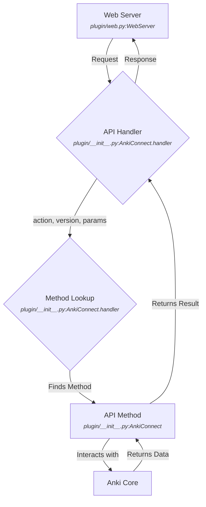
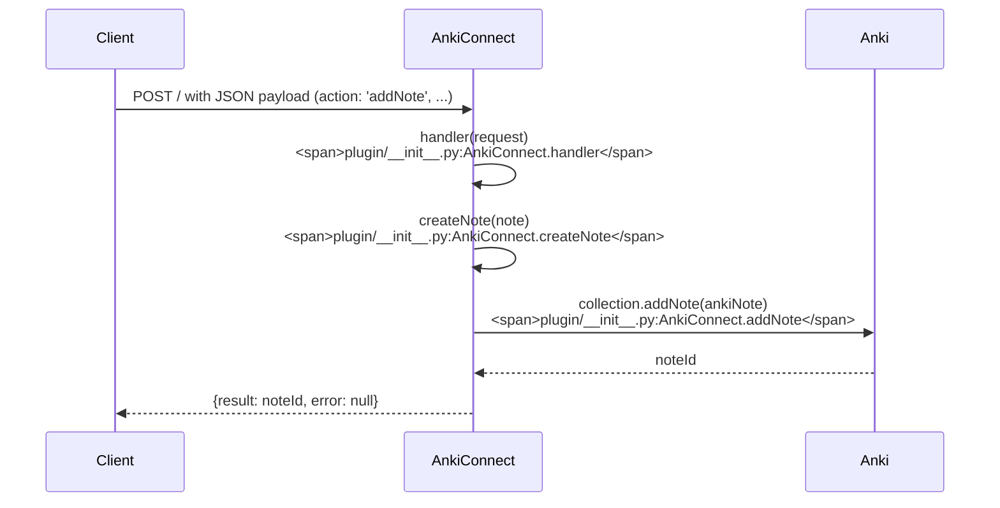

# API Module

## Overview

The API module is the central part of AnkiConnect, responsible for handling the logic of all the available API actions. It receives requests from the web server, interacts with the Anki collection and database, and returns the results.

## Architecture

The `AnkiConnect` class in `plugin/__init__.py` is the main entry point for all API calls. It uses a decorator-based system to identify API methods and their supported versions.

When a request is received, the `handler` method in the `AnkiConnect` class dynamically finds the appropriate method to call based on the `action` and `version` parameters in the request. The `util.api` decorator is used to mark methods as being part of the public API.

## Consumers

- **Web Server Module**: The web server is the primary consumer of this module. It forwards incoming HTTP requests to the `AnkiConnect.handler` method.

## Dependencies

- **Anki Core**: This module heavily depends on the Anki toolkit API (`aqt` and `anki`) to interact with the user's collection.
- **GUI Module**: The API module uses the GUI module to open custom dialogs like the enhanced note editor.

## Features

### Deck Management

This feature allows for the management of decks, including creation, deletion, and retrieval of deck names and IDs.

**Citations:** `plugin/__init__.py:AnkiConnect.deckNames`, `plugin/__init__.py:AnkiConnect.deckNamesAndIds`, `plugin/__init__.py:AnkiConnect.createDeck`, `plugin/__init__.py:AnkiConnect.deleteDecks`

### Note Management

This feature enables the creation, modification, and deletion of notes. It also supports managing tags and fields associated with notes.

**Citations:** `plugin/__init__.py:AnkiConnect.addNote`, `plugin/__init__.py:AnkiConnect.updateNoteFields`, `plugin/__init__.py:AnkiConnect.updateNoteTags`, `plugin/__init__.py:AnkiConnect.deleteNotes`

### Card Management

This feature provides functionality to find, suspend, and modify cards. It also allows for answering cards and setting their due dates.

**Citations:** `plugin/__init__.py:AnkiConnect.findCards`, `plugin/__init__.py:AnkiConnect.suspend`, `plugin/__init__.py:AnkiConnect.unsuspend`, `plugin/__init__.py:AnkiConnect.setDueDate`

### Model Management

This feature allows for the creation, modification, and querying of note models (types).

**Citations:** `plugin/__init__.py:AnkiConnect.modelNames`, `plugin/__init__.py:AnkiConnect.modelNamesAndIds`, `plugin/__init__.py:AnkiConnect.createModel`, `plugin/__init__.py:AnkiConnect.updateModelTemplates`

### Media Management

This feature handles the storage and retrieval of media files associated with notes.

**Citations:** `plugin/__init__.py:AnkiConnect.storeMediaFile`, `plugin/__init__.py:AnkiConnect.retrieveMediaFile`, `plugin/__init__.py:AnkiConnect.deleteMediaFile`

### GUI Interaction

This feature allows for the programmatic opening and controlling of Anki's GUI windows, such as the browser and editor.

**Citations:** `plugin/__init__.py:AnkiConnect.guiBrowse`, `plugin/__init__.py:AnkiConnect.guiEditNote`

### Example: Adding a Note

One of the most common use cases is adding a new note to Anki. The `addNote` action handles this.

The `createNote` method first validates the input and creates an `anki.notes.Note` object. It then calls `collection.addNote` to add the note to the collection and returns the new note's ID.

Sources: `plugin/__init__.py`, `plugin/util.py`
