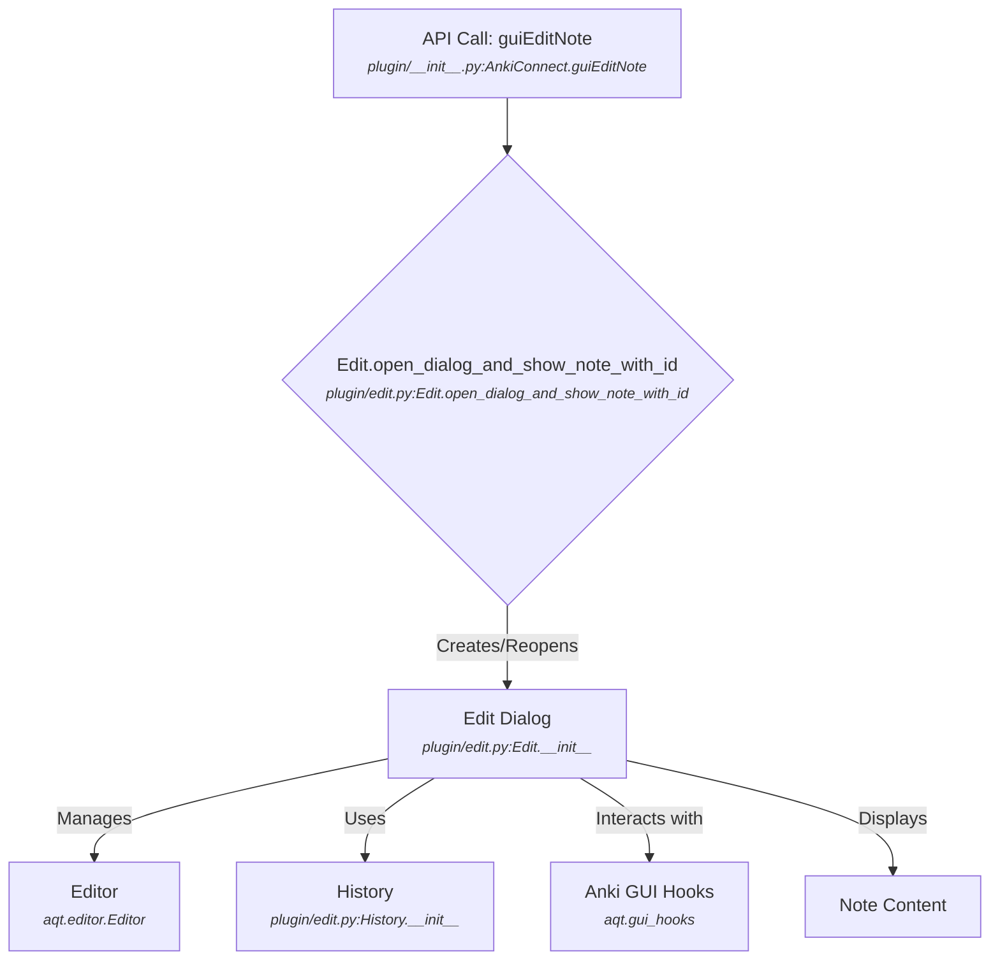
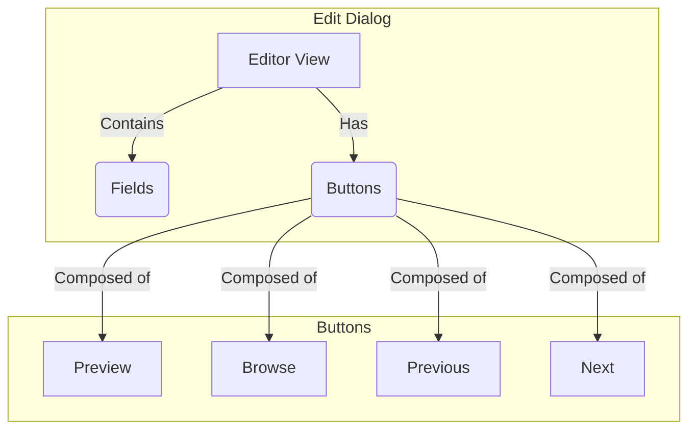
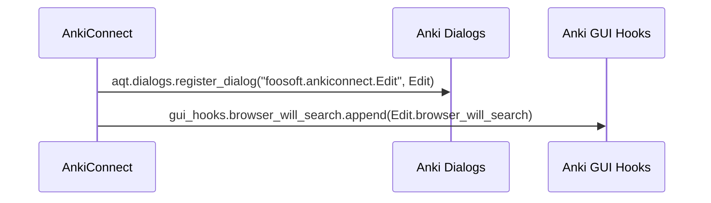
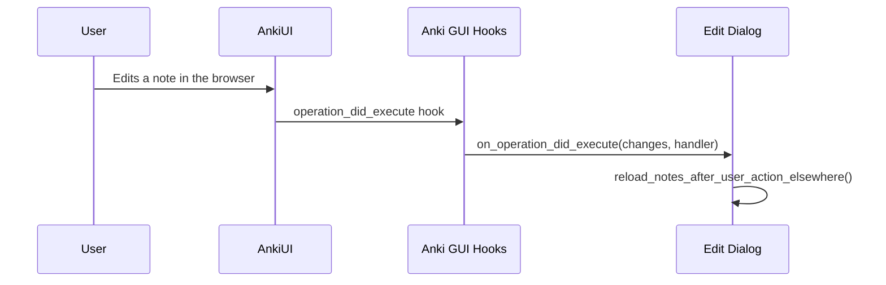
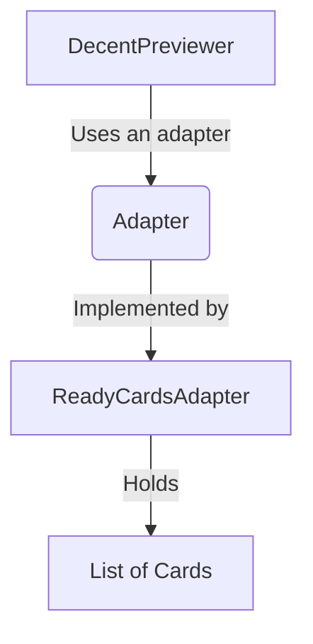

# GUI Module

## Overview

The GUI module of AnkiConnect provides custom user interface components that enhance the user's interaction with Anki, especially when initiated from external applications. The primary component is a feature-rich note editor dialog.

## Architecture

The main part of the GUI module is the `Edit` class, located in `plugin/edit.py`. This class extends Anki's built-in `EditCurrent` dialog to provide additional functionality.



The `Edit` dialog is designed to be a more powerful replacement for the standard note editor. It maintains its own navigation history using the `History` class, allowing users to easily move between recently edited notes. It also integrates with Anki's GUI hooks to add custom buttons and to react to changes made elsewhere in the Anki application.

## Consumers

-   **API Module**: The `guiEditNote` action in the API module is the entry point for opening the enhanced note editor.

## Dependencies

-   **Anki GUI Toolkit**: This module is heavily dependent on Anki's native GUI components, primarily from the `aqt` package, including `aqt.editor`, `aqt.browser.previewer`, and `aqt.gui_hooks`.
-   **API Module**: It uses functions from the API module, such as `get_note_by_note_id`, to fetch note data.

## Features

### Enhanced Note Editor

The custom `Edit` dialog provides a feature-rich environment for editing notes, including:

-   **Preview Button**: Renders and displays the cards for the current note.
-   **Navigation History**: Allows the user to navigate between recently edited notes.
-   **Browse Button**: Opens the Anki browser with the history of edited notes.

**Component Diagram:**


**Call Graph Analysis:**

-   `Edit.show_preview` -> `DecentPreviewer` -> `ReadyCardsAdapter`
-   `Edit.show_browser` -> `aqt.dialogs.open("Browser", ...)`
-   `Edit.show_previous` -> `History.get_note_to_left_of` -> `Edit.show_note`
-   `Edit.show_next` -> `History.get_note_to_right_of` -> `Edit.show_note`

**Citations:** `plugin/edit.py:Edit`

### Seamless Integration with Anki

The `Edit` dialog is tightly integrated with Anki's native environment, allowing for a smooth user experience.

**Sequence Diagram: Registering the Dialog**


**Sequence Diagram: Reacting to External Changes**


**Citations:** `plugin/edit.py:Edit.register_with_anki`, `plugin/edit.py:Edit.on_operation_did_execute`

### Custom Card Previewer

A specialized card previewer is used to display the cards of a note within the `Edit` dialog.

**Component Diagram:**


**Call Graph Analysis:**

-   `DecentPreviewer._on_prev_card` -> `Adapter.select_previous_card` -> `DecentPreviewer.render_card`
-   `DecentPreviewer._on_next_card` -> `Adapter.select_next_card` -> `DecentPreviewer.render_card`

**Citations:** `plugin/edit.py:DecentPreviewer`, `plugin/edit.py:ReadyCardsAdapter`

### Example: Editing a Note

When an external application calls the `guiEditNote` action, AnkiConnect opens the custom `Edit` dialog for the specified note.

```mermaid
sequenceDiagram
    participant C as Client
    participant A as AnkiConnect
    participant E as Edit Dialog
    participant Anki

    C->>A: POST / with JSON payload (action: 'guiEditNote', ...)
    A->>E: Edit.open_dialog_and_show_note_with_id(note_id)<br><span style="font-size:0.8em; font-style:italic">plugin/edit.py:Edit.open_dialog_and_show_note_with_id</span>
    E->>Anki: get_note_by_note_id(note_id)<br><span style="font-size:0.8em; font-style:italic">plugin/edit.py:get_note_by_note_id</span>
    Anki-->>E: Note Object
    E->>E: history.append(note)<br><span style="font-size:0.8em; font-style:italic">plugin/edit.py:History.append</span>
    E->>E: show_note(note)<br><span style="font-size:0.8em; font-style:italic">plugin/edit.py:Edit.show_note</span>
    E-->>C: (Dialog is shown)
```

The `open_dialog_and_show_note_with_id` class method retrieves the note and then opens the `Edit` dialog. The dialog adds the note to its history and displays it in the editor. The user can then use the enhanced features of the dialog to edit the note, preview its cards, or navigate to other notes.

Sources: `plugin/edit.py`
