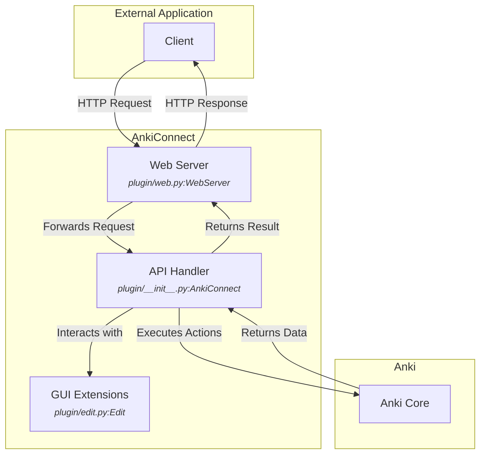

# AnkiConnect Architecture

> This repository was last analyzed by Gemini (using Gemini 2.5 Flash) on miércoles, 23 de julio de 2025.

## Overview

AnkiConnect is an Anki plugin that exposes a local web server, allowing external applications to programmatically interact with Anki. It provides a JSON-RPC style API over HTTP to perform various actions such as creating, modifying, and querying notes, cards, decks, and models.

## Architecture

The architecture of AnkiConnect can be broken down into three main components: the Web Server, the API Handler, and the GUI extensions.

- **Web Server**: Listens for incoming HTTP requests, parses them, and passes them to the API Handler. It also handles CORS and security checks.
- **API Handler**: This is the core of the plugin. It receives requests from the Web Server, validates them, and executes the corresponding actions by interacting with the Anki toolkit API.
- **GUI Extensions**: Provides custom user interface components, such as a feature-rich note editor, to enhance the user experience.

## Modules

- [API](./api.md): The core module that implements the API endpoints.
- [Web Server](./web-server.md): The module responsible for handling HTTP communication.
- [GUI](./gui.md): The module that provides custom GUI components.
- [Utility](./util.md): Provides various helper functions and utilities.

## Also See

- [Development Guide](./development.md): Information for developers on setting up the environment, contributing, and testing.
- [Epics and User Stories](./stories.md): Reverse-engineered user requirements and product vision.

Sources: `plugin/__init__.py`, `plugin/web.py`, `plugin/edit.py`, `plugin/util.py`
