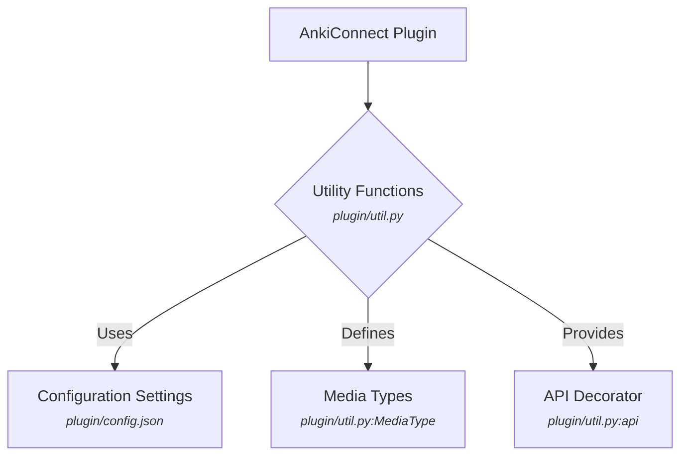

# Utility Module

## Overview

The Utility module (`plugin/util.py`) provides various helper functions and utilities used across the AnkiConnect plugin. These functions include API decorators, media type definitions, configuration settings retrieval, and data downloading.

## Architecture

The `util.py` file contains a collection of standalone functions and a `MediaType` enum.

## Consumers

-   **API Module**: Heavily uses `util.api` decorator for API method registration, `util.setting` for configuration, and `util.MediaType` for media handling.
-   **Web Server Module**: Uses `util.setting` for web server configuration.

## Dependencies

-   **Configuration File**: Relies on `plugin/config.json` for various settings.

## Features

### API Decorator

The `api` decorator is used to mark methods in the `AnkiConnect` class as callable API actions. It also handles versioning of API methods.

**Citations:** `plugin/util.py:api`

### Configuration Settings

Provides a centralized way to access configuration settings from `plugin/config.json`.

**Citations:** `plugin/util.py:setting`

### Media Type Definitions

Defines an enum `MediaType` for different types of media (Audio, Video, Picture).

**Citations:** `plugin/util.py:MediaType`

### Data Downloading

Includes a utility function to download data from a given URL.

**Citations:** `plugin/util.py:download`

Sources: `plugin/util.py`, `plugin/config.json`
