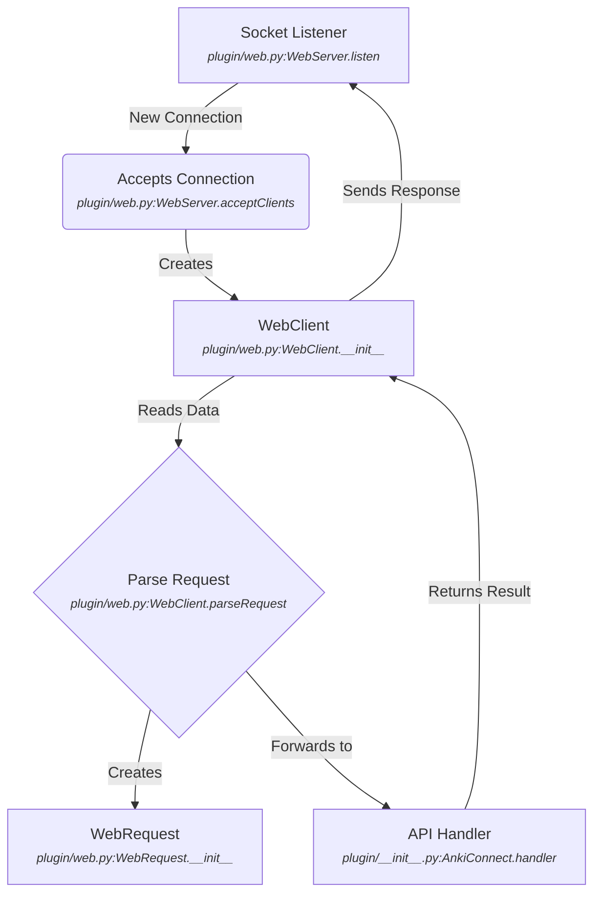
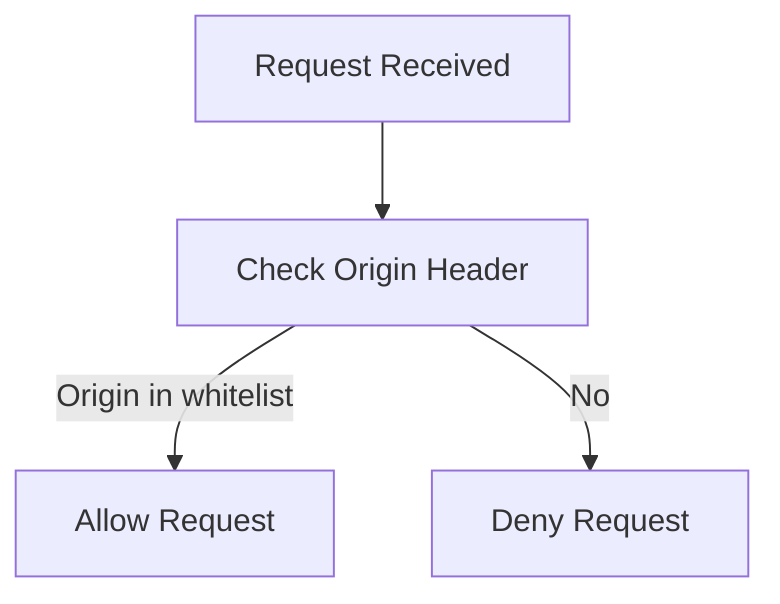

# Web Server Module

## Overview

The Web Server module is responsible for handling all HTTP communication for AnkiConnect. It listens for incoming requests, parses them, and passes them on to the API handler. It also manages Cross-Origin Resource Sharing (CORS) to allow web applications to securely access the API.

## Architecture

The web server is implemented in the `plugin/web.py` file and consists of three main classes:

- `WebServer`: The main server class that listens for new connections and manages client sockets.
- `WebClient`: Represents a single client connection. It reads incoming data, parses HTTP requests, and sends back responses.
- `WebRequest`: A simple data class that represents a parsed HTTP request.

The `WebServer` uses a non-blocking socket to listen for new connections. When a new client connects, a `WebClient` object is created to handle the communication with that client. The `WebClient` reads the incoming data, parses the HTTP request, and then calls the API handler with the request details. The response from the handler is then sent back to the client.

## Consumers

- **AnkiConnect Plugin**: The main plugin entry point in `plugin/__init__.py` creates and starts the `WebServer`.

## Dependencies

- **API Module**: The web server forwards parsed requests to the `AnkiConnect.handler` method in the API module.

## Features

### HTTP Server

A simple, single-threaded HTTP server that can handle multiple clients concurrently using non-blocking sockets.

**Citations:** `plugin/web.py:WebServer`

### CORS Support

Implements CORS to allow web pages from different origins to interact with the API. The list of allowed origins is configurable.

**Flowchart:**

**Citations:** `plugin/web.py:WebServer.handlerWrapper`, `plugin/config.json:webCorsOriginList`

### Request Parsing

Parses HTTP requests, including headers and body, to extract the action, version, and parameters for the API handler.

**Citations:** `plugin/web.py:WebClient.parseRequest`

### JSON-RPC Formatting

Formats the responses from the API handler into JSON-RPC compliant success or error objects.

**Citations:** `plugin/web.py:format_success_reply`, `plugin/web.py:format_exception_reply`

### CORS Handling

CORS is handled in the `handlerWrapper` method of the `WebServer` class. It checks the `Origin` header of the incoming request against a configurable list of allowed origins. If the origin is allowed, it adds the necessary `Access-Control-Allow-Origin` header to the response. It also handles pre-flight `OPTIONS` requests.

Sources: `plugin/web.py`, `plugin/config.json`
