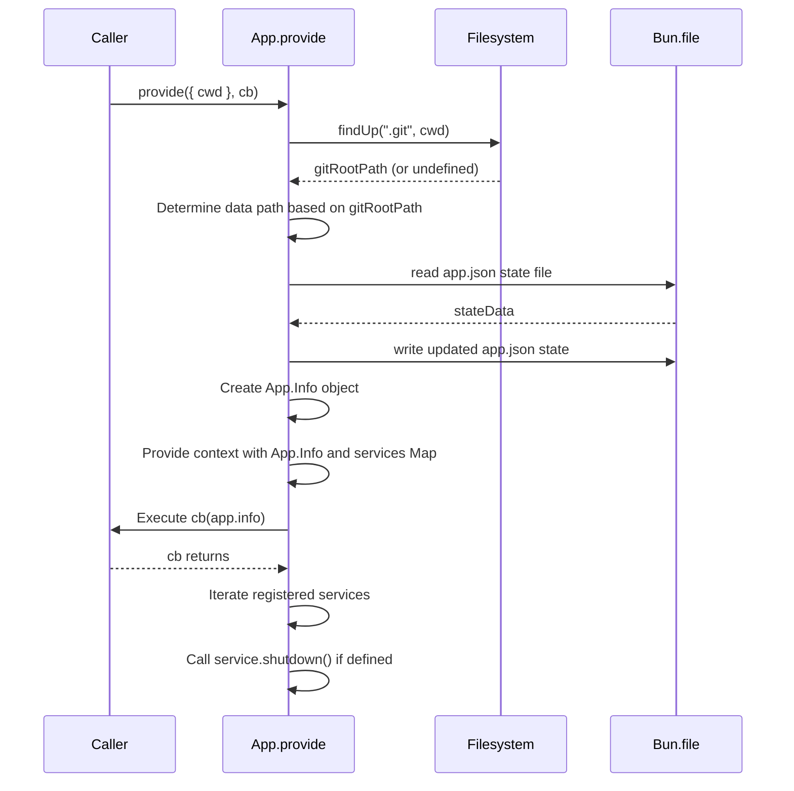

# App Module

## Overview

The `App` module (`packages/opencode/src/app/app.ts`) is responsible for managing application-wide context, configuration, and the lifecycle of various services. It provides essential information about the application's environment, such as the current working directory, Git repository status, and paths for configuration and data storage. It also facilitates the registration and graceful shutdown of application services.

## Architecture

The `App` module leverages a `Context` object to provide application-wide information and service management. It initializes an `App.Info` object containing details about the hostname, Git status, and various file paths. Services can register their state and an optional shutdown function with the `App` module, ensuring proper cleanup when the application exits.

```mermaid
graph TD
    A["App.provide(input, cb)"] --> B{"Filesystem.findUp(".git")"}
    B --> C{"Determine root path"}
    C --> D{"Load/Save app.json state"}
    D --> E["App.Info Object"]
    E --> F["Context.provide(app, cb)"]
    F --> G{"Service Registration (App.state)"}
    G --> H["Service State & Shutdown"]
    F --> I{"Execute Callback (cb)"}
    I --> J{"Shutdown Registered Services"}
```

## Data Models

### App.Info

Represents the core information about the application's current state and environment.

**Schema:**

```typescript
export const Info = z
  .object({
    hostname: z.string(),
    git: z.boolean(),
    path: z.object({
      config: z.string(),
      data: z.string(),
      root: z.string(),
      cwd: z.string(),
      state: z.string(),
    }),
    time: z.object({
      initialized: z.number().optional(),
    }),
  })
  .openapi({
    ref: "App",
  })
export type Info = z.infer<typeof Info>
```

**Overview:**

- `hostname`: The hostname of the machine running the application.
- `git`: A boolean indicating whether the current project is a Git repository.
- `path`: An object containing various absolute paths:
    - `config`: Path to the application's configuration directory.
    - `data`: Path to the application's data directory (specific to the project or global).
    - `root`: The root directory of the project (either the Git repository root or the current working directory).
    - `cwd`: The current working directory where the application was launched.
    - `state`: Path to the application's state directory.
- `time`: An object containing timestamps:
    - `initialized`: Optional timestamp indicating when the application was last initialized.

**Sources:** `packages/opencode/src/app/app.ts:13-31`

## Features

### Application Context Provisioning (`App.provide`)

This feature initializes the application's context, determines the project root, sets up data and state paths, and manages the lifecycle of registered services. It ensures that all services have access to a consistent application environment.



**Call graph analysis:**

- `App.provide` → `Filesystem.findUp`
- `App.provide` → `Bun.file().json()`
- `App.provide` → `Bun.write()`
- `App.provide` → `Context.provide`

**Code example:**

```typescript
// packages/opencode/src/app/app.ts:40-79
export async function provide<T>(input: Input, cb: (app: App.Info) => Promise<T>) {
  log.info("creating", {
    cwd: input.cwd,
  })
  const git = await Filesystem.findUp(".git", input.cwd).then(([x]) => (x ? path.dirname(x) : undefined))
  log.info("git", { git })

  const data = path.join(Global.Path.data, "project", git ? directory(git) : "global")
  const stateFile = Bun.file(path.join(data, APP_JSON))
  const state = (await stateFile.json().catch(() => ({}))) as {
    initialized: number
  }
  await stateFile.write(JSON.stringify(state))

  const services = new Map<
    any,
    {
      state: any
      shutdown?: (input: any) => Promise<void>
    }
  >()

  const root = git ?? input.cwd

  const info: Info = {
    hostname: os.hostname(),
    time: {
      initialized: state.initialized,
    },
    git: git !== undefined,
    path: {
      config: Global.Path.config,
      state: Global.Path.state,
      data,
      root,
      cwd: input.cwd,
    },
  }
  const app = {
    services,
    info,
  }

  return ctx.provide(app, async () => {
    try {
      const result = await cb(app.info)
      return result
    } finally {
      for (const [key, entry] of app.services.entries()) {
        if (!entry.shutdown) continue
        log.info("shutdown", { name: key })
        await entry.shutdown?.(await entry.state)
      }
    }
  })
}
```

**Sources:** `packages/opencode/src/app/app.ts:40-79`

### Service State Management (`App.state`)

This feature allows other modules to register and manage the state of their services within the application's context. It ensures that a service's state is initialized only once and provides a mechanism for graceful shutdown.

**Code example:**

```typescript
// packages/opencode/src/app/app.ts:81-95
export function state<State>(
  key: any,
  init: (app: Info) => State,
  shutdown?: (state: Awaited<State>) => Promise<void>,
) {
  return () => {
    const app = ctx.use()
    const services = app.services
    if (!services.has(key)) {
      log.info("registering service", { name: key })
      services.set(key, {
        state: init(app.info),
        shutdown,
      })
    }
    return services.get(key)?.state as State
  }
}
```

**Sources:** `packages/opencode/src/app/app.ts:81-95`

### Application Information Access (`App.info`)

Provides a simple way to access the `App.Info` object, which contains details about the application's environment and paths.

**Code example:**

```typescript
// packages/opencode/src/app/app.ts:97-99
export function info() {
  return ctx.use().info
}
```

**Sources:** `packages/opencode/src/app/app.ts:97-99`

### Application Initialization (`App.initialize`)

Updates the `initialized` timestamp in the application's state file, marking the application as having been initialized.

**Code example:**

```typescript
// packages/opencode/src/app/app.ts:101-110
export async function initialize() {
  const { info } = ctx.use()
  info.time.initialized = Date.now()
  await Bun.write(
    path.join(info.path.data, APP_JSON),
    JSON.stringify({
      initialized: Date.now(),
    }),
  )
}
```

**Sources:** `packages/opencode/src/app/app.ts:101-110`

## Dependencies

- `zod-openapi/extend`: For extending Zod schemas with OpenAPI metadata.
- [Log](../util/util.md#log): For logging application events.
- [Context](../util/util.md#context): For managing application context.
- [Filesystem](../util/util.md#filesystem): For file system operations, specifically `findUp`.
- [Global](../global.md): For accessing global path configurations.
- `path`: Node.js built-in module for path manipulation.
- `os`: Node.js built-in module for operating system-related utility functions.
- `zod`: For schema definition and validation.

**Sources:** `packages/opencode/src/app/app.ts:1-9`

## Consumers

- [CLI](../cli.md): For bootstrapping the application.
- [Config](../config.md): For managing application configuration.
- [File](../file.md): For file system operations and status.
- [IDE](../ide.md): For interacting with IDEs.
- [Installation](../installation.md): For managing application installation and versions.
- [LSP](../lsp.md): For Language Server Protocol client functionalities.
- [MCP](../mcp.md): For managing Model Context Protocol connections.
- [Permission](../permission.md): For managing user permissions.
- [Provider](../provider.md): For managing language model providers.
- [Session](../session.md): For managing user interaction sessions.
- [Storage](../storage.md): For persistent storage.

**Sources:** `packages/opencode/src/app/app.ts` (implicit from exports)
