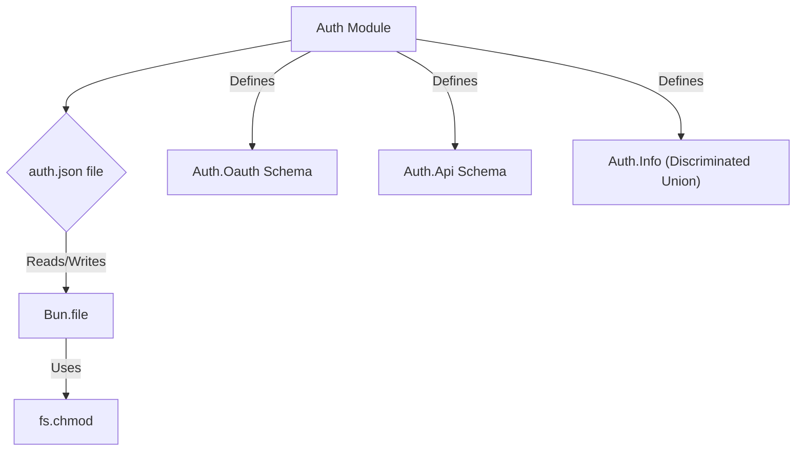

# Auth Module

## Overview

The `Auth` module (`packages/opencode/src/auth/index.ts`) provides functionalities for managing authentication information for various providers. It supports OAuth and API key-based authentication, allowing for secure storage and retrieval of credentials.

## Architecture

The `Auth` module stores authentication data in a `auth.json` file located in the global data directory. It uses Zod schemas to define the structure of different authentication types (OAuth and API Key). Functions are provided to interact with this storage, allowing retrieval of specific provider credentials, listing all stored credentials, and adding or removing credentials.



## Data Models

### Auth.Oauth

Represents OAuth-based authentication information.

**Schema:**

```typescript
export const Oauth = z.object({
  type: z.literal("oauth"),
  refresh: z.string(),
  access: z.string(),
  expires: z.number(),
})
```

**Overview:**

- `type`: Literal string "oauth" to identify the authentication type.
- `refresh`: The OAuth refresh token.
- `access`: The OAuth access token.
- `expires`: The expiration timestamp of the access token.

**Sources:** `packages/opencode/src/auth/index.ts:7-12`

### Auth.Api

Represents API key-based authentication information.

**Schema:**

```typescript
export const Api = z.object({
  type: z.literal("api"),
  key: z.string(),
})
```

**Overview:**

- `type`: Literal string "api" to identify the authentication type.
- `key`: The API key.

**Sources:** `packages/opencode/src/auth/index.ts:14-17`

### Auth.Info

A discriminated union type representing either OAuth or API key authentication information.

**Schema:**

```typescript
export const Info = z.discriminatedUnion("type", [Oauth, Api])
export type Info = z.infer<typeof Info>
```

**Sources:** `packages/opencode/src/auth/index.ts:19-20`

## Features

### Get Authentication Information (`Auth.get`)

Retrieves authentication information for a specific provider ID from the `auth.json` file.

**Code example:**

```typescript
// packages/opencode/src/auth/index.ts:24-29
export async function get(providerID: string) {
  const file = Bun.file(filepath)
  return file
    .json()
    .catch(() => ({}))
    .then((x) => x[providerID] as Info | undefined)
}
```

**Sources:** `packages/opencode/src/auth/index.ts:24-29`

### Get All Authentication Information (`Auth.all`)

Retrieves all stored authentication information from the `auth.json` file.

**Code example:**

```typescript
// packages/opencode/src/auth/index.ts:31-34
export async function all(): Promise<Record<string, Info>> {
  const file = Bun.file(filepath)
  return file.json().catch(() => ({}))
}
```

**Sources:** `packages/opencode/src/auth/index.ts:31-34`

### Set Authentication Information (`Auth.set`)

Stores or updates authentication information for a given provider ID in the `auth.json` file. It also sets file permissions to `0o600` for security.

**Code example:**

```typescript
// packages/opencode/src/auth/index.ts:36-41
export async function set(key: string, info: Info) {
  const file = Bun.file(filepath)
  const data = await all()
  await Bun.write(file, JSON.stringify({ ...data, [key]: info }, null, 2))
  await fs.chmod(file.name!, 0o600)
}
```

**Sources:** `packages/opencode/src/auth/index.ts:36-41`

### Remove Authentication Information (`Auth.remove`)

Removes authentication information for a specific provider ID from the `auth.json` file.

**Code example:**

```typescript
// packages/opencode/src/auth/index.ts:43-48
export async function remove(key: string) {
  const file = Bun.file(filepath)
  const data = await all()
  delete data[key]
  await Bun.write(file, JSON.stringify(data, null, 2))
  await fs.chmod(file.name!, 0o600)
}
```

**Sources:** `packages/opencode/src/auth/index.ts:43-48`

## Dependencies

- `path`: Node.js built-in module for path manipulation.
- [Global](../global.md): For accessing global path configurations.
- `fs/promises`: Node.js built-in module for file system operations with promises.
- `zod`: For schema definition and validation.

**Sources:** `packages/opencode/src/auth/index.ts:1-4`

## Consumers

- [Provider](../provider.md): For managing language model providers that require authentication.

**Sources:** `packages/opencode/src/auth/index.ts` (implicit from exports)
