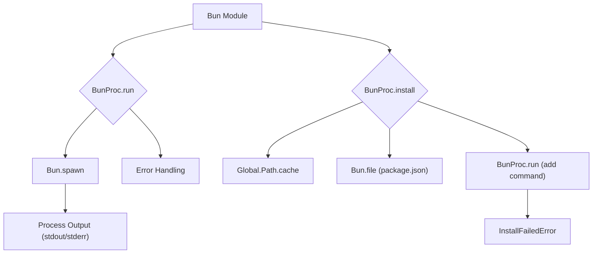

# Bun Module

## Overview

The `Bun` module (`packages/opencode/src/bun/index.ts`) provides utilities for interacting with the Bun runtime, specifically for executing Bun commands and managing Bun package installations. It abstracts away the complexities of spawning Bun processes and handles output and error reporting.

## Architecture

The `Bun` module primarily exposes functions for running Bun commands (`BunProc.run`) and installing packages (`BunProc.install`). It uses `Bun.spawn` to execute commands as child processes, capturing their standard output and error streams. For package installation, it manages a `package.json` file within a global cache directory to track installed packages and their versions.



## Data Models

### BunProc.InstallFailedError

Represents an error that occurs when a Bun package installation fails.

**Schema:**

```typescript
export const InstallFailedError = NamedError.create(
  "BunInstallFailedError",
  z.object({
    pkg: z.string(),
    version: z.string(),
  }),
)
```

**Overview:**

- `pkg`: The name of the package that failed to install.
- `version`: The version of the package that failed to install.

**Sources:** `packages/opencode/src/bun/index.ts:50-56`

## Features

### Run Bun Command (`BunProc.run`)

Executes a given Bun command as a child process, captures its output, and throws an error if the command fails.

**Call graph analysis:**

- `BunProc.run` → `Bun.spawn`
- `BunProc.run` → `readableStreamToText`

**Code example:**

```typescript
// packages/opencode/src/bun/index.ts:12-47
export async function run(cmd: string[], options?: Bun.SpawnOptions.OptionsObject<any, any, any>) {
  log.info("running", {
    cmd: [which(), ...cmd],
    ...options,
  })
  const result = Bun.spawn([which(), ...cmd], {
    ...options,
    stdout: "pipe",
    stderr: "pipe",
    env: {
      ...process.env,
      ...options?.env,
      BUN_BE_BUN: "1",
    },
  })
  const code = await result.exited
  const stdout = result.stdout
    ? typeof result.stdout === "number"
      ? result.stdout
      : await readableStreamToText(result.stdout)
    : undefined
  const stderr = result.stderr
    ? typeof result.stderr === "number"
      ? result.stderr
      : await readableStreamToText(result.stderr)
    : undefined
  log.info("done", {
    code,
    stdout,
    stderr,
  })
  if (code !== 0) {
    throw new Error(`Command failed with exit code ${result.exitCode}`)
  }
  return result
}
```

**Sources:** `packages/opencode/src/bun/index.ts:12-47`

### Install Bun Package (`BunProc.install`)

Installs a specified Bun package at a given version into a global cache directory. It manages a `package.json` file to track dependencies and uses `BunProc.run` internally for the installation process.

**Call graph analysis:**

- `BunProc.install` → `Bun.file().json()`
- `BunProc.install` → `Bun.write()`
- `BunProc.install` → `BunProc.run`
- `BunProc.install` → `NamedError.create` (for `InstallFailedError`)

**Code example:**

```typescript
// packages/opencode/src/bun/index.ts:58-90
export async function install(pkg: string, version = "latest") {
  const mod = path.join(Global.Path.cache, "node_modules", pkg)
  const pkgjson = Bun.file(path.join(Global.Path.cache, "package.json"))
  const parsed = await pkgjson.json().catch(async () => {
    const result = { dependencies: {} }
    await Bun.write(pkgjson.name!, JSON.stringify(result, null, 2))
    return result
  })
  if (parsed.dependencies[pkg] === version) return mod

  // Build command arguments
  const args = ["add", "--force", "--exact", "--cwd", Global.Path.cache, pkg + "@" + version]

  // Let Bun handle registry resolution:
  // - If .npmrc files exist, Bun will use them automatically
  // - If no .npmrc files exist, Bun will default to https://registry.npmjs.org
  log.info("installing package using Bun's default registry resolution", { pkg, version })

  await BunProc.run(args, {
    cwd: Global.Path.cache,
  }).catch((e) => {
    throw new InstallFailedError(
      { pkg, version },
      {
        cause: e,
      },
    )
  })
  parsed.dependencies[pkg] = version
  await Bun.write(pkgjson.name!, JSON.stringify(parsed, null, 2))
  return mod
}
```

**Sources:** `packages/opencode/src/bun/index.ts:58-90`

## Dependencies

- `zod`: For schema definition and validation.
- [Global](../global.md): For accessing global path configurations (e.g., `Global.Path.cache`).
- [Log](../util/util.md#log): For logging application events.
- `path`: Node.js built-in module for path manipulation.
- [NamedError](../util/util.md#custom-named-errors): For creating named error types.
- `bun`: Bun's built-in `readableStreamToText` function.

**Sources:** `packages/opencode/src/bun/index.ts:1-6`

## Consumers

- [Provider](../provider.md): For installing provider SDKs.
- [Format](../format.md): For running formatters.
- [LSP](../lsp.md): For spawning language servers.

**Sources:** `packages/opencode/src/bun/index.ts` (implicit from exports)
