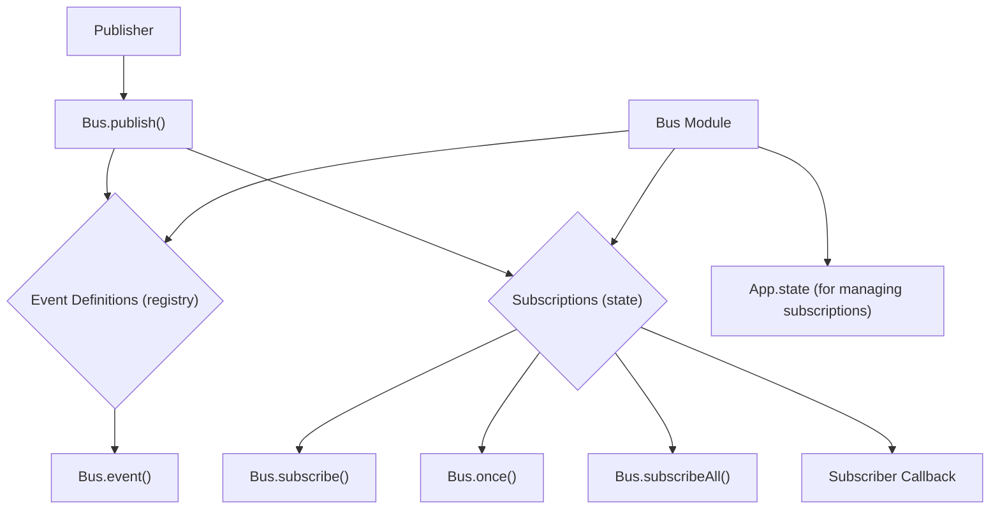

# Bus Module

## Overview

The `Bus` module (`packages/opencode/src/bus/index.ts`) implements a simple event bus system. It allows different parts of the application to publish and subscribe to events, facilitating a decoupled communication mechanism between components. This module is crucial for managing application-wide events and ensuring that components can react to changes without direct dependencies on each other.

## Architecture

The `Bus` module maintains a registry of event definitions and a map of subscriptions. Events are defined with a type and a Zod schema for their properties. When an event is published, the bus iterates through all relevant subscriptions (both specific to the event type and global wildcard subscriptions) and invokes their callbacks. It integrates with the `App` module to manage its internal state (subscriptions).



## Data Models

### Bus.EventDefinition

Represents the definition of an event, including its type and a Zod schema for its properties.

**Schema:**

```typescript
export type EventDefinition = ReturnType<typeof event>
```

**Overview:**

- `type`: A string literal representing the unique type of the event.
- `properties`: A Zod schema defining the structure of the event's payload.

**Sources:** `packages/opencode/src/bus/index.ts:17`

## Features

### Define Event (`Bus.event`)

Registers a new event type with its associated Zod schema for properties. This allows the event bus to validate payloads and provide type safety.

**Code example:**

```typescript
// packages/opencode/src/bus/index.ts:21-27
export function event<Type extends string, Properties extends ZodType>(type: Type, properties: Properties) {
  const result = {
    type,
    properties,
  }
  registry.set(type, result)
  return result
}
```

**Sources:** `packages/opencode/src/bus/index.ts:21-27`

### Publish Event (`Bus.publish`)

Publishes an event to the bus. All subscribed callbacks for the specific event type and for the wildcard (`*`) will be invoked with the event payload.

**Code example:**

```typescript
// packages/opencode/src/bus/index.ts:49-66
export async function publish<Definition extends EventDefinition>(
  def: Definition,
  properties: z.output<Definition["properties"]>,
) {
  const payload = {
    type: def.type,
    properties,
  }
  log.info("publishing", {
    type: def.type,
  })
  const pending = []
  for (const key of [def.type, "*"]) {
    const match = state().subscriptions.get(key)
    for (const sub of match ?? []) {
      pending.push(sub(payload))
    }
  }
  return Promise.all(pending)
}
```

**Sources:** `packages/opencode/src/bus/index.ts:49-66`

### Subscribe to Event (`Bus.subscribe`)

Subscribes a callback function to a specific event type. The callback will be invoked whenever an event of that type is published.

**Code example:**

```typescript
// packages/opencode/src/bus/index.ts:68-72
export function subscribe<Definition extends EventDefinition>(
  def: Definition,
  callback: (event: { type: Definition["type"]; properties: z.infer<Definition["properties"]> }) => void,
) {
  return raw(def.type, callback)
}
```

**Sources:** `packages/opencode/src/bus/index.ts:68-72`

### Subscribe Once to Event (`Bus.once`)

Subscribes a callback function to a specific event type, but the subscription is automatically removed after the callback is invoked once and returns a truthy value.

**Code example:**

```typescript
// packages/opencode/src/bus/index.ts:74-82
export function once<Definition extends EventDefinition>(
  def: Definition,
  callback: (
    event: {
      type: Definition["type"]
      properties: z.infer<Definition["properties"]>
    },
  ) => "done" | undefined,
) {
  const unsub = subscribe(def, (event) => {
    if (callback(event)) unsub()
  })
}
```

**Sources:** `packages/opencode/src/bus/index.ts:74-82`

### Subscribe to All Events (`Bus.subscribeAll`)

Subscribes a callback function to all events published on the bus, regardless of their type.

**Code example:**

```typescript
// packages/opencode/src/bus/index.ts:84-86
export function subscribeAll(callback: (event: any) => void) {
  return raw("*", callback)
}
```

**Sources:** `packages/opencode/src/bus/index.ts:84-86`

## Dependencies

- `zod`: For schema definition and validation of event properties.
- [App](../app.md): For managing the internal state of the event bus (`App.state`).
- [Log](../util/util.md#log): For logging events within the bus module.

**Sources:** `packages/opencode/src/bus/index.ts:1-3`

## Consumers

- [App](../app.md): For initializing the application.
- [Config](../config.md): For configuration hooks.
- [File](../file.md): For file-related events.
- [Format](../format.md): For triggering code formatting.
- [IDE](../ide.md): For publishing IDE installation events.
- [Installation](../installation.md): For publishing installation update events.
- [LSP](../lsp.md): For LSP client events.
- [MCP](../mcp.md): For publishing MCP server errors.
- [Permission](../permission.md): For publishing permission updates.
- [Server](../server.md): For streaming events via SSE.
- [Session](../session.md): For publishing session and message events.
- [Share](../share.md): For synchronizing shared session data.
- [Storage](../storage.md): For publishing storage write events.
- [Tool](../tool.md): Various tools publish events.

**Sources:** `packages/opencode/src/bus/index.ts` (implicit from exports)
