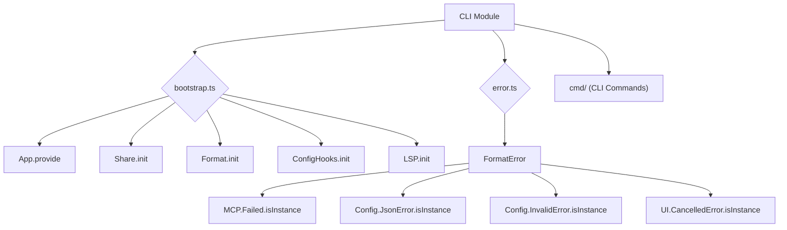

# CLI Module

## Overview

The `CLI` module (`packages/opencode/src/cli`) provides the foundational components for the OpenCode command-line interface. It handles the bootstrapping of the application, error formatting for user-friendly messages, and defines the structure for various CLI commands.

## Architecture

The `CLI` module orchestrates the initialization of core application services and provides a centralized mechanism for handling and formatting errors that occur during CLI execution. The `bootstrap.ts` file is the entry point for setting up the CLI environment, while `error.ts` defines how different types of errors are presented to the user. Individual CLI commands are expected to reside within the `cmd` subdirectory.



## Features

### CLI Bootstrapping (`bootstrap.ts`)

Initializes the core services and configurations required for the CLI application to function. This includes providing the application context, initializing sharing mechanisms, formatting utilities, configuration hooks, and LSP (Language Server Protocol) integration.

**Call graph analysis:**

- `bootstrap` → `App.provide`
- `bootstrap` → `Share.init`
- `bootstrap` → `Format.init`
- `bootstrap` → `ConfigHooks.init`
- `bootstrap` → `LSP.init`

**Code example:**

```typescript
// packages/opencode/src/cli/bootstrap.ts:7-15
export async function bootstrap<T>(input: App.Input, cb: (app: App.Info) => Promise<T>) {
  return App.provide(input, async (app) => {
    Share.init()
    Format.init()
    ConfigHooks.init()
    LSP.init()

    return cb(app)
  })
}
```

**Sources:** `packages/opencode/src/cli/bootstrap.ts:7-15`

### Error Formatting (`error.ts`)

Provides a utility function to format various types of errors into user-friendly messages for display in the CLI. It specifically handles errors related to MCP (Multi-Cloud Platform) server failures, invalid configuration JSON, and invalid configuration content.

**Call graph analysis:**

- `FormatError` → `MCP.Failed.isInstance`
- `FormatError` → `Config.JsonError.isInstance`
- `FormatError` → `Config.InvalidError.isInstance`
- `FormatError` → `UI.CancelledError.isInstance`

**Code example:**

```typescript
// packages/opencode/src/cli/error.ts:5-18
export function FormatError(input: unknown) {
  if (MCP.Failed.isInstance(input))
    return `MCP server "${input.data.name}" failed. Note, opencode does not support MCP authentication yet.`
  if (Config.JsonError.isInstance(input)) return `Config file at ${input.data.path} is not valid JSON`
  if (Config.InvalidError.isInstance(input))
    return [
      `Config file at ${input.data.path} is invalid`,
      ...(input.data.issues?.map((issue) => "↳ " + issue.message + " " + issue.path.join(".")) ?? []),
    ].join("\n")

  if (UI.CancelledError.isInstance(input)) return ""
}
```

**Sources:** `packages/opencode/src/cli/error.ts:5-18`

## Dependencies

- [App](../app.md): For providing the application context during bootstrapping.
- [ConfigHooks](../config.md#configuration-hooks): For initializing configuration-related hooks.
- [Format](../format.md): For initializing formatting utilities.
- [LSP](../lsp.md): For initializing Language Server Protocol integration.
- [Share](../share.md): For initializing sharing mechanisms.
- [Config](../config.md): For handling configuration-related errors.
- [MCP](../mcp.md): For handling MCP-related errors.
- `./ui`: For handling UI-related errors (e.g., cancellation).

**Sources:** `packages/opencode/src/cli/bootstrap.ts:1-5`, `packages/opencode/src/cli/error.ts:1-3`

## Consumers

- The main entry point of the OpenCode CLI application (`packages/opencode/src/index.ts`) to set up the environment and handle command execution and error reporting.

**Sources:** `packages/opencode/src/cli/bootstrap.ts`, `packages/opencode/src/cli/error.ts` (implicit from exports)

```