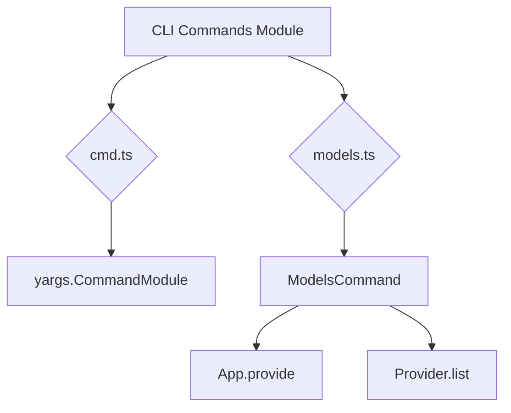

# CLI Commands Module

## Overview

The `CLI Commands` module (`packages/opencode/src/cli/cmd`) defines the various commands available in the OpenCode command-line interface. It uses `yargs` for command-line parsing and provides a structured way to define and implement new commands.

## Architecture

This module serves as a collection of individual command definitions. Each command is typically defined in its own file and then exported. The `cmd.ts` file provides a simple helper function to wrap `yargs` command modules, ensuring consistency. The `models.ts` file demonstrates a command that lists available models by interacting with the `App` and `Provider` modules.



## Features

### Command Definition Helper (`cmd.ts`)

Provides a simple wrapper function to define `yargs` command modules, promoting a consistent structure for all CLI commands.

**Code example:**

```typescript
// packages/opencode/src/cli/cmd/cmd.ts:3-5
export function cmd<T, U>(input: CommandModule<T, U>) {
  return input
}
```

**Sources:** `packages/opencode/src/cli/cmd/cmd.ts:3-5`

### List Models Command (`models.ts`)

Implements a CLI command (`opencode models`) that lists all available models by iterating through registered providers and their associated models.

**Call graph analysis:**

- `ModelsCommand.handler` → `App.provide`
- `ModelsCommand.handler` → `Provider.list`

**Code example:**

```typescript
// packages/opencode/src/cli/cmd/models.ts:6-18
export const ModelsCommand = cmd({
  command: "models",
  describe: "list all available models",
  handler: async () => {
    await App.provide({ cwd: process.cwd() }, async () => {
      const providers = await Provider.list()

      for (const [providerID, provider] of Object.entries(providers)) {
        for (const modelID of Object.keys(provider.info.models)) {
          console.log(`${providerID}/${modelID}`)
        }
      }
    })
  },
})
```

**Sources:** `packages/opencode/src/cli/cmd/models.ts:6-18`

## Dependencies

- `yargs`: For defining command-line interfaces.
- [App](../app.md): For providing application context.
- [Provider](../provider.md): For listing available providers and their models.

**Sources:** `packages/opencode/src/cli/cmd/cmd.ts:1`, `packages/opencode/src/cli/cmd/models.ts:1-3`

## Consumers

- The main CLI application (`packages/opencode/src/index.ts`) which uses `yargs` to parse command-line arguments and execute the corresponding command handlers.

**Sources:** `packages/opencode/src/cli/cmd/cmd.ts`, `packages/opencode/src/cli/cmd/models.ts` (implicit from exports)
