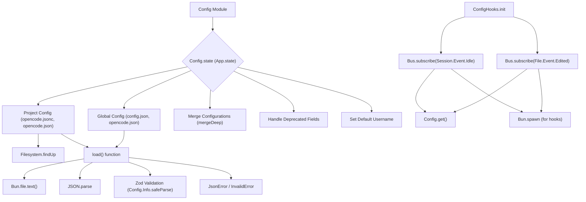

# Config Module

## Overview

The `Config` module (`packages/opencode/src/config`) is responsible for loading, parsing, and managing the application's configuration. It supports hierarchical configuration loading from `opencode.jsonc` and `opencode.json` files, merging configurations from different levels (global and project-specific). It also handles environment variable interpolation and file content inclusion within the configuration.

## Architecture

The `Config` module uses Zod schemas to define the structure of the configuration, ensuring type safety and validation. It loads configuration from a global location and then merges it with project-specific configuration files found by traversing up the directory tree. It also provides mechanisms for handling deprecated fields (e.g., `autoshare` to `share`) and setting default values (e.g., `username`). The `hooks.ts` file defines how the configuration can trigger actions based on certain events, such as file edits or session completion.



## Data Models

### Config.McpLocal

Schema for local MCP (Model Context Protocol) server configuration.

**Schema:**

```typescript
export const McpLocal = z
  .object({
    type: z.literal("local").describe("Type of MCP server connection"),
    command: z.string().array().describe("Command and arguments to run the MCP server"),
    environment: z
      .record(z.string(), z.string())
      .optional()
      .describe("Environment variables to set when running the MCP server"),
    enabled: z.boolean().optional().describe("Enable or disable the MCP server on startup"),
  })
  .strict()
  .openapi({
    ref: "McpLocalConfig",
  })
```

**Sources:** `packages/opencode/src/config/config.ts:40-53`

### Config.McpRemote

Schema for remote MCP server configuration.

**Schema:**

```typescript
export const McpRemote = z
  .object({
    type: z.literal("remote").describe("Type of MCP server connection"),
    url: z.string().describe("URL of the remote MCP server"),
    enabled: z.boolean().optional().describe("Enable or disable the MCP server on startup"),
    headers: z.record(z.string(), z.string()).optional().describe("Headers to send with the request"),
  })
  .strict()
  .openapi({
    ref: "McpRemoteConfig",
  })
```

**Sources:** `packages/opencode/src/config/config.ts:55-67`

### Config.Mcp

Discriminated union for MCP server configurations (either local or remote).

**Schema:**

```typescript
export const Mcp = z.discriminatedUnion("type", [McpLocal, McpRemote])
export type Mcp = z.infer<typeof Mcp>
```

**Sources:** `packages/opencode/src/config/config.ts:69-70`

### Config.Mode

Schema for mode-specific configurations.

**Schema:**

```typescript
export const Mode = z
  .object({
    model: z.string().optional(),
    prompt: z.string().optional(),
    tools: z.record(z.string(), z.boolean()).optional(),
  })
  .openapi({
    ref: "ModeConfig",
  })
export type Mode = z.infer<typeof Mode>
```

**Sources:** `packages/opencode/src/config/config.ts:72-81`

### Config.Keybinds

Schema for custom keybind configurations.

**Schema:**

```typescript
export const Keybinds = z
  .object({
    leader: z.string().optional().default("ctrl+x").describe("Leader key for keybind combinations"),
    app_help: z.string().optional().default("<leader>h").describe("Show help dialog"),
    switch_mode: z.string().optional().default("tab").describe("Next mode"),
    switch_mode_reverse: z.string().optional().default("shift+tab").describe("Previous Mode"),
    editor_open: z.string().optional().default("<leader>e").describe("Open external editor"),
    session_export: z.string().optional().default("<leader>x").describe("Export session to editor"),
    session_new: z.string().optional().default("<leader>n").describe("Create a new session"),
    session_list: z.string().optional().default("<leader>l").describe("List all sessions"),
    session_share: z.string().optional().default("<leader>s").describe("Share current session"),
    session_unshare: z.string().optional().default("<leader>u").describe("Unshare current session"),
    session_interrupt: z.string().optional().default("esc").describe("Interrupt current session"),
    session_compact: z.string().optional().default("<leader>c").describe("Compact the session"),
    tool_details: z.string().optional().default("<leader>d").describe("Toggle tool details"),
    model_list: z.string().optional().default("<leader>m").describe("List available models"),
    theme_list: z.string().optional().default("<leader>t").describe("List available themes"),
    file_list: z.string().optional().default("<leader>f").describe("List files"),
    file_close: z.string().optional().default("esc").describe("Close file"),
    file_search: z.string().optional().default("<leader>/").describe("Search file"),
    file_diff_toggle: z.string().optional().default("<leader>v").describe("Split/unified diff"),
    project_init: z.string().optional().default("<leader>i").describe("Create/update AGENTS.md"),
    input_clear: z.string().optional().default("ctrl+c").describe("Clear input field"),
    input_paste: z.string().optional().default("ctrl+v").describe("Paste from clipboard"),
    input_submit: z.string().optional().default("enter").describe("Submit input"),
    input_newline: z.string().optional().default("shift+enter,ctrl+j").describe("Insert newline in input"),
    messages_page_up: z.string().optional().default("pgup").describe("Scroll messages up by one page"),
    messages_page_down: z.string().optional().default("pgdown").describe("Scroll messages down by one page"),
    messages_half_page_up: z.string().optional().default("ctrl+alt+u").describe("Scroll messages up by half page"),
    messages_half_page_down: z
      .string()
      .optional()
      .default("ctrl+alt+d")
      .describe("Scroll messages down by half page"),
    messages_previous: z.string().optional().default("ctrl+up").describe("Navigate to previous message"),
    messages_next: z.string().optional().default("ctrl+down").describe("Navigate to next message"),
    messages_first: z.string().optional().default("ctrl+g").describe("Navigate to first message"),
    messages_last: z.string().optional().default("ctrl+alt+g").describe("Navigate to last message"),
    messages_layout_toggle: z.string().optional().default("<leader>p").describe("Toggle layout"),
    messages_copy: z.string().optional().default("<leader>y").describe("Copy message"),
    messages_revert: z.string().optional().default("<leader>r").describe("Revert message"),
    app_exit: z.string().optional().default("ctrl+c,<leader>q").describe("Exit the application"),
  })
  .strict()
  .openapi({
    ref: "KeybindsConfig",
  })
```

**Sources:** `packages/opencode/src/config/config.ts:83-150`

### Config.Layout

Schema for layout configuration.

**Schema:**

```typescript
export const Layout = z.enum(["auto", "stretch"]).openapi({
  ref: "LayoutConfig",
})
export type Layout = z.infer<typeof Layout>
```

**Sources:** `packages/opencode/src/config/config.ts:152-155`

### Config.Info

Main schema for the application's configuration.

**Schema:**

```typescript
export const Info = z
  .object({
    $schema: z.string().optional().describe("JSON schema reference for configuration validation"),
    theme: z.string().optional().describe("Theme name to use for the interface"),
    keybinds: Keybinds.optional().describe("Custom keybind configurations"),
    share: z
      .enum(["manual", "auto", "disabled"])
      .optional()
      .describe(
        "Control sharing behavior:'manual' allows manual sharing via commands, 'auto' enables automatic sharing, 'disabled' disables all sharing",
      ),
    autoshare: z
      .boolean()
      .optional()
      .describe("@deprecated Use 'share' field instead. Share newly created sessions automatically"),
    autoupdate: z.boolean().optional().describe("Automatically update to the latest version"),
    disabled_providers: z.array(z.string()).optional().describe("Disable providers that are loaded automatically"),
    model: z.string().describe("Model to use in the format of provider/model, eg anthropic/claude-2").optional(),
    small_model: z
      .string()
      .describe(
        "Small model to use for tasks like summarization and title generation in the format of provider/model",
      )
      .optional(),
    username: z
      .string()
      .optional()
      .describe("Custom username to display in conversations instead of system username"),
    mode: z
      .object({
        build: Mode.optional(),
        plan: Mode.optional(),
      })
      .catchall(Mode)
      .optional()
      .describe("Modes configuration, see https://opencode.ai/docs/modes"),
    provider: z
      .record(
        ModelsDev.Provider.partial().extend({
          models: z.record(ModelsDev.Model.partial()),
          options: z.record(z.any()).optional(),
        }),
      )
      .optional()
      .describe("Custom provider configurations and model overrides"),
    mcp: z.record(z.string(), Mcp).optional().describe("MCP (Model Context Protocol) server configurations"),
    instructions: z.array(z.string()).optional().describe("Additional instruction files or patterns to include"),
    layout: Layout.optional().describe("@deprecated Always uses stretch layout."),
    experimental: z
      .object({
        hook: z
          .object({
            file_edited: z
              .record(
                z.string(),
                z
                  .object({
                    command: z.string().array(),
                    environment: z.record(z.string(), z.string()).optional(),
                  })
                  .array(),
              )
              .optional(),
            session_completed: z
              .object({
                command: z.string().array(),
                environment: z.record(z.string(), z.string()).optional(),
              })
              .array()
              .optional(),
          })
          .optional(),
      })
      .optional(),
  })
  .strict()
  .openapi({
    ref: "Config",
  })

export type Info = z.output<typeof Info>
```

**Sources:** `packages/opencode/src/config/config.ts:157-236`

### Config.JsonError

Represents an error indicating that a configuration file is not valid JSON.

**Schema:**

```typescript
export const JsonError = NamedError.create(
  "ConfigJsonError",
  z.object({
    path: z.string(),
  }),
)
```

**Sources:** `packages/opencode/src/config/config.ts:279-284`

### Config.InvalidError

Represents an error indicating that a configuration file is invalid according to its schema.

**Schema:**

```typescript
export const InvalidError = NamedError.create(
  "ConfigInvalidError",
  z.object({
    path: z.string(),
    issues: z.custom<z.ZodIssue[]>().optional(),
  }),
)
```

**Sources:** `packages/opencode/src/config/config.ts:286-292`

## Features

### Load Configuration (`Config.state` and `load` function)

Loads the application configuration by merging global and project-specific configuration files. It handles JSON parsing, environment variable interpolation, file content inclusion, and schema validation.

**Call graph analysis:**

- `Config.state` → `global()`
- `Config.state` → `Filesystem.findUp`
- `Config.state` → `load()`
- `load` → `Bun.file().text()`
- `load` → `JSON.parse`
- `load` → `Config.Info.safeParse`
- `load` → `Bun.write`
- `load` → `fs.unlink`

**Code example (simplified):**

```typescript
// packages/opencode/src/config/config.ts:16-37 (Config.state)
// packages/opencode/src/config/config.ts:240-277 (load function)
export const state = App.state("config", async (app) => {
  let result = await global()
  for (const file of ["opencode.jsonc", "opencode.json"]) {
    const found = await Filesystem.findUp(file, app.path.cwd, app.path.root)
    for (const resolved of found.toReversed()) {
      result = mergeDeep(result, await load(resolved))
    }
  }

  // Handle migration from autoshare to share field
  if (result.autoshare === true && !result.share) {
    result.share = "auto"
  }

  if (!result.username) {
    const os = await import("os")
    result.username = os.userInfo().username
  }

  log.info("loaded", result)

  return result
})

async function load(configPath: string) {
  let text = await Bun.file(configPath)
    .text()
    .catch((err) => {
      if (err.code === "ENOENT") return
      throw new JsonError({ path: configPath }, { cause: err })
    })
  if (!text) return {}

  text = text.replace(/\{env:([^}]+)\}/g, (_, varName) => {
    return process.env[varName] || ""
  })

  const fileMatches = text.match(/"?\{file:([^}]+)\}"?/g)
  if (fileMatches) {
    const configDir = path.dirname(configPath)
    for (const match of fileMatches) {
      const filePath = match.replace(/^"?\{file:/, "").replace(/\}"?$/, "")
      const resolvedPath = path.isAbsolute(filePath) ? filePath : path.resolve(configDir, filePath)
      const fileContent = await Bun.file(resolvedPath).text()
      text = text.replace(match, JSON.stringify(fileContent))
    }
  }

  let data: any
  try {
    data = JSON.parse(text)
  } catch (err) {
    throw new JsonError({ path: configPath }, { cause: err as Error })
  }

  const parsed = Info.safeParse(data)
  if (parsed.success) {
    if (!parsed.data.$schema) {
      parsed.data.$schema = "https://opencode.ai/config.json"
      await Bun.write(configPath, JSON.stringify(parsed.data, null, 2))
    }
    return parsed.data
  }
  throw new InvalidError({ path: configPath, issues: parsed.error.issues })
}
```

**Sources:** `packages/opencode/src/config/config.ts:16-37, packages/opencode/src/config/config.ts:240-277`

### Configuration Hooks (`ConfigHooks.init`)

Initializes event listeners that trigger actions based on configuration. Currently, it supports `file_edited` and `session_completed` hooks, allowing external commands to be executed when these events occur.

**Call graph analysis:**

- `ConfigHooks.init` → `App.info()`
- `ConfigHooks.init` → `Bus.subscribe(File.Event.Edited)`
- `ConfigHooks.init` → `Bus.subscribe(Session.Event.Idle)`
- `ConfigHooks.init` → `Config.get()`
- `ConfigHooks.init` → `Bun.spawn`

**Code example:**

```typescript
// packages/opencode/src/config/hooks.ts:12-57
export function init() {
  log.info("init")
  const app = App.info()

  Bus.subscribe(File.Event.Edited, async (payload) => {
    const cfg = await Config.get()
    const ext = path.extname(payload.properties.file)
    for (const item of cfg.experimental?.hook?.file_edited?.[ext] ?? []) {
      log.info("file_edited", {
        file: payload.properties.file,
        command: item.command,
      })
      Bun.spawn({
        cmd: item.command.map((x) => x.replace("$FILE", payload.properties.file)),
        env: item.environment,
        cwd: app.path.cwd,
        stdout: "ignore",
        stderr: "ignore",
      })
    }
  })

  Bus.subscribe(Session.Event.Idle, async (payload) => {
    const cfg = await Config.get()
    if (cfg.experimental?.hook?.session_completed) {
      const session = await Session.get(payload.properties.sessionID)
      // Only fire hook for top-level sessions (not subagent sessions)
      if (session.parentID) return

      for (const item of cfg.experimental.hook.session_completed) {
        log.info("session_completed", {
          command: item.command,
        })
        Bun.spawn({
          cmd: item.command,
          cwd: App.info().path.cwd,
          env: item.environment,
          stdout: "ignore",
          stderr: "ignore",
        })
      }
    }
  })
}
```

**Sources:** `packages/opencode/src/config/hooks.ts:12-57`

## Dependencies

- [Log](../util/util.md#log): For logging events.
- `path`: Node.js built-in module for path manipulation.
- `zod`: For schema definition and validation.
- [App](../app.md): For accessing application context and state management.
- [Filesystem](../util/util.md#filesystem): For finding configuration files.
- `../provider/models`: For model-related schema definitions within the config.
- `remeda`: For deep merging objects.
- [Global](../global.md): For accessing global path configurations.
- `fs/promises`: Node.js built-in module for file system operations.
- [Lazy](../util/util.md#lazy): For lazy initialization of global config.
- [NamedError](../util/util.md#custom-named-errors): For creating named error types.
- [Bus](../bus.md): For subscribing to events.
- [File](../file.md): For file-related events.
- [Session](../session.md): For session-related events.

**Sources:** `packages/opencode/src/config/config.ts:1-12`, `packages/opencode/src/config/hooks.ts:1-7`

## Consumers

- [CLI](../cli.md): For bootstrapping.
- [Provider](../provider.md): For model configurations.

**Sources:** `packages/opencode/src/config/config.ts`, `packages/opencode/src/config/hooks.ts` (implicit from exports)
