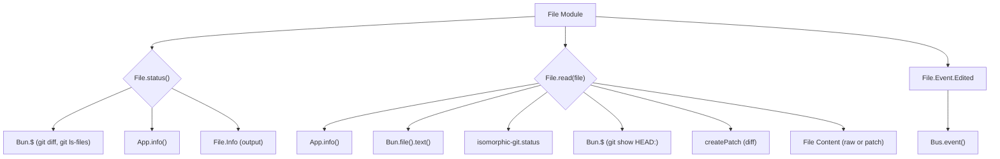

# File Module

## Overview

The `File` module (`packages/opencode/src/file/index.ts`) provides utilities for interacting with the file system, particularly focusing on Git-related file status and content reading. It enables the application to track changes in files, read their content, and publish events when files are edited.

## Architecture

The `File` module integrates with Git to determine the status of files (added, deleted, modified) within the current project. It uses Bun's `$` for executing shell commands (specifically `git diff` and `git ls-files`) and `isomorphic-git` for more detailed Git operations like `git.status`. When reading file content, it can generate a Git patch if the file is modified. It also defines and publishes a `file.edited` event through the `Bus` module when a file is changed.



## Data Models

### File.Info

Represents information about a file's status within the Git repository.

**Schema:**

```typescript
export const Info = z
  .object({
    path: z.string(),
    added: z.number().int(),
    removed: z.number().int(),
    status: z.enum(["added", "deleted", "modified"]),
  })
  .openapi({
    ref: "File",
  })

export type Info = z.infer<typeof Info>
```

**Overview:**

- `path`: The relative path to the file.
- `added`: The number of lines added to the file.
- `removed`: The number of lines removed from the file.
- `status`: The Git status of the file (e.g., "added", "deleted", "modified").

**Sources:** `packages/opencode/src/file/index.ts:15-24`

### File.Event.Edited

Represents an event that is published when a file is edited.

**Schema:**

```typescript
export const Event = {
  Edited: Bus.event(
    "file.edited",
    z.object({
      file: z.string(),
    }),
  ),
}
```

**Overview:**

- `file`: The path to the edited file.

**Sources:** `packages/opencode/src/file/index.ts:26-33`

## Features

### Get File Status (`File.status`)

Retrieves the Git status of files in the current project, including modified, added, and deleted files. It returns an array of `File.Info` objects.

**Call graph analysis:**

- `File.status` → `App.info()`
- `File.status` → `Bun.$` (for `git diff --numstat HEAD`, `git ls-files --others --exclude-standard`, `git diff --name-only --diff-filter=D HEAD`)
- `File.status` → `Bun.file().text()`

**Code example:**

```typescript
// packages/opencode/src/file/index.ts:35-99
export async function status() {
  const app = App.info()
  if (!app.git) return []

  const diffOutput = await $`git diff --numstat HEAD`.cwd(app.path.cwd).quiet().nothrow().text()

  const changedFiles: Info[] = []

  if (diffOutput.trim()) {
    const lines = diffOutput.trim().split("\n")
    for (const line of lines) {
      const [added, removed, filepath] = line.split("\t")
      changedFiles.push({
        path: filepath,
        added: added === "-" ? 0 : parseInt(added, 10),
        removed: removed === "-" ? 0 : parseInt(removed, 10),
        status: "modified",
      })
    }
  }

  const untrackedOutput = await $`git ls-files --others --exclude-standard`.cwd(app.path.cwd).quiet().nothrow().text()

  if (untrackedOutput.trim()) {
    const untrackedFiles = untrackedOutput.trim().split("\n")
    for (const filepath of untrackedFiles) {
      try {
        const content = await Bun.file(path.join(app.path.root, filepath)).text()
        const lines = content.split("\n").length
        changedFiles.push({
          path: filepath,
          added: lines,
          removed: 0,
          status: "added",
        })
      } catch {
        continue
      }
    }
  }

  // Get deleted files
  const deletedOutput = await $`git diff --name-only --diff-filter=D HEAD`.cwd(app.path.cwd).quiet().nothrow().text()

  if (deletedOutput.trim()) {
    const deletedFiles = deletedOutput.trim().split("\n")
    for (const filepath of deletedFiles) {
      changedFiles.push({
        path: filepath,
        added: 0,
        removed: 0, // Could get original line count but would require another git command
        status: "deleted",
      })
    }
  }

  return changedFiles.map((x) => ({
    ...x,
    path: path.relative(app.path.cwd, path.join(app.path.root, x.path)),
  }))
}
```

**Sources:** `packages/opencode/src/file/index.ts:35-99`

### Read File Content (`File.read`)

Reads the content of a specified file. If the file is part of a Git repository and has been modified, it returns a Git patch; otherwise, it returns the raw content.

**Call graph analysis:**

- `File.read` → `App.info()`
- `File.read` → `Bun.file().text()`
- `File.read` → `git.status`
- `File.read` → `Bun.$` (for `git show HEAD:rel`)
- `File.read` → `createPatch`

**Code example:**

```typescript
// packages/opencode/src/file/index.ts:101-127
export async function read(file: string) {
  using _ = log.time("read", { file })
  const app = App.info()
  const full = path.join(app.path.cwd, file)
  const content = await Bun.file(full)
    .text()
    .catch(() => "")
    .then((x) => x.trim())
  if (app.git) {
    const rel = path.relative(app.path.root, full)
    const diff = await git.status({
      fs,
      dir: app.path.root,
      filepath: rel,
    })
    if (diff !== "unmodified") {
      const original = await $`git show HEAD:${rel}`.cwd(app.path.root).quiet().nothrow().text()
      const patch = createPatch(file, original, content, "old", "new", {
        context: Infinity,
      })
      return { type: "patch", content: patch }
    }
  }
  return { type: "raw", content }
}
```

**Sources:** `packages/opencode/src/file/index.ts:101-127`

## Dependencies

- `zod`: For schema definition and validation.
- [Bus](../bus.md): For publishing file-related events.
- `bun`: For executing shell commands (`---
createdAt: 2025-07-22T13:32:28Z
---

# File Module

## Overview

The `File` module (`packages/opencode/src/file/index.ts`) provides utilities for interacting with the file system, particularly focusing on Git-related file status and content reading. It enables the application to track changes in files, read their content, and publish events when files are edited.

## Architecture

The `File` module integrates with Git to determine the status of files (added, deleted, modified) within the current project. It uses Bun's `$` for executing shell commands (specifically `git diff` and `git ls-files`) and `isomorphic-git` for more detailed Git operations like `git.status`. When reading file content, it can generate a Git patch if the file is modified. It also defines and publishes a `file.edited` event through the `Bus` module when a file is changed.


## Data Models

### File.Info

Represents information about a file's status within the Git repository.

**Schema:**

```typescript
export const Info = z
  .object({
    path: z.string(),
    added: z.number().int(),
    removed: z.number().int(),
    status: z.enum(["added", "deleted", "modified"]),
  })
  .openapi({
    ref: "File",
  })

export type Info = z.infer<typeof Info>
```

**Overview:**

- `path`: The relative path to the file.
- `added`: The number of lines added to the file.
- `removed`: The number of lines removed from the file.
- `status`: The Git status of the file (e.g., "added", "deleted", "modified").

**Sources:** `packages/opencode/src/file/index.ts:15-24`

### File.Event.Edited

Represents an event that is published when a file is edited.

**Schema:**

```typescript
export const Event = {
  Edited: Bus.event(
    "file.edited",
    z.object({
      file: z.string(),
    }),
  ),
}
```

**Overview:**

- `file`: The path to the edited file.

**Sources:** `packages/opencode/src/file/index.ts:26-33`

## Features

### Get File Status (`File.status`)

Retrieves the Git status of files in the current project, including modified, added, and deleted files. It returns an array of `File.Info` objects.

**Call graph analysis:**

- `File.status` → `App.info()`
- `File.status` → `Bun.$` (for `git diff --numstat HEAD`, `git ls-files --others --exclude-standard`, `git diff --name-only --diff-filter=D HEAD`)
- `File.status` → `Bun.file().text()`

**Code example:**

```typescript
// packages/opencode/src/file/index.ts:35-99
export async function status() {
  const app = App.info()
  if (!app.git) return []

  const diffOutput = await $`git diff --numstat HEAD`.cwd(app.path.cwd).quiet().nothrow().text()

  const changedFiles: Info[] = []

  if (diffOutput.trim()) {
    const lines = diffOutput.trim().split("\n")
    for (const line of lines) {
      const [added, removed, filepath] = line.split("\t")
      changedFiles.push({
        path: filepath,
        added: added === "-" ? 0 : parseInt(added, 10),
        removed: removed === "-" ? 0 : parseInt(removed, 10),
        status: "modified",
      })
    }
  }

  const untrackedOutput = await $`git ls-files --others --exclude-standard`.cwd(app.path.cwd).quiet().nothrow().text()

  if (untrackedOutput.trim()) {
    const untrackedFiles = untrackedOutput.trim().split("\n")
    for (const filepath of untrackedFiles) {
      try {
        const content = await Bun.file(path.join(app.path.root, filepath)).text()
        const lines = content.split("\n").length
        changedFiles.push({
          path: filepath,
          added: lines,
          removed: 0,
          status: "added",
        })
      } catch {
        continue
      }
    }
  }

  // Get deleted files
  const deletedOutput = await $`git diff --name-only --diff-filter=D HEAD`.cwd(app.path.cwd).quiet().nothrow().text()

  if (deletedOutput.trim()) {
    const deletedFiles = deletedOutput.trim().split("\n")
    for (const filepath of deletedFiles) {
      changedFiles.push({
        path: filepath,
        added: 0,
        removed: 0, // Could get original line count but would require another git command
        status: "deleted",
      })
    }
  }

  return changedFiles.map((x) => ({
    ...x,
    path: path.relative(app.path.cwd, path.join(app.path.root, x.path)),
  }))
}
```

**Sources:** `packages/opencode/src/file/index.ts:35-99`

### Read File Content (`File.read`)

Reads the content of a specified file. If the file is part of a Git repository and has been modified, it returns a Git patch; otherwise, it returns the raw content.

**Call graph analysis:**

- `File.read` → `App.info()`
- `File.read` → `Bun.file().text()`
- `File.read` → `git.status`
- `File.read` → `Bun.$` (for `git show HEAD:rel`)
- `File.read` → `createPatch`

**Code example:**

```typescript
// packages/opencode/src/file/index.ts:101-127
export async function read(file: string) {
  using _ = log.time("read", { file })
  const app = App.info()
  const full = path.join(app.path.cwd, file)
  const content = await Bun.file(full)
    .text()
    .catch(() => "")
    .then((x) => x.trim())
  if (app.git) {
    const rel = path.relative(app.path.root, full)
    const diff = await git.status({
      fs,
      dir: app.path.root,
      filepath: rel,
    })
    if (diff !== "unmodified") {
      const original = await $`git show HEAD:${rel}`.cwd(app.path.root).quiet().nothrow().text()
      const patch = createPatch(file, original, content, "old", "new", {
        context: Infinity,
      })
      return { type: "patch", content: patch }
    }
  }
  return { type: "raw", content }
}
```

**Sources:** `packages/opencode/src/file/index.ts:101-127`

) and file operations (`Bun.file`).
- `diff`: For generating Git patches (`createPatch`).
- `path`: Node.js built-in module for path manipulation.
- `isomorphic-git`: For Git repository status checks.
- [App](../app.md): For accessing application context and Git information.
- `fs`: Node.js built-in module for file system operations.
- [Log](../util/util.md#log): For logging events.

**Sources:** `packages/opencode/src/file/index.ts:1-9`

## Consumers

- [Config](../config.md): For configuration hooks that react to file edits.
- [Format](../format.md): For triggering code formatting on file edits.
- [Server](../server.md): For file search and read endpoints.
- [Session](../session.md): For reading file content in chat interactions.

**Sources:** `packages/opencode/src/file/index.ts` (implicit from exports)
