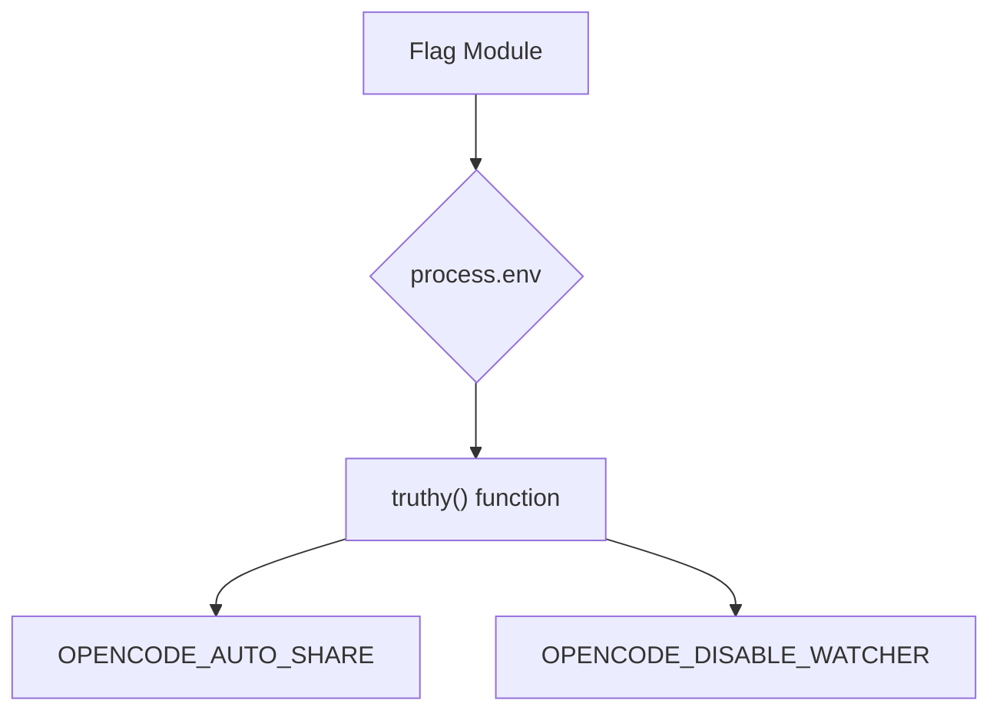

# Flag Module

## Overview

The `Flag` module (`packages/opencode/src/flag/flag.ts`) provides a simple mechanism to read and interpret boolean flags from environment variables. It defines specific application-wide flags that can alter behavior based on their presence and value in the environment.

## Architecture

The `Flag` module directly accesses `process.env` to retrieve environment variable values. It uses a `truthy` helper function to determine if an environment variable's value (case-insensitively) represents a true boolean, considering "true" or "1" as true. This allows for easy configuration of application behavior via environment variables.



## Features

### Environment Variable Interpretation (`truthy` function)

This internal utility function checks if a given environment variable's value is considered "truthy" (i.e., "true" or "1", case-insensitive).

**Code example:**

```typescript
// packages/opencode/src/flag/flag.ts:5-8
function truthy(key: string) {
  const value = process.env[key]?.toLowerCase()
  return value === "true" || value === "1"
}
```

**Sources:** `packages/opencode/src/flag/flag.ts:5-8`

### OPENCODE_AUTO_SHARE Flag

Determines if automatic session sharing is enabled based on the `OPENCODE_AUTO_SHARE` environment variable.

**Code example:**

```typescript
// packages/opencode/src/flag/flag.ts:2
export const OPENCODE_AUTO_SHARE = truthy("OPENCODE_AUTO_SHARE")
```

**Sources:** `packages/opencode/src/flag/flag.ts:2`

### OPENCODE_DISABLE_WATCHER Flag

Determines if the file watcher functionality should be disabled based on the `OPENCODE_DISABLE_WATCHER` environment variable.

**Code example:**

```typescript
// packages/opencode/src/flag/flag.ts:3
export const OPENCODE_DISABLE_WATCHER = truthy("OPENCODE_DISABLE_WATCHER")
```

**Sources:** `packages/opencode/src/flag/flag.ts:3`

## Dependencies

- None (relies on built-in `process.env`)

**Sources:** `packages/opencode/src/flag/flag.ts` (implicit)

## Consumers

- [Session](../session.md): For checking `OPENCODE_AUTO_SHARE` for automatic session sharing.
- `file/watch.ts`: For checking `OPENCODE_DISABLE_WATCHER` to disable file watching.

**Sources:** `packages/opencode/src/flag/flag.ts` (implicit from exports)
