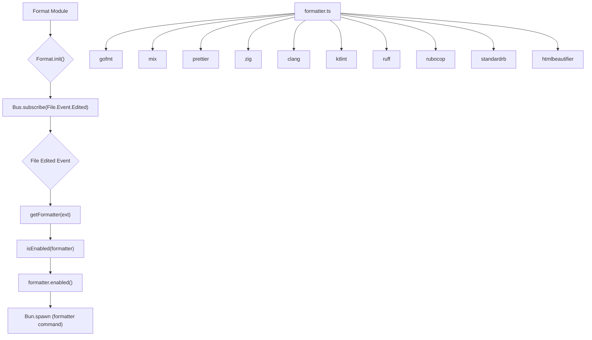

# Format Module

## Overview

The `Format` module (`packages/opencode/src/format`) provides functionality for automatically formatting code files based on their extension and the availability of relevant formatters. It integrates with the application's event bus to trigger formatting whenever a file is edited.

## Architecture

The `Format` module maintains a state of enabled formatters. When a `File.Event.Edited` event is published, it identifies the file's extension, checks for available and enabled formatters for that extension, and then executes the formatter's command as a child process. The `formatter.ts` file defines a collection of supported formatters (e.g., `gofmt`, `prettier`, `ruff`), each specifying its name, command, supported extensions, and an `enabled()` function to check its availability.



## Data Models

### Formatter.Info

Represents the information and capabilities of a code formatter.

**Schema:**

```typescript
export interface Info {
  name: string
  command: string[]
  environment?: Record<string, string>
  extensions: string[]
  enabled(): Promise<boolean>
}
```

**Overview:**

- `name`: The name of the formatter (e.g., "gofmt", "prettier").
- `command`: An array representing the command and its arguments to execute the formatter. `$FILE` is a placeholder for the file path.
- `environment`: Optional environment variables to set when running the formatter command.
- `extensions`: An array of file extensions that this formatter supports.
- `enabled()`: An asynchronous function that returns `true` if the formatter is available and enabled in the current environment, `false` otherwise.

**Sources:** `packages/opencode/src/format/formatter.ts:6-12`

## Features

### Initialize Formatter (`Format.init`)

Initializes the formatting module by subscribing to `File.Event.Edited` events. When a file is edited, it attempts to format the file using available and enabled formatters.

**Call graph analysis:**

- `Format.init` → `Bus.subscribe(File.Event.Edited)`
- `Format.init` → `getFormatter`
- `Format.init` → `Bun.spawn`

**Code example:**

```typescript
// packages/opencode/src/format/index.ts:39-60
export function init() {
  log.info("init")
  Bus.subscribe(File.Event.Edited, async (payload) => {
    const file = payload.properties.file
    log.info("formatting", { file })
    const ext = path.extname(file)

    for (const item of await getFormatter(ext)) {
      log.info("running", { command: item.command })
      const proc = Bun.spawn({
        cmd: item.command.map((x) => x.replace("$FILE", file)),
        cwd: App.info().path.cwd,
        env: item.environment,
        stdout: "ignore",
        stderr: "ignore",
      })
      const exit = await proc.exited
      if (exit !== 0)
        log.error("failed", {
          command: item.command,
          ...item.environment,
        })
    }
  })
}
```

**Sources:** `packages/opencode/src/format/index.ts:39-60`

### Formatter Availability Check (`isEnabled` and `formatter.enabled()`)

Determines if a specific formatter is enabled and available. The `isEnabled` function caches the result of the formatter's `enabled()` method, which typically checks for the presence of the formatter's executable in the system's PATH or other project-specific configurations.

**Code example (`isEnabled`):**

```typescript
// packages/opencode/src/format/index.ts:19-26
async function isEnabled(item: Formatter.Info) {
  const s = state()
  let status = s.enabled[item.name]
  if (status === undefined) {
    status = await item.enabled()
    s.enabled[item.name] = status
  }
  return status
}
```

**Code example (`gofmt.enabled()`):**

```typescript
// packages/opencode/src/format/formatter.ts:18-20
async enabled() {
  return Bun.which("gofmt") !== null
},
```

**Sources:** `packages/opencode/src/format/index.ts:19-26`, `packages/opencode/src/format/formatter.ts:18-20`

## Dependencies

- [App](../app.md): For accessing application context (e.g., `App.info().path.cwd`).
- [Bus](../bus.md): For subscribing to file edited events.
- [File](../file.md): For file-related events (`File.Event.Edited`).
- [Log](../util/util.md#log): For logging events.
- `path`: Node.js built-in module for path manipulation.
- `bun`: For executing shell commands (`Bun.spawn`, `Bun.which`) and file operations (`Bun.file`).
- [Filesystem](../util/util.md#filesystem): For finding files (used by `prettier` and `ruff` formatters).

**Sources:** `packages/opencode/src/format/index.ts:1-5`, `packages/opencode/src/format/formatter.ts:1-4`

## Consumers

- [CLI](../cli.md): During its bootstrapping process (`ConfigHooks.init` calls `Format.init`).
- [File](../file.md): Implicitly consumes `File.Event.Edited` events published by the `File` module.

**Sources:** `packages/opencode/src/format/index.ts` (implicit from exports)
