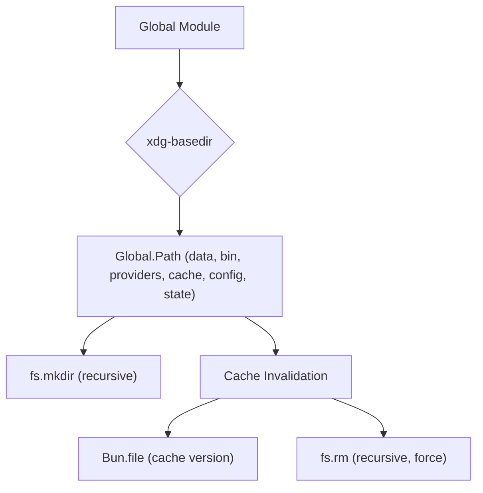

# Global Module

## Overview

The `Global` module (`packages/opencode/src/global/index.ts`) defines and manages global application paths and ensures the existence of necessary directories for data, configuration, and cache. It also handles cache invalidation based on a versioning system.

## Architecture

The module uses `xdg-basedir` to determine platform-specific standard directories for data, cache, config, and state. It then constructs absolute paths for various application-specific subdirectories (e.g., `bin`, `providers`). Upon initialization, it asynchronously creates these directories if they don't exist. It also implements a cache versioning mechanism: if the stored cache version differs from the `CACHE_VERSION` constant, the entire cache directory is removed and recreated.



## Data Models

### Global.Path

An object containing constant absolute paths for various application directories.

**Schema:**

```typescript
export const Path = {
  data,
  bin: path.join(data, "bin"),
  providers: path.join(config, "providers"),
  cache,
  config,
  state,
} as const
```

**Overview:**

- `data`: Base directory for user-specific data.
- `bin`: Directory for application binaries.
- `providers`: Directory for provider configurations.
- `cache`: Base directory for cached data.
- `config`: Base directory for user-specific configuration files.
- `state`: Base directory for application state files.

**Sources:** `packages/opencode/src/global/index.ts:12-19`

## Features

### Directory Initialization

Ensures that all necessary global application directories (data, config, providers, state) exist, creating them recursively if they don't.

**Call graph analysis:**

- `Promise.all` → `fs.mkdir`

**Code example:**

```typescript
// packages/opencode/src/global/index.ts:22-26
await Promise.all([
  fs.mkdir(Global.Path.data, { recursive: true }),
  fs.mkdir(Global.Path.config, { recursive: true }),
  fs.mkdir(Global.Path.providers, { recursive: true }),
  fs.mkdir(Global.Path.state, { recursive: true }),
])
```

**Sources:** `packages/opencode/src/global/index.ts:22-26`

### Cache Invalidation

Manages the application cache by checking a `CACHE_VERSION`. If the current cache version is outdated, the entire cache directory is removed and then recreated, ensuring a clean state for cached data.

**Call graph analysis:**

- `Bun.file().text()`
- `fs.rm`
- `Bun.file().write()`

**Code example:**

```typescript
// packages/opencode/src/global/index.ts:28-36
const CACHE_VERSION = "3"

const version = await Bun.file(path.join(Global.Path.cache, "version"))
  .text()
  .catch(() => "0")

if (version !== CACHE_VERSION) {
  await fs.rm(Global.Path.cache, { recursive: true, force: true })
  await Bun.file(path.join(Global.Path.cache, "version")).write(CACHE_VERSION)
}
```

**Sources:** `packages/opencode/src/global/index.ts:28-36`

## Dependencies

- `fs/promises`: Node.js built-in module for file system operations.
- `xdg-basedir`: For resolving XDG Base Directory Specification paths.
- `path`: Node.js built-in module for path manipulation.
- `bun`: For file operations (`Bun.file`).

**Sources:** `packages/opencode/src/global/index.ts:1-3`

## Consumers

- [App](../app.md): For determining application paths.
- [Config](../config.md): For global configuration paths.
- [Auth](../auth.md): For authentication file paths.
- [Bun](../bun.md): For caching Bun installations.
- [Log](../util/util.md#log): For logging file paths.
- [Ripgrep](../file.md): For file search operations.
- [Fzf](../file.md): For file search operations.
- [LSP](../lsp.md): For language server paths.
- [Session](../session.md): For system prompts.
- [Provider](../provider.md): For provider model paths.

**Sources:** `packages/opencode/src/global/index.ts` (implicit from exports)
