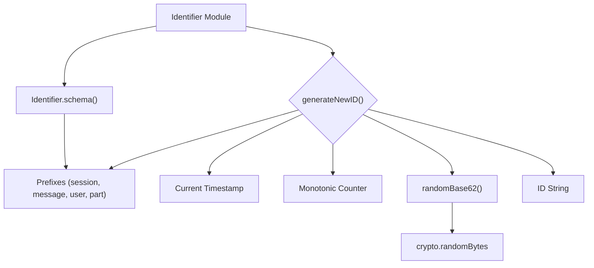

# ID Module

## Overview

The `ID` module (`packages/opencode/src/id/id.ts`) is responsible for generating unique, monotonic, and prefixed identifiers for various entities within the application, such as sessions, messages, users, and parts. It supports both ascending and descending ID generation.

## Architecture

The `ID` module generates identifiers by combining a predefined prefix, a timestamp, and a random component. It maintains internal state (`lastTimestamp`, `counter`) to ensure monotonicity for ascending IDs. The `generateNewID` function constructs the ID using a base62 encoding for the random part and hexadecimal for the timestamp. It also provides Zod schemas for validating these prefixed IDs.



## Data Models

### Identifier.schema

A Zod schema generator for validating identifiers with specific prefixes.

**Schema:**

```typescript
export function schema(prefix: keyof typeof prefixes) {
  return z.string().startsWith(prefixes[prefix])
}
```

**Overview:**

- Takes a `prefix` (e.g., "session", "message") as input.
- Returns a Zod string schema that validates if a string starts with the corresponding predefined prefix (e.g., "ses_", "msg_").

**Sources:** `packages/opencode/src/id/id.ts:13-15`

## Features

### Generate Ascending ID (`Identifier.ascending`)

Generates a new unique identifier that is monotonically increasing, suitable for chronological ordering.

**Code example:**

```typescript
// packages/opencode/src/id/id.ts:22-24
export function ascending(prefix: keyof typeof prefixes, given?: string) {
  return generateID(prefix, false, given)
}
```

**Sources:** `packages/opencode/src/id/id.ts:22-24`

### Generate Descending ID (`Identifier.descending`)

Generates a new unique identifier that is monotonically decreasing, useful for reverse chronological ordering.

**Code example:**

```typescript
// packages/opencode/src/id/id.ts:26-28
export function descending(prefix: keyof typeof prefixes, given?: string) {
  return generateID(prefix, true, given)
}
```

**Sources:** `packages/opencode/src/id/id.ts:26-28`

### Internal ID Generation (`generateNewID`)

This internal function handles the core logic of creating a new unique ID by combining a timestamp, a counter for monotonicity, and a random string. It applies a bitwise NOT operation for descending IDs.

**Call graph analysis:**

- `generateNewID` → `randomBase62`
- `generateNewID` → `crypto.randomBytes` (indirectly via `randomBase62`)

**Code example:**

```typescript
// packages/opencode/src/id/id.ts:52-70
function generateNewID(prefix: keyof typeof prefixes, descending: boolean): string {
  const currentTimestamp = Date.now()

  if (currentTimestamp !== lastTimestamp) {
    lastTimestamp = currentTimestamp
    counter = 0
  }
  counter++

  let now = BigInt(currentTimestamp) * BigInt(0x1000) + BigInt(counter)

  now = descending ? ~now : now

  const timeBytes = Buffer.alloc(6)
  for (let i = 0; i < 6; i++) {
    timeBytes[i] = Number((now >> BigInt(40 - 8 * i)) & BigInt(0xff))
  }

  return prefixes[prefix] + "_" + timeBytes.toString("hex") + randomBase62(LENGTH - 12)
}
```

**Sources:** `packages/opencode/src/id/id.ts:52-70`

## Dependencies

- `zod`: For schema definition and validation.
- `crypto`: Node.js built-in module for cryptographic functionalities, specifically `randomBytes` for generating random components of the ID.

**Sources:** `packages/opencode/src/id/id.ts:1-2`

## Consumers

- [Session](../session.md): For managing sessions and messages.
- [Storage](../storage.md): For storing data with unique identifiers.
- [Tool](../tool.md): For generating IDs for tasks.

**Sources:** `packages/opencode/src/id/id.ts` (implicit from exports)
