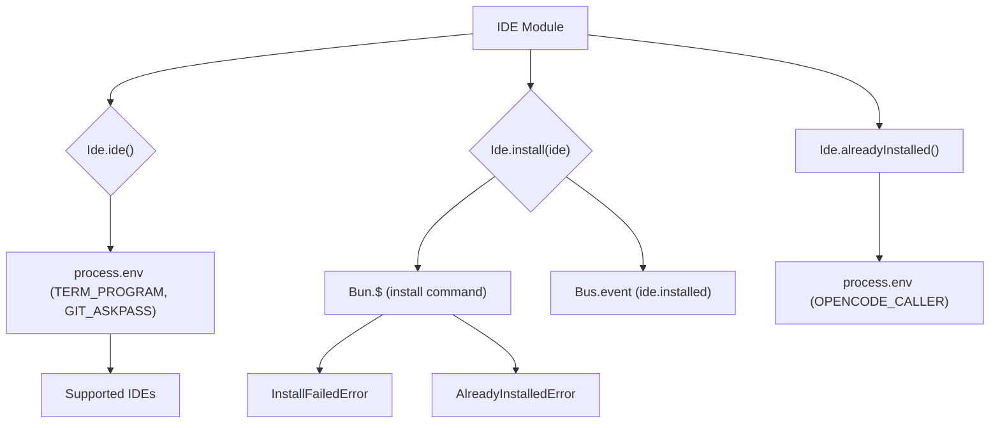

# IDE Module

## Overview

The `IDE` module (`packages/opencode/src/ide/index.ts`) provides functionalities for interacting with various Integrated Development Environments (IDEs), primarily for installing OpenCode extensions. It can detect the current IDE and facilitate the installation process.

## Architecture

The `IDE` module defines a list of `SUPPORTED_IDES` and provides functions to identify the currently running IDE based on environment variables (`TERM_PROGRAM`, `GIT_ASKPASS`). It also offers a mechanism to install the OpenCode extension into a detected IDE by executing specific shell commands. The module defines custom error types for cases where the extension is already installed or installation fails. It publishes an `ide.installed` event upon successful installation.



## Data Models

### Ide.Event.Installed

Represents an event that is published when an IDE extension is successfully installed.

**Schema:**

```typescript
export const Event = {
  Installed: Bus.event(
    "ide.installed",
    z.object({
      ide: z.string(),
    }),
  ),
}
```

**Overview:**

- `ide`: The name of the IDE where the extension was installed.

**Sources:** `packages/opencode/src/ide/index.ts:13-19`

### Ide.AlreadyInstalledError

Represents an error indicating that the OpenCode extension is already installed in the target IDE.

**Schema:**

```typescript
export const AlreadyInstalledError = NamedError.create("AlreadyInstalledError", z.object({}))
```

**Sources:** `packages/opencode/src/ide/index.ts:23`

### Ide.InstallFailedError

Represents an error indicating that the installation of the OpenCode extension failed.

**Schema:**

```typescript
export const InstallFailedError = NamedError.create(
  "InstallFailedError",
  z.object({
    stderr: z.string(),
  }),
)
```

**Overview:**

- `stderr`: The standard error output from the installation command, providing details about the failure.

**Sources:** `packages/opencode/src/ide/index.ts:25-30`

## Features

### Detect Current IDE (`Ide.ide`)

Attempts to detect the currently running IDE based on environment variables. Returns the name of the detected IDE or "unknown" if not recognized.

**Code example:**

```typescript
// packages/opencode/src/ide/index.ts:32-39
export async function ide() {
  if (process.env["TERM_PROGRAM"] === "vscode") {
    const v = process.env["GIT_ASKPASS"]
    for (const ide of SUPPORTED_IDES) {
      if (v?.includes(ide)) return ide
    }
  }
  return "unknown"
}
```

**Sources:** `packages/opencode/src/ide/index.ts:32-39`

### Check if Already Installed (`Ide.alreadyInstalled`)

Checks if the OpenCode extension is already installed by examining the `OPENCODE_CALLER` environment variable.

**Code example:**

```typescript
// packages/opencode/src/ide/index.ts:41-43
export function alreadyInstalled() {
  return process.env["OPENCODE_CALLER"] === "vscode"
}
```

**Sources:** `packages/opencode/src/ide/index.ts:41-43`

### Install IDE Extension (`Ide.install`)

Installs the OpenCode extension into the specified IDE by executing the appropriate command. Throws `AlreadyInstalledError` if the extension is already present or `InstallFailedError` if the installation command fails.

**Call graph analysis:**

- `Ide.install` → `Bun.$`
- `Ide.install` → `NamedError.create` (for `AlreadyInstalledError`, `InstallFailedError`)

**Code example:**

```typescript
// packages/opencode/src/ide/index.ts:45-72
export async function install(ide: Ide) {
  const cmd = (() => {
    switch (ide) {
      case "Windsurf":
        return $`windsurf --install-extension sst-dev.opencode`
      case "Visual Studio Code":
        return $`code --install-extension sst-dev.opencode`
      case "Cursor":
        return $`cursor --install-extension sst-dev.opencode`
      case "VSCodium":
        return $`codium --install-extension sst-dev.opencode`
      default:
        throw new Error(`Unknown IDE: ${ide}`)
    }
  })()
  // TODO: check OPENCODE_CALLER
  const result = await cmd.quiet().throws(false)
  log.info("installed", {
    ide,
    stdout: result.stdout.toString(),
    stderr: result.stderr.toString(),
  })
  if (result.exitCode !== 0)
    throw new InstallFailedError({
      stderr: result.stderr.toString("utf8"),
    })
  if (result.stdout.toString().includes("already installed")) throw new AlreadyInstalledError({})
}
```

**Sources:** `packages/opencode/src/ide/index.ts:45-72`

## Dependencies

- `bun`: For executing shell commands (`$`).
- `zod`: For schema definition and validation.
- `../util/error`: For creating named error types (`NamedError`).
- `../util/log`: For logging events.
- `../bus`: For publishing events (`Bus.event`).

**Sources:** `packages/opencode/src/ide/index.ts:1-5`

## Consumers

The `IDE` module is likely consumed by CLI commands or other parts of the application that need to interact with the user's development environment, such as an `install` command for the OpenCode extension or a feature that adapts its behavior based on the detected IDE.

**Sources:** `packages/opencode/src/ide/index.ts` (implicit from exports)
