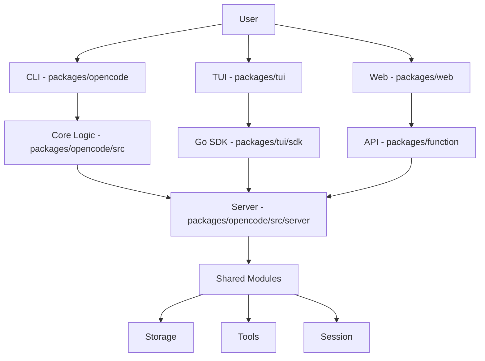

# Codebase Analysis: OpenCode

## Overview

OpenCode is a monorepo project designed to provide a comprehensive set of tools for software development, including a CLI, a TUI (Terminal User Interface), a web interface, and various SDKs. It aims to streamline development workflows and provide a unified experience across different platforms.

## Architecture

The project follows a modular architecture, with different functionalities encapsulated within distinct packages. The core logic resides in the `packages/opencode` directory, which serves as the central hub for the CLI and other shared components. The `packages/tui` provides a rich terminal interface, while `packages/web` offers a web-based interaction. Communication between these components, especially between the Go-based TUI and the TypeScript server, is facilitated through a generated SDK.

## Modules

The `packages/opencode/src` directory contains the following potential modules, grouped by category:

### Core/Foundation
- [App](app.md)
- [Global](global.md)
- [ID](id.md)
- [Util](util.md)

### CLI/User Interface
- [CLI](cli.md)
  - [CLI Commands](cli_commands.md)
- [Format](format.md)
- [IDE](ide.md)
- [Installation](installation.md)

### System/Infrastructure
- [Bun](bun.md)
- [Bus](bus.md)
- [Config](config.md)
- [File](file.md)
- [Flag](flag.md)
- [LSP](lsp.md)
- [MCP](mcp.md)
- [Permission](permission.md)
- [Provider](provider.md)
- [Server](server.md)
- [Session](session.md)
- [Share](share.md)
- [Snapshot](snapshot.md)
- [Storage](storage.md)
- [Tool](tool.md)
- [Trace](trace.md)

### Security/Authentication
- [Auth](auth.md)

## Also see

- [Development Guide](development.md)
- [Stories Document](stories.md)
- [FAQ Document](faq.md)

**Sources:** `packages/opencode/src`, `packages/tui`, `packages/web`, `packages/function`, `packages/opencode/AGENTS.md`, `packages/tui/sdk`
