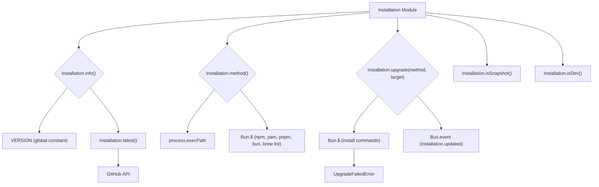

# Installation Module

## Overview

The `Installation` module (`packages/opencode/src/installation/index.ts`) provides functionalities related to the OpenCode application's installation, version management, and upgrade processes. It can determine the installation method, check for the latest version, and facilitate upgrades.

## Architecture

The `Installation` module exposes functions to retrieve information about the current OpenCode version, check if it's a development or snapshot build, and determine the method by which it was installed (e.g., `curl`, `npm`, `brew`). It can also fetch the latest release version from GitHub. For upgrades, it constructs and executes appropriate shell commands based on the detected installation method. It defines an `installation.updated` event that is published upon successful updates.



## Data Models

### Installation.Event.Updated

Represents an event that is published when the OpenCode installation is updated.

**Schema:**

```typescript
export const Event = {
  Updated: Bus.event(
    "installation.updated",
    z.object({
      version: z.string(),
    }),
  ),
}
```

**Overview:**

- `version`: The new version of the OpenCode application.

**Sources:** `packages/opencode/src/installation/index.ts:16-22`

### Installation.Info

Represents information about the current OpenCode installation.

**Schema:**

```typescript
export const Info = z
  .object({
    version: z.string(),
    latest: z.string(),
  })
  .openapi({
    ref: "InstallationInfo",
  })
export type Info = z.infer<typeof Info>
```

**Overview:**

- `version`: The current installed version of OpenCode.
- `latest`: The latest available version of OpenCode.

**Sources:** `packages/opencode/src/installation/index.ts:24-31`

### Installation.UpgradeFailedError

Represents an error that occurs when an OpenCode upgrade fails.

**Schema:**

```typescript
export const UpgradeFailedError = NamedError.create(
  "UpgradeFailedError",
  z.object({
    stderr: z.string(),
  }),
)
```

**Overview:**

- `stderr`: The standard error output from the upgrade command, providing details about the failure.

**Sources:** `packages/opencode/src/installation/index.ts:90-95`

## Features

### Get Installation Information (`Installation.info`)

Retrieves the current and latest available versions of OpenCode.

**Call graph analysis:**

- `Installation.info` → `Installation.latest()`

**Code example:**

```typescript
// packages/opencode/src/installation/index.ts:33-38
export async function info() {
  return {
    version: VERSION,
    latest: await latest(),
  }
}
```

**Sources:** `packages/opencode/src/installation/index.ts:33-38`

### Determine Installation Method (`Installation.method`)

Attempts to determine how OpenCode was installed (e.g., `curl`, `npm`, `brew`) by checking `process.execPath` and running various package manager commands.

**Call graph analysis:**

- `Installation.method` → `Bun.$` (for `npm list`, `yarn global list`, `pnpm list`, `bun pm ls`, `brew list`)

**Code example:**

```typescript
// packages/opencode/src/installation/index.ts:46-87
export async function method() {
  if (process.execPath.includes(path.join(".opencode", "bin"))) return "curl"
  const exec = process.execPath.toLowerCase()

  const checks = [
    {
      name: "npm" as const,
      command: () => $`npm list -g --depth=0`.throws(false).text(),
    },
    {
      name: "yarn" as const,
      command: () => $`yarn global list`.throws(false).text(),
    },
    {
      name: "pnpm" as const,
      command: () => $`pnpm list -g --depth=0`.throws(false).text(),
    },
    {
      name: "bun" as const,
      command: () => $`bun pm ls -g`.throws(false).text(),
    },
    {
      name: "brew" as const,
      command: () => $`brew list --formula opencode-ai`.throws(false).text(),
    },
  ]

  checks.sort((a, b) => {
    const aMatches = exec.includes(a.name)
    const bMatches = exec.includes(b.name)
    if (aMatches && !bMatches) return -1
    if (!aMatches && bMatches) return 1
    return 0
  })

  for (const check of checks) {
    const output = await check.command()
    if (output.includes("opencode-ai")) {
      return check.name
    }
  }

  return "unknown"
}
```

**Sources:** `packages/opencode/src/installation/index.ts:46-87`

### Upgrade OpenCode (`Installation.upgrade`)

Upgrades the OpenCode application to a specified target version using the determined installation method. Throws `UpgradeFailedError` if the upgrade command fails.

**Call graph analysis:**

- `Installation.upgrade` → `Bun.$`
- `Installation.upgrade` → `NamedError.create` (for `UpgradeFailedError`)

**Code example:**

```typescript
// packages/opencode/src/installation/index.ts:97-134
export async function upgrade(method: Method, target: string) {
  const cmd = (() => {
    switch (method) {
      case "curl":
        return $`curl -fsSL https://opencode.ai/install | bash`.env({
          ...process.env,
          VERSION: target,
        })
      case "npm":
        return $`npm install -g opencode-ai@${target}`
      case "pnpm":
        return $`pnpm install -g opencode-ai@${target}`
      case "bun":
        return $`bun install -g opencode-ai@${target}`
      case "brew":
        return $`brew install sst/tap/opencode`.env({
          HOMEBREW_NO_AUTO_UPDATE: "1",
        })
      default:
        throw new Error(`Unknown method: ${method}`)
    }
  })()
  const result = await cmd.quiet().throws(false)
  log.info("upgraded", {
    method,
    target,
    stdout: result.stdout.toString(),
    stderr: result.stderr.toString(),
  })
  if (result.exitCode !== 0)
    throw new UpgradeFailedError({
      stderr: result.stderr.toString("utf8"),
    })
}
```

**Sources:** `packages/opencode/src/installation/index.ts:97-134`

### Get Latest Version (`Installation.latest`)

Fetches the latest release version of OpenCode from the GitHub API.

**Code example:**

```typescript
// packages/opencode/src/installation/index.ts:138-146
export async function latest() {
  return fetch("https://api.github.com/repos/sst/opencode/releases/latest")
    .then((res) => res.json())
    .then((data) => {
      if (typeof data.tag_name !== "string") {
        log.error("GitHub API error", data)
        throw new Error("failed to fetch latest version")
      }
      return data.tag_name.slice(1) as string
    })
}
```

**Sources:** `packages/opencode/src/installation/index.ts:138-146`

## Dependencies

- `path`: Node.js built-in module for path manipulation.
- `bun`: For executing shell commands (`$`) and file operations (`Bun.file`).
- `zod`: For schema definition and validation.
- `../util/error`: For creating named error types (`NamedError`).
- `../bus`: For publishing events (`Bus.event`).
- `../util/log`: For logging events.

**Sources:** `packages/opencode/src/installation/index.ts:1-6`

## Consumers

The `Installation` module is likely consumed by CLI commands related to version management, updates, and potentially by the application's bootstrapping process to check for updates or ensure a valid installation.

**Sources:** `packages/opencode/src/installation/index.ts` (implicit from exports)
