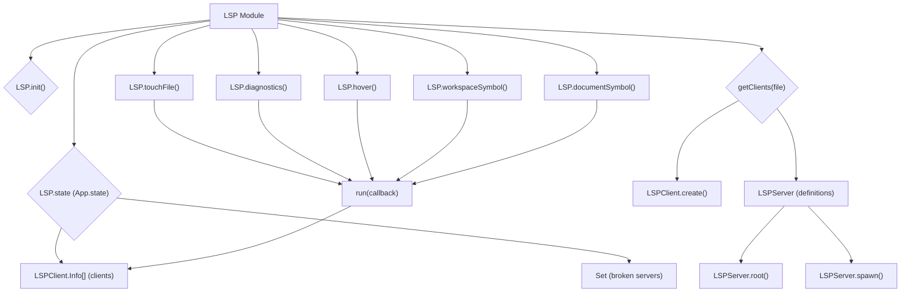

# LSP Module

## Overview

The `LSP` module (`packages/opencode/src/lsp/index.ts`) provides Language Server Protocol (LSP) client functionalities, enabling the OpenCode application to interact with various language servers. This allows for features like diagnostics, hover information, and symbol lookup within codebases.

## Architecture

The `LSP` module manages a collection of `LSPClient` instances, each representing a connection to a specific language server for a given project root. It maintains a state of active and broken LSP client connections. When a file is touched or diagnostics are requested, it identifies the relevant language server based on file extension and project root, spawns a new server process if necessary, and then routes the request to the appropriate client. It defines Zod schemas for common LSP data structures like `Range`, `Symbol`, and `DocumentSymbol`.



## Data Models

### LSP.Range

Represents a range within a text document, typically used for defining the start and end positions of code elements.

**Schema:**

```typescript
export const Range = z
  .object({
    start: z.object({
      line: z.number(),
      character: z.number(),
    }),
    end: z.object({
      line: z.number(),
      character: z.number(),
    }),
  })
  .openapi({
    ref: "Range",
  })
export type Range = z.infer<typeof Range>
```

**Sources:** `packages/opencode/src/lsp/index.ts:11-24`

### LSP.Symbol

Represents a symbol found in a workspace or document, including its name, kind, and location.

**Schema:**

```typescript
export const Symbol = z
  .object({
    name: z.string(),
    kind: z.number(),
    location: z.object({
      uri: z.string(),
      range: Range,
    }),
  })
  .openapi({
    ref: "Symbol",
  })
export type Symbol = z.infer<typeof Symbol>
```

**Sources:** `packages/opencode/src/lsp/index.ts:26-39`

### LSP.DocumentSymbol

Represents a symbol found within a single document, providing more detail than `LSP.Symbol`.

**Schema:**

```typescript
export const DocumentSymbol = z
  .object({
    name: z.string(),
    detail: z.string().optional(),
    kind: z.number(),
    range: Range,
    selectionRange: Range,
  })
  .openapi({
    ref: "DocumentSymbol",
  })
export type DocumentSymbol = z.infer<typeof DocumentSymbol>
```

**Sources:** `packages/opencode/src/lsp/index.ts:41-54`

## Features

### Initialize LSP State (`LSP.init`)

Initializes the LSP module's internal state, including the list of active LSP clients and a set of broken server roots. It also sets up a shutdown hook to gracefully terminate LSP client connections.

**Code example:**

```typescript
// packages/opencode/src/lsp/index.ts:56-70
const state = App.state(
  "lsp",
  async () => {
    const clients: LSPClient.Info[] = []
    return {
      broken: new Set<string>(),
      clients,
    }
  },
  async (state) => {
    for (const client of state.clients) {
      await client.shutdown()
    }
  },
)

export async function init() {
  return state()
}
```

**Sources:** `packages/opencode/src/lsp/index.ts:56-70`

### Touch File (`LSP.touchFile`)

Notifies the relevant LSP server(s) that a file has been opened or changed. Optionally waits for diagnostics to be available after the file is touched.

**Call graph analysis:**

- `LSP.touchFile` → `getClients`
- `LSP.touchFile` → `LSPClient.notify.open`
- `LSP.touchFile` → `LSPClient.waitForDiagnostics`

**Code example:**

```typescript
// packages/opencode/src/lsp/index.ts:114-121
export async function touchFile(input: string, waitForDiagnostics?: boolean) {
  const clients = await getClients(input)
  await run(async (client) => {
    if (!clients.includes(client)) return
    const wait = waitForDiagnostics ? client.waitForDiagnostics({ path: input }) : Promise.resolve()
    await client.notify.open({ path: input })
    return wait
  })
}
```

**Sources:** `packages/opencode/src/lsp/index.ts:114-121`

### Get Diagnostics (`LSP.diagnostics`)

Retrieves diagnostic information (errors, warnings, etc.) from all active LSP clients.

**Call graph analysis:**

- `LSP.diagnostics` → `run`
- `LSP.diagnostics` → `LSPClient.diagnostics`

**Code example:**

```typescript
// packages/opencode/src/lsp/index.ts:123-134
export async function diagnostics() {
  const results: Record<string, LSPClient.Diagnostic[]> = {}
  for (const result of await run(async (client) => client.diagnostics)) {
    for (const [path, diagnostics] of result.entries()) {
      const arr = results[path] || []
      arr.push(...diagnostics)
      results[path] = arr
    }
  }
  return results
}
```

**Sources:** `packages/opencode/src/lsp/index.ts:123-134`

### Get Hover Information (`LSP.hover`)

Retrieves hover information (e.g., type definitions, documentation) for a specific position in a file.

**Call graph analysis:**

- `LSP.hover` → `run`
- `LSP.hover` → `LSPClient.connection.sendRequest("textDocument/hover")`

**Code example:**

```typescript
// packages/opencode/src/lsp/index.ts:136-149
export async function hover(input: { file: string; line: number; character: number }) {
  return run((client) => {
    return client.connection.sendRequest("textDocument/hover", {
      textDocument: {
        uri: `file://${input.file}`,
      },
      position: {
        line: input.line,
        character: input.character,
      },
    })
  })
}
```

**Sources:** `packages/opencode/src/lsp/index.ts:136-149`

### Search Workspace Symbols (`LSP.workspaceSymbol`)

Searches for symbols (e.g., classes, functions, variables) across the entire workspace that match a given query.

**Call graph analysis:**

- `LSP.workspaceSymbol` → `run`
- `LSP.workspaceSymbol` → `LSPClient.connection.sendRequest("workspace/symbol")`

**Code example:**

```typescript
// packages/opencode/src/lsp/index.ts:182-191
export async function workspaceSymbol(query: string) {
  return run((client) =>
    client.connection
      .sendRequest("workspace/symbol", {
        query,
      })
      .then((result: any) => result.filter((x: LSP.Symbol) => kinds.includes(x.kind)))
      .then((result: any) => result.slice(0, 10))
      .catch(() => []),
  ).then((result) => result.flat() as LSP.Symbol[])
}
```

**Sources:** `packages/opencode/src/lsp/index.ts:182-191`

### Get Document Symbols (`LSP.documentSymbol`)

Retrieves a hierarchical outline of symbols defined within a specific document.

**Call graph analysis:**

- `LSP.documentSymbol` → `run`
- `LSP.documentSymbol` → `LSPClient.connection.sendRequest("textDocument/documentSymbol")`

**Code example:**

```typescript
// packages/opencode/src/lsp/index.ts:193-203
export async function documentSymbol(uri: string) {
  return run((client) =>
    client.connection
      .sendRequest("textDocument/documentSymbol", {
        textDocument: {
          uri,
        },
      })
      .catch(() => []),
  )
    .then((result) => result.flat() as (LSP.DocumentSymbol | LSP.Symbol)[])
    .then((result) => result.filter(Boolean))
}
```

**Sources:** `packages/opencode/src/lsp/index.ts:193-203`

## Dependencies

- `../app/app`: For managing LSP client state and accessing application information.
- `../util/log`: For logging LSP-related events.
- `./client`: The `LSPClient` module, responsible for managing individual LSP connections.
- `path`: Node.js built-in module for path manipulation.
- `./server`: The `LSPServer` module, defining available language servers.
- `zod`: For schema definition and validation of LSP data structures.

**Sources:** `packages/opencode/src/lsp/index.ts:1-6`

## Consumers

The `LSP` module is consumed by features that require code intelligence, such as IDE integrations, code editors, or tools that perform static analysis. The `CLI` module's `bootstrap.ts` initializes the LSP module.

**Sources:** `packages/opencode/src/lsp/index.ts` (implicit from exports)
