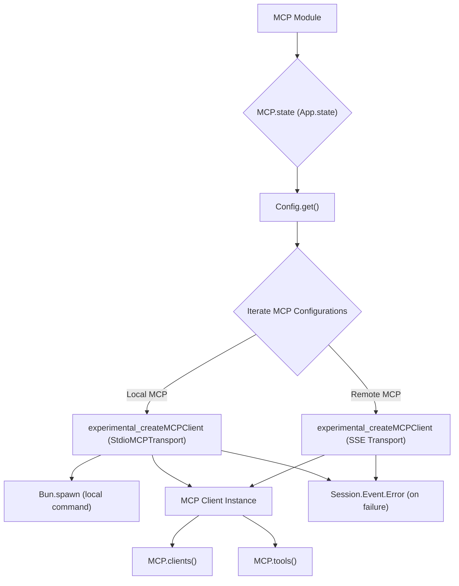

# MCP Module

## Overview

The `MCP` module (`packages/opencode/src/mcp/index.ts`) is responsible for managing connections to Model Context Protocol (MCP) servers. It supports both local (spawned process) and remote (SSE-based) MCP server connections, allowing the application to interact with various AI models and tools provided by these servers.

## Architecture

The `MCP` module uses `App.state` to manage its internal state, which includes a map of active MCP clients. Upon initialization, it reads MCP server configurations from the `Config` module. For each configured MCP server, it attempts to create an `experimental_createMCPClient` instance, either by spawning a local command or connecting to a remote URL. It handles potential connection failures and logs relevant information. It also provides functions to retrieve active MCP clients and their exposed tools.



## Data Models

### MCP.Failed

Represents an error indicating that an MCP server failed to start or connect.

**Schema:**

```typescript
export const Failed = NamedError.create(
  "MCPFailed",
  z.object({
    name: z.string(),
  }),
)
```

**Overview:**

- `name`: The name of the MCP server that failed.

**Sources:** `packages/opencode/src/mcp/index.ts:14-19`

## Features

### MCP Client Management (`MCP.state`)

Initializes and manages the lifecycle of MCP client connections. It reads configurations, attempts to establish connections to local or remote MCP servers, and ensures that clients are properly closed when the application shuts down.

**Call graph analysis:**

- `MCP.state` → `Config.get()`
- `MCP.state` → `experimental_createMCPClient`
- `MCP.state` → `Experimental_StdioMCPTransport`
- `MCP.state` → `Bus.publish(Session.Event.Error)`
- `MCP.state` → `client.close()` (on shutdown)

**Code example (simplified):**

```typescript
// packages/opencode/src/mcp/index.ts:21-90
const state = App.state(
  "mcp",
  async () => {
    const cfg = await Config.get()
    const clients: {
      [name: string]: Awaited<ReturnType<typeof experimental_createMCPClient>>
    } = {}
    for (const [key, mcp] of Object.entries(cfg.mcp ?? {})) {
      if (mcp.enabled === false) {
        log.info("mcp server disabled", { key })
        continue
      }
      log.info("found", { key, type: mcp.type })
      if (mcp.type === "remote") {
        const client = await experimental_createMCPClient({
          name: key,
          transport: {
            type: "sse",
            url: mcp.url,
            headers: mcp.headers,
          },
        }).catch(() => {})
        if (!client) {
          Bus.publish(Session.Event.Error, {
            error: {
              name: "UnknownError",
              data: {
                message: `MCP server ${key} failed to start`,
              },
            },
          })
          continue
        }
        clients[key] = client
      }

      if (mcp.type === "local") {
        const [cmd, ...args] = mcp.command
        const client = await experimental_createMCPClient({
          name: key,
          transport: new Experimental_StdioMCPTransport({
            stderr: "ignore",
            command: cmd,
            args,
            env: {
              ...process.env,
              ...(cmd === "opencode" ? { BUN_BE_BUN: "1" } : {}),
              ...mcp.environment,
            },
          }),
        }).catch(() => {})
        if (!client) {
          Bus.publish(Session.Event.Error, {
            error: {
              name: "UnknownError",
              data: {
                message: `MCP server ${key} failed to start`,
              },
            },
          })
          continue
        }
        clients[key] = client
      }
    }

    return {
      clients,
    }
  },
  async (state) => {
    for (const client of Object.values(state.clients)) {
      client.close()
    }
  },
)
```

**Sources:** `packages/opencode/src/mcp/index.ts:21-90`

### Get MCP Clients (`MCP.clients`)

Retrieves a map of active MCP client instances.

**Code example:**

```typescript
// packages/opencode/src/mcp/index.ts:92-94
export async function clients() {
  return state().then((state) => state.clients)
}
```

**Sources:** `packages/opencode/src/mcp/index.ts:92-94`

### Get All Tools from MCP Clients (`MCP.tools`)

Aggregates and returns all tools exposed by the connected MCP clients, prefixing tool names with the client name to ensure uniqueness.

**Call graph analysis:**

- `MCP.tools` → `MCP.clients()`
- `MCP.tools` → `client.tools()`

**Code example:**

```typescript
// packages/opencode/src/mcp/index.ts:96-104
export async function tools() {
  const result: Record<string, Tool> = {}
  for (const [clientName, client] of Object.entries(await clients())) {
    for (const [toolName, tool] of Object.entries(await client.tools())) {
      result[clientName + "_" + toolName] = tool
    }
  }
  return result
}
```

**Sources:** `packages/opencode/src/mcp/index.ts:96-104`

## Dependencies

- `ai`: For `experimental_createMCPClient` and `Tool` types.
- `ai/mcp-stdio`: For `Experimental_StdioMCPTransport` to handle local MCP server processes.
- `../app/app`: For managing MCP client state (`App.state`).
- `../config/config`: For reading MCP server configurations.
- `../util/log`: For logging events.
- `../util/error`: For creating named error types (`NamedError`).
- `zod`: For schema definition and validation.
- `../session`: For publishing session-related events (e.g., errors).
- `../bus`: For publishing events.

**Sources:** `packages/opencode/src/mcp/index.ts:1-9`

## Consumers

The `MCP` module is a critical component for any part of the application that needs to interact with AI models or tools provided by MCP servers. This likely includes the core AI agent logic, command-line tools that leverage AI capabilities, and potentially the TUI or web interface for displaying AI responses or tool outputs.

**Sources:** `packages/opencode/src/mcp/index.ts` (implicit from exports)
