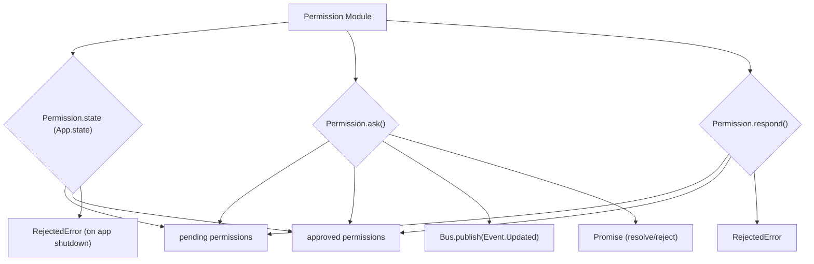

# Permission Module

## Overview

The `Permission` module (`packages/opencode/src/permission/index.ts`) is designed to manage user permissions for various actions within the application. It provides a mechanism to ask for, approve, or reject permissions, and to remember user choices for future interactions.

## Architecture

The `Permission` module maintains a state of pending and approved permissions using `App.state`. When a permission is requested via `Permission.ask`, it creates a new promise that resolves upon approval or rejects upon denial. If a permission was previously approved (`"always"` response), it's automatically granted. The module publishes `permission.updated` events through the `Bus` to notify other parts of the application about changes in permission status. It also defines a `RejectedError` for when a permission request is denied.



## Data Models

### Permission.Info

Represents the details of a permission request.

**Schema:**

```typescript
export const Info = z
  .object({
    id: z.string(),
    sessionID: z.string(),
    title: z.string(),
    metadata: z.record(z.any()),
    time: z.object({
      created: z.number(),
    }),
  })
  .openapi({
    ref: "permission.info",
  })
export type Info = z.infer<typeof Info>
```

**Overview:**

- `id`: A unique identifier for the permission request.
- `sessionID`: The ID of the session associated with the permission request.
- `title`: A human-readable title for the permission request.
- `metadata`: Additional metadata related to the permission request.
- `time.created`: Timestamp when the permission request was created.

**Sources:** `packages/opencode/src/permission/index.ts:9-21`

### Permission.Event.Updated

Represents an event that is published when a permission's status is updated.

**Schema:**

```typescript
export const Event = {
  Updated: Bus.event("permission.updated", Info),
}
```

**Overview:**

- `Info`: The `Permission.Info` object containing the updated permission details.

**Sources:** `packages/opencode/src/permission/index.ts:25-27`

## Features

### Ask for Permission (`Permission.ask`)

Initiates a permission request. If the permission was previously approved with an "always" response, it's granted immediately. Otherwise, it creates a pending permission and publishes an update event.

**Code example:**

```typescript
// packages/opencode/src/permission/index.ts:62-99
export function ask(input: {
  id: Info["id"]
  sessionID: Info["sessionID"]
  title: Info["title"]
  metadata: Info["metadata"]
}) {
  return
  const { pending, approved } = state()
  log.info("asking", {
    sessionID: input.sessionID,
    permissionID: input.id,
  })
  if (approved[input.sessionID]?.[input.id]) {
    log.info("previously approved", {
      sessionID: input.sessionID,
      permissionID: input.id,
    })
    return
  }
  const info: Info = {
    id: input.id,
    sessionID: input.sessionID,
    title: input.title,
    metadata: input.metadata,
    time: {
      created: Date.now(),
    },
  }
  pending[input.sessionID] = pending[input.sessionID] || {}
  return new Promise<void>((resolve, reject) => {
    pending[input.sessionID][input.id] = {
      info,
      resolve,
      reject,
    }
    setTimeout(() => {
      respond({
        sessionID: input.sessionID,
        permissionID: input.id,
        response: "always",
      })
    }, 1000)
    Bus.publish(Event.Updated, info)
  })
}
```

**Sources:** `packages/opencode/src/permission/index.ts:62-99`

### Respond to Permission (`Permission.respond`)

Handles a response to a pending permission request. It can approve the request (either once or always) or reject it. If approved with "always", the permission is stored as approved for future requests.

**Code example:**

```typescript
// packages/opencode/src/permission/index.ts:101-122
export function respond(input: {
  sessionID: Info["sessionID"]
  permissionID: Info["id"]
  response: "once" | "always" | "reject"
}) {
  log.info("response", input)
  const { pending, approved } = state()
  const match = pending[input.sessionID]?.[input.permissionID]
  if (!match) return
  delete pending[input.sessionID][input.permissionID]
  if (input.response === "reject") {
    match.reject(new RejectedError(input.sessionID, input.permissionID))
    return
  }
  match.resolve()
  if (input.response === "always") {
    approved[input.sessionID] = approved[input.sessionID] || {}
    approved[input.sessionID][input.permissionID] = match.info
  }
}
```

**Sources:** `packages/opencode/src/permission/index.ts:101-122`

### RejectedError

A custom error class thrown when a permission request is rejected by the user or the system.

**Code example:**

```typescript
// packages/opencode/src/permission/index.ts:124-130
export class RejectedError extends Error {
  constructor(
    public readonly sessionID: string,
    public readonly permissionID: string,
  ) {
    super(`The user rejected permission to use this functionality`)
  }
}
```

**Sources:** `packages/opencode/src/permission/index.ts:124-130`

## Dependencies

- `../app/app`: For managing the module's state (`App.state`).
- `zod`: For schema definition and validation.
- `../bus`: For publishing permission-related events.
- `../util/log`: For logging events.

**Sources:** `packages/opencode/src/permission/index.ts:1-4`

## Consumers

Any module or feature that requires explicit user consent before performing certain actions will consume the `Permission` module. This could include sensitive operations, access to certain resources, or actions that have significant side effects.

**Sources:** `packages/opencode/src/permission/index.ts` (implicit from exports)
