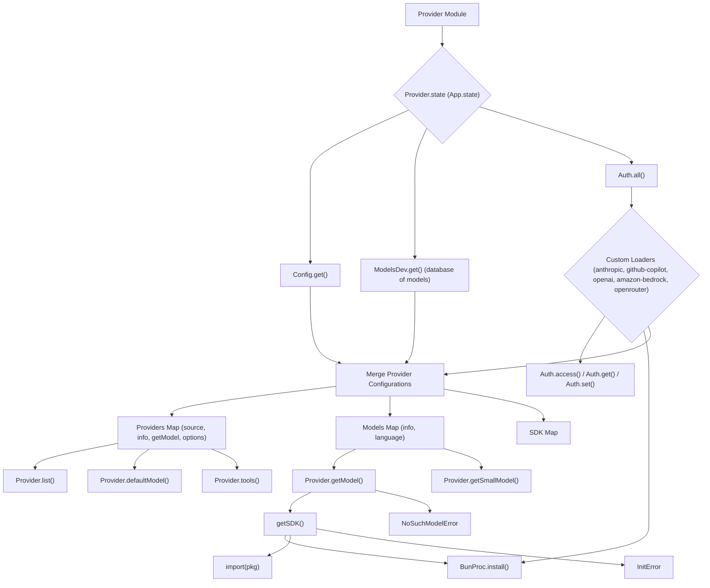

# Provider Module

## Overview

The `Provider` module (`packages/opencode/src/provider/provider.ts`) is responsible for managing and interacting with various language model providers (e.g., Anthropic, GitHub Copilot, OpenAI, Amazon Bedrock, OpenRouter). It handles loading provider configurations, authenticating with providers, retrieving language models, and exposing available tools.

## Architecture

The `Provider` module maintains a state of loaded providers and their associated language models. It integrates with the `Config` module to load provider-specific settings and with the `Auth` module for authentication. It dynamically loads SDKs for each provider using `BunProc.install` and provides a unified interface to access language models and tools. It also includes logic for handling different authentication methods (API keys, OAuth) and for sanitizing tool parameters for specific models (e.g., Gemini).



## Data Models

### ModelsDev.Provider

Represents the configuration and metadata for a language model provider.

**Schema (simplified, see `packages/opencode/src/provider/models.ts` for full schema):**

```typescript
interface Provider {
  id: string;
  npm?: string;
  name?: string;
  env: string[];
  api?: string;
  models: Record<string, Model>;
}
```

**Overview:**

- `id`: Unique identifier for the provider.
- `npm`: Optional npm package name for the provider's SDK.
- `name`: Display name of the provider.
- `env`: Array of environment variable names used for authentication.
- `api`: Base URL for the provider's API.
- `models`: A record of models supported by this provider.

**Sources:** `packages/opencode/src/provider/models.ts` (implicit, as it's imported)

### ModelsDev.Model

Represents the configuration and metadata for a specific language model.

**Schema (simplified, see `packages/opencode/src/provider/models.ts` for full schema):**

```typescript
interface Model {
  id: string;
  name?: string;
  release_date?: string;
  attachment?: boolean;
  reasoning?: boolean;
  temperature?: boolean;
  tool_call?: boolean;
  cost: {
    input: number;
    output: number;
    cache_read: number;
    cache_write: number;
  };
  options?: Record<string, any>;
  limit?: {
    context: number;
    output: number;
  };
}
```

**Overview:**

- `id`: Unique identifier for the model.
- `name`: Display name of the model.
- `release_date`: Release date of the model.
- `attachment`: Indicates if the model supports attachments.
- `reasoning`: Indicates if the model supports reasoning.
- `temperature`: Indicates if the model supports temperature parameter.
- `tool_call`: Indicates if the model supports tool calls.
- `cost`: Cost information for input, output, cache read, and cache write.
- `options`: Additional model-specific options.
- `limit`: Context and output token limits.

**Sources:** `packages/opencode/src/provider/models.ts` (implicit, as it's imported)

### Provider.ModelNotFoundError

Represents an error indicating that a requested model was not found.

**Schema:**

```typescript
export const ModelNotFoundError = NamedError.create(
  "ProviderModelNotFoundError",
  z.object({
    providerID: z.string(),
    modelID: z.string(),
  }),
)
```

**Sources:** `packages/opencode/src/provider/provider.ts:400-405`

### Provider.InitError

Represents an error that occurs during the initialization of a provider's SDK.

**Schema:**

```typescript
export const InitError = NamedError.create(
  "ProviderInitError",
  z.object({
    providerID: z.string(),
  }),
)
```

**Sources:** `packages/opencode/src/provider/provider.ts:407-411`

## Features

### List Available Providers (`Provider.list`)

Returns a map of all configured and loaded language model providers.

**Code example:**

```typescript
// packages/opencode/src/provider/provider.ts:299-301
export async function list() {
  return state().then((state) => state.providers)
}
```

**Sources:** `packages/opencode/src/provider/provider.ts:299-301`

### Get Language Model (`Provider.getModel`)

Retrieves a specific language model from a provider. It handles caching of models and dynamically loads provider SDKs if necessary.

**Call graph analysis:**

- `Provider.getModel` → `Provider.state()`
- `Provider.getModel` → `getSDK()`
- `Provider.getModel` → `sdk.languageModel()`
- `Provider.getModel` → `NoSuchModelError`
- `Provider.getModel` → `ModelNotFoundError`

**Code example:**

```typescript
// packages/opencode/src/provider/provider.ts:316-354
export async function getModel(providerID: string, modelID: string) {
  const key = `${providerID}/${modelID}`
  const s = await state()
  if (s.models.has(key)) return s.models.get(key)!

  log.info("getModel", {
    providerID,
    modelID,
  })

  const provider = s.providers[providerID]
  if (!provider) throw new ModelNotFoundError({ providerID, modelID })
  const info = provider.info.models[modelID]
  if (!info) throw new ModelNotFoundError({ providerID, modelID })
  const sdk = await getSDK(provider.info)

  try {
    const language = provider.getModel ? await provider.getModel(sdk, modelID) : sdk.languageModel(modelID)
    log.info("found", { providerID, modelID })
    s.models.set(key, {
      info,
      language,
    })
    return {
      info,
      language,
    }
  } catch (e) {
    if (e instanceof NoSuchModelError)
      throw new ModelNotFoundError(
        {
          modelID: modelID,
          providerID,
        },
        { cause: e },
      )
    throw e
  }
}
```

**Sources:** `packages/opencode/src/provider/provider.ts:316-354`

### Get Small Model (`Provider.getSmallModel`)

Attempts to retrieve a smaller, more efficient model for tasks like summarization or title generation, prioritizing models specified in the configuration or a predefined list.

**Call graph analysis:**

- `Provider.getSmallModel` → `Config.get()`
- `Provider.getSmallModel` → `parseModel()`
- `Provider.getSmallModel` → `getModel()`
- `Provider.getSmallModel` → `Provider.state()`

**Code example:**

```typescript
// packages/opencode/src/provider/provider.ts:356-374
export async function getSmallModel(providerID: string) {
  const cfg = await Config.get()

  if (cfg.small_model) {
    const parsed = parseModel(cfg.small_model)
    return getModel(parsed.providerID, parsed.modelID)
  }

  const provider = await state().then((state) => state.providers[providerID])
  if (!provider) return
  const priority = ["3-5-haiku", "3.5-haiku", "gemini-2.5-flash"]
  for (const item of priority) {
    for (const model of Object.keys(provider.info.models)) {
      if (model.includes(item)) return getModel(providerID, model)
    }
  }
}
```

**Sources:** `packages/opencode/src/provider/provider.ts:356-374`

### Get Default Model (`Provider.defaultModel`)

Determines the default language model to use based on configuration or by selecting the highest-priority model from available providers.

**Call graph analysis:**

- `Provider.defaultModel` → `Config.get()`
- `Provider.defaultModel` → `list()`
- `Provider.defaultModel` → `sort()`
- `Provider.defaultModel` → `parseModel()`

**Code example:**

```typescript
// packages/opencode/src/provider/provider.ts:384-397
export async function defaultModel() {
  const cfg = await Config.get()
  if (cfg.model) return parseModel(cfg.model)
  const provider = await list()
    .then((val) => Object.values(val))
    .then((x) => x.find((p) => !cfg.provider || Object.keys(cfg.provider).includes(p.info.id)))
  if (!provider) throw new Error("no providers found")
  const [model] = sort(Object.values(provider.info.models))
  if (!model) throw new Error("no models found")
  return {
    providerID: provider.info.id,
    modelID: model.id,
  }
}
```

**Sources:** `packages/opencode/src/provider/provider.ts:384-397`

### Parse Model String (`Provider.parseModel`)

Parses a model string (e.g., "anthropic/claude-2") into its `providerID` and `modelID` components.

**Code example:**

```typescript
// packages/opencode/src/provider/provider.ts:399-404
export function parseModel(model: string) {
  const [providerID, ...rest] = model.split("/")
  return {
    providerID: providerID,
    modelID: rest.join("/"),
  }
}
```

**Sources:** `packages/opencode/src/provider/provider.ts:399-404`

### Get Provider Tools (`Provider.tools`)

Returns a list of tools available for a given provider, with special handling for certain providers (e.g., Anthropic, OpenAI, Azure, Google).

**Code example:**

```typescript
// packages/opencode/src/provider/provider.ts:436-443
export async function tools(providerID: string) {
  /*
  const cfg = await Config.get()
  if (cfg.tool?.provider?.[providerID])
    return cfg.tool.provider[providerID].map(
      (id) => TOOLS.find((t) => t.id === id)!,
    )
      */
  return TOOL_MAPPING[providerID] ?? TOOLS
}
```

**Sources:** `packages/opencode/src/provider/provider.ts:436-443`

## Dependencies

- `zod`: For schema definition and validation.
- `../app/app`: For managing provider state (`App.state`).
- `../config/config`: For loading provider configurations.
- `remeda`: For utility functions like `mergeDeep` and `sortBy`.
- `ai`: For `LanguageModel` and `Provider` types from the AI SDK.
- `../util/log`: For logging events.
- `../bun`: For installing provider SDKs (`BunProc.install`).
- `../tool/*`: Various tool modules (e.g., `BashTool`, `EditTool`, `WebFetchTool`) that can be exposed by providers.
- `../auth/anthropic`: For Anthropic authentication.
- `../auth/copilot`: For GitHub Copilot authentication.
- `./models`: For `ModelsDev` schemas and data.
- `../util/error`: For creating named error types (`NamedError`).
- `../auth`: For general authentication utilities.

**Sources:** `packages/opencode/src/provider/provider.ts:1-25`

## Consumers

The `Provider` module is a core component consumed by any part of the application that needs to interact with language models or their associated tools. This includes the main AI agent logic, CLI commands that utilize models (e.g., `opencode models`), and potentially the TUI or web interface for displaying model responses or tool outputs.

**Sources:** `packages/opencode/src/provider/provider.ts` (implicit from exports)
