# Server Module

## Overview

The `Server` module (`packages/opencode/src/server/server.ts`) implements the HTTP API for the OpenCode application. It uses the Hono web framework to define various endpoints for interacting with different parts of the application, such as sessions, configurations, files, and language models. It also provides an event stream for real-time updates.

## Architecture

The `Server` module initializes a Hono application and defines a set of API routes. It includes middleware for logging requests and handling errors, converting `NamedError` instances into structured JSON responses. Key functionalities include: serving OpenAPI documentation, providing an SSE (Server-Sent Events) endpoint for real-time events, and exposing endpoints for application info, configuration, session management, file operations, and model providers. It integrates with various other modules like `App`, `Bus`, `Session`, `Config`, `Provider`, `Ripgrep`, `File`, `LSP`, and `Mode` to fulfill API requests.

```mermaid
graph TD
    A["Server Module"] --> B{"Hono App"}
    B --> C["Error Handling (NamedError)"]
    B --> D["Request Logging"]

    B --> E["/doc (OpenAPI Specs)"]
    B --> F["/event (SSE Stream)"]
    F --> G["Bus.subscribeAll"]

    B --> H["/app (App.info)"]
    B --> I["/app/init (App.initialize)"]
    B --> J["/config (Config.get)"]

    B --> K["/session (Session.list, create, remove, initialize, abort, share, unshare, summarize)"]
    K --> L["Session Module"]

    B --> M["/session/:id/message (Session.messages, chat)"]
    M --> L

    B --> N["/config/providers (Provider.list, sort)"]
    N --> O["Provider Module"]

    B --> P["/find (Ripgrep.search, files)"]
    P --> Q["Ripgrep Module"]

    B --> R["/find/symbol (LSP.workspaceSymbol)"]
    R --> S["LSP Module"]

    B --> T["/file (File.read, status)"]
    T --> U["File Module"]

    B --> V["/log (Log.create)"]
    V --> W["Log Module"]

    B --> X["/mode (Mode.list)"]
    X --> Y["Mode Module"]

    B --> Z["/tui/prompt, /tui/open-help, /tui/control (callTui, TuiRoute)"]
    Z --> AA["Tui Module"]

    B --> BB["Bun.serve (HTTP Server)"]
```



## Features

### Event Stream (`/event`)

Provides a Server-Sent Events (SSE) endpoint that streams all events published on the internal `Bus` to connected clients. This allows for real-time updates and notifications in the UI.

**Call graph analysis:**

- `/event` handler → `streamSSE`
- `/event` handler → `Bus.subscribeAll`

**Code example:**

```typescript
// packages/opencode/src/server/server.ts:89-116
.get(
  "/event",
  describeRoute({
    description: "Get events",
    responses: {
      200: {
        description: "Event stream",
        content: {
          "application/json": {
            schema: resolver(
              Bus.payloads().openapi({
                ref: "Event",
              }),
            ),
          },
        },
      },
    },
  }),
  async (c) => {
    log.info("event connected")
    return streamSSE(c, async (stream) => {
      stream.writeSSE({
        data: JSON.stringify({}),
      })
      const unsub = Bus.subscribeAll(async (event) => {
        await stream.writeSSE({
          data: JSON.stringify(event),
        })
      })
      await new Promise<void>((resolve) => {
        stream.onAbort(() => {
          unsub()
          resolve()
          log.info("event disconnected")
        })
      })
    })
  },
)
```

**Sources:** `packages/opencode/src/server/server.ts:89-116`

### Session Management Endpoints

Provides a suite of endpoints for managing user sessions, including listing, creating, deleting, initializing, aborting, sharing, unsharing, and summarizing sessions.

**Endpoints:**

- `GET /session`: List all sessions.
- `POST /session`: Create a new session.
- `DELETE /session/:id`: Delete a session.
- `POST /session/:id/init`: Initialize a session.
- `POST /session/:id/abort`: Abort a session.
- `POST /session/:id/share`: Share a session.
- `DELETE /session/:id/share`: Unshare a session.
- `POST /session/:id/summarize`: Summarize a session.

**Call graph analysis (example for `POST /session`):**

- `POST /session` handler → `Session.create()`

**Code example (for `POST /session`):**

```typescript
// packages/opencode/src/server/server.ts:200-217
.post(
  "/session",
  describeRoute({
    description: "Create a new session",
    responses: {
      ...ERRORS,
      200: {
        description: "Successfully created session",
        content: {
          "application/json": {
            schema: resolver(Session.Info),
          },
        },
      },
    },
  }),
  async (c) => {
    const session = await Session.create()
    return c.json(session)
  },
)
```

**Sources:** `packages/opencode/src/server/server.ts:200-217` (and surrounding session-related routes)

### File Search and Read Endpoints

Offers endpoints for searching text within files, finding files by name, and reading file content, including Git status and patch generation.

**Endpoints:**

- `GET /find`: Find text in files using Ripgrep.
- `GET /find/file`: Find files by name using Ripgrep.
- `GET /find/symbol`: Find workspace symbols using LSP.
- `GET /file`: Read a file's content (raw or patch).
- `GET /file/status`: Get Git file status.

**Call graph analysis (example for `GET /find`):**

- `GET /find` handler → `App.info()`
- `GET /find` handler → `Ripgrep.search()`

**Code example (for `GET /find`):**

```typescript
// packages/opencode/src/server/server.ts:400-427
.get(
  "/find",
  describeRoute({
    description: "Find text in files",
    responses: {
      200: {
        description: "Matches",
        content: {
          "application/json": {
            schema: resolver(Ripgrep.Match.shape.data.array()),
          },
        },
      },
    },
  }),
  zValidator(
    "query",
    z.object({
      pattern: z.string(),
    }),
  ),
  async (c) => {
    const app = App.info()
    const pattern = c.req.valid("query").pattern
    const result = await Ripgrep.search({
      cwd: app.path.cwd,
      pattern,
      limit: 10,
    })
    return c.json(result)
  },
)
```

**Sources:** `packages/opencode/src/server/server.ts:400-427` (and surrounding file-related routes)

### Log Endpoint (`POST /log`)

Allows clients to send log entries to the server, which are then processed by the internal `Log` module.

**Call graph analysis:**

- `POST /log` handler → `Log.create()`
- `POST /log` handler → `logger.debug/info/error/warn()`

**Code example:**

```typescript
// packages/opencode/src/server/server.ts:500-537
.post(
  "/log",
  describeRoute({
    description: "Write a log entry to the server logs",
    responses: {
      200: {
        description: "Log entry written successfully",
        content: {
          "application/json": {
            schema: resolver(z.boolean()),
          },
        },
      },
    },
  }),
  zValidator(
    "json",
    z.object({
      service: z.string().openapi({ description: "Service name for the log entry" }),
      level: z.enum(["debug", "info", "error", "warn"]).openapi({ description: "Log level" }),
      message: z.string().openapi({ description: "Log message" }),
      extra: z
        .record(z.string(), z.any())
        .optional()
        .openapi({ description: "Additional metadata for the log entry" }),
    }),
  ),
  async (c) => {
    const { service, level, message, extra } = c.req.valid("json")
    const logger = Log.create({ service })

    switch (level) {
      case "debug":
        logger.debug(message, extra)
        break
      case "info":
        logger.info(message, extra)
        break
      case "error":
        logger.error(message, extra)
        break
      case "warn":
        logger.warn(message, extra)
        break
    }

    return c.json(true)
  },
)
```

**Sources:** `packages/opencode/src/server/server.ts:500-537`

### TUI Interaction Endpoints

Provides endpoints for the Terminal User Interface (TUI) to send prompts, open help dialogs, and control the TUI application.

**Endpoints:**

- `POST /tui/prompt`: Send a prompt to the TUI.
- `POST /tui/open-help`: Open the help dialog in the TUI.
- `ROUTE /tui/control`: Control the TUI (details in `tui.ts`).

**Call graph analysis (example for `POST /tui/prompt`):**

- `POST /tui/prompt` handler → `callTui()`

**Code example (for `POST /tui/prompt`):**

```typescript
// packages/opencode/src/server/server.ts:556-575
.post(
  "/tui/prompt",
  describeRoute({
    description: "Send a prompt to the TUI",
    responses: {
      200: {
        description: "Prompt processed successfully",
        content: {
          "application/json": {
            schema: resolver(z.boolean()),
          },
        },
      },
    },
  }),
  zValidator(
    "json",
    z.object({
      text: z.string(),
      parts: MessageV2.Part.array(),
    }),
  ),
  async (c) => c.json(await callTui(c)),
)
```

**Sources:** `packages/opencode/src/server/server.ts:556-575` (and surrounding TUI-related routes)

## Dependencies

- `../util/log`: For logging server events.
- `../bus`: For publishing and subscribing to events.
- `hono-openapi`: For generating OpenAPI specifications.
- `hono`: The web framework.
- `hono/streaming`: For Server-Sent Events.
- `../session`: For session management.
- `hono-openapi/zod`: For Zod-based validation in Hono routes.
- `zod`: For schema definition and validation.
- `../provider/provider`: For language model provider information.
- `../app/app`: For application-wide information.
- `remeda`: For utility functions like `mapValues`.
- `../util/error`: For `NamedError`.
- `../provider/models`: For model-related schemas.
- `../file/ripgrep`: For file search functionalities.
- `../config/config`: For configuration information.
- `../file`: For file operations.
- `../lsp`: For Language Server Protocol functionalities.
- `../session/message-v2`: For message-related schemas.
- `../session/mode`: For mode-related information.
- `./tui`: For TUI-specific routes and functions.

**Sources:** `packages/opencode/src/server/server.ts:1-20`

## Consumers

The `Server` module is the primary entry point for external clients (e.g., the TUI, web UI, or other CLI tools) to interact with the OpenCode application's core functionalities. It exposes the API that these clients consume to perform operations and receive real-time updates.

**Sources:** `packages/opencode/src/server/server.ts` (implicit from exports)
