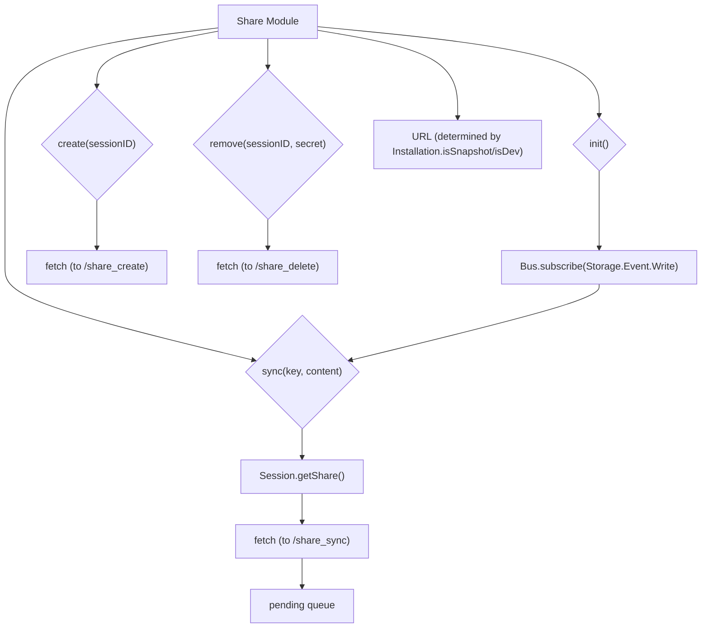

# Share Module

## Overview

The `Share` module (`packages/opencode/src/share/share.ts`) provides functionalities for sharing sessions, allowing them to be accessed externally via a URL. It handles the synchronization of session data with a remote sharing service and manages the creation and deletion of shared sessions.

## Architecture

The `Share` module interacts with a remote API (defined by `URL`) to create, synchronize, and remove shared sessions. It maintains a queue (`pending`) to ensure that data synchronization requests are processed sequentially. It subscribes to `Storage.Event.Write` events to automatically synchronize session data whenever it is written to local storage. The `URL` for the sharing service is determined based on the application's installation type (snapshot, dev, or production).



## Features

### Synchronize Data (`Share.sync`)

Synchronizes a piece of session data (identified by `key` and `content`) with the remote sharing service. It ensures that only session-related data is synchronized and processes requests sequentially to avoid race conditions.

**Call graph analysis:**

- `Share.sync` → `Session.getShare`
- `Share.sync` → `fetch`

**Code example:**

```typescript
// packages/opencode/src/share/share.ts:13-45
export async function sync(key: string, content: any) {
  const [root, ...splits] = key.split("/")
  if (root !== "session") return
  const [sub, sessionID] = splits
  if (sub === "share") return
  const share = await Session.getShare(sessionID).catch(() => {})
  if (!share) return
  const { secret } = share
  pending.set(key, content)
  queue = queue
    .then(async () => {
      const content = pending.get(key)
      if (content === undefined) return
      pending.delete(key)

      return fetch(`${URL}/share_sync`, {
        method: "POST",
        body: JSON.stringify({
          sessionID: sessionID,
          secret,
          key: key,
          content,
        }),
      })
    })
    .then((x) => {
      if (x) {
        log.info("synced", {
          key: key,
          status: x.status,
        })
      }
    })
}
```

**Sources:** `packages/opencode/src/share/share.ts:13-45`

### Initialize Sharing (`Share.init`)

Initializes the sharing module by subscribing to `Storage.Event.Write` events, which triggers automatic data synchronization.

**Call graph analysis:**

- `Share.init` → `Bus.subscribe(Storage.Event.Write)`
- `Share.init` → `sync`

**Code example:**

```typescript
// packages/opencode/src/share/share.ts:47-51
export function init() {
  Bus.subscribe(Storage.Event.Write, async (payload) => {
    await sync(payload.properties.key, payload.properties.content)
  })
}
```

**Sources:** `packages/opencode/src/share/share.ts:47-51`

### Create Shared Session (`Share.create`)

Requests the remote sharing service to create a new shared session for a given `sessionID`. Returns the URL and secret for the shared session.

**Call graph analysis:**

- `Share.create` → `fetch`

**Code example:**

```typescript
// packages/opencode/src/share/share.ts:57-63
export async function create(sessionID: string) {
  return fetch(`${URL}/share_create`, {
    method: "POST",
    body: JSON.stringify({ sessionID: sessionID }),
  })
    .then((x) => x.json())
    .then((x) => x as { url: string; secret: string })
}
```

**Sources:** `packages/opencode/src/share/share.ts:57-63`

### Remove Shared Session (`Share.remove`)

Requests the remote sharing service to delete a shared session, identified by its `sessionID` and `secret`.

**Call graph analysis:**

- `Share.remove` → `fetch`

**Code example:**

```typescript
// packages/opencode/src/share/share.ts:65-70
export async function remove(sessionID: string, secret: string) {
  return fetch(`${URL}/share_delete`, {
    method: "POST",
    body: JSON.stringify({ sessionID, secret }),
  }).then((x) => x.json())
}
```

**Sources:** `packages/opencode/src/share/share.ts:65-70`

## Dependencies

- `../bus`: For subscribing to storage write events.
- `../installation`: For determining the base URL of the sharing service.
- `../session`: For retrieving session sharing information.
- `../storage/storage`: For subscribing to storage events.
- `../util/log`: For logging events.

**Sources:** `packages/opencode/src/share/share.ts:1-5`

## Consumers

The `Share` module is primarily consumed by the `Session` module to enable and manage session sharing. It is also implicitly consumed by the `Storage` module when data is written, triggering synchronization.

**Sources:** `packages/opencode/src/share/share.ts` (implicit from exports)
