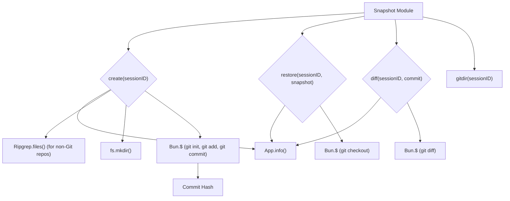

# Snapshot Module

## Overview

The `Snapshot` module (`packages/opencode/src/snapshot/index.ts`) provides functionality for creating and restoring snapshots of the project's working directory. These snapshots are essentially Git commits within a dedicated bare Git repository, allowing for version control of the project state during a session.

## Architecture

The `Snapshot` module creates and manages a bare Git repository within the application's data directory (`app.path.data/snapshot/<sessionID>`). It uses Bun's `$` to execute Git commands (e.g., `git init`, `git add`, `git commit`, `git checkout`, `git diff`). When `Snapshot.create` is called, it initializes a new Git repository (if one doesn't exist for the session), adds all current files, and commits them, returning the commit hash. `Snapshot.restore` checks out a specific commit, effectively reverting the working directory to that state. `Snapshot.diff` can show the differences between a snapshot and the current working directory.



## Features

### Create Snapshot (`Snapshot.create`)

Creates a new snapshot of the current working directory. If the project is not a Git repository, it performs a check to ensure it's not too large to snapshot. It initializes a bare Git repository for the session (if not already present), stages all files, and commits them, returning the commit hash.

**Call graph analysis:**

- `Snapshot.create` → `App.info()`
- `Snapshot.create` → `Ripgrep.files()` (conditional)
- `Snapshot.create` → `fs.mkdir()`
- `Snapshot.create` → `Bun.$` (for `git init`, `git add`, `git commit`)

**Code example:**

```typescript
// packages/opencode/src/snapshot/index.ts:11-49
export async function create(sessionID: string) {
  log.info("creating snapshot")
  const app = App.info()

  // not a git repo, check if too big to snapshot
  if (!app.git) {
    return
    const files = await Ripgrep.files({
      cwd: app.path.cwd,
      limit: 1000,
    })
    log.info("found files", { count: files.length })
    if (files.length >= 1000) return
  }

  const git = gitdir(sessionID)
  if (await fs.mkdir(git, { recursive: true })) {
    await $`git init`
      .env({
        ...process.env,
        GIT_DIR: git,
        GIT_WORK_TREE: app.path.root,
      })
      .quiet()
      .nothrow()
    log.info("initialized")
  }

  await $`git --git-dir ${git} add .`.quiet().cwd(app.path.cwd).nothrow()
  log.info("added files")

  const result =
    await $`git --git-dir ${git} commit -m "snapshot" --no-gpg-sign --author="opencode <mail@opencode.ai>"`
      .quiet()
      .cwd(app.path.cwd)
      .nothrow()

  const match = result.stdout.toString().match(/\[.+ ([a-f0-9]+)\]/)
  if (!match) return
  return match![1]
}
```

**Sources:** `packages/opencode/src/snapshot/index.ts:11-49`

### Restore Snapshot (`Snapshot.restore`)

Restores the project's working directory to the state of a specified snapshot (Git commit).

**Call graph analysis:**

- `Snapshot.restore` → `App.info()`
- `Snapshot.restore` → `Bun.$` (for `git checkout`)

**Code example:**

```typescript
// packages/opencode/src/snapshot/index.ts:51-56
export async function restore(sessionID: string, snapshot: string) {
  log.info("restore", { commit: snapshot })
  const app = App.info()
  const git = gitdir(sessionID)
  await $`git --git-dir=${git} checkout ${snapshot} --force`.quiet().cwd(app.path.root)
}
```

**Sources:** `packages/opencode/src/snapshot/index.ts:51-56`

### Diff Snapshot (`Snapshot.diff`)

Generates a Git diff between a specified snapshot and the current working directory.

**Call graph analysis:**

- `Snapshot.diff` → `App.info()`
- `Snapshot.diff` → `Bun.$` (for `git diff`)

**Code example:**

```typescript
// packages/opencode/src/snapshot/index.ts:58-62
export async function diff(sessionID: string, commit: string) {
  const git = gitdir(sessionID)
  const result = await $`git --git-dir=${git} diff -R ${commit}`.quiet().cwd(App.info().path.root)
  return result.stdout.toString("utf8")
}
```

**Sources:** `packages/opencode/src/snapshot/index.ts:58-62`

## Dependencies

- `../app/app`: For accessing application information (e.g., current working directory, Git status).
- `bun`: For executing shell commands (`$`).
- `path`: Node.js built-in module for path manipulation.
- `fs/promises`: Node.js built-in module for file system operations.
- `../file/ripgrep`: For checking file sizes in non-Git repositories.
- `../util/log`: For logging events.

**Sources:** `packages/opencode/src/snapshot/index.ts:1-6`

## Consumers

The `Snapshot` module is primarily consumed by the `Session` module to enable features like session reversion and to provide a historical record of the project's state during a conversation. It might also be used by debugging or analysis tools.

**Sources:** `packages/opencode/src/snapshot/index.ts` (implicit from exports)
