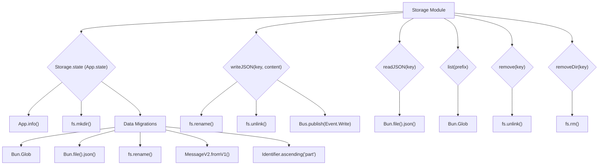

# Storage Module

## Overview

The `Storage` module (`packages/opencode/src/storage/storage.ts`) provides a persistent storage layer for the OpenCode application. It handles reading from and writing to JSON files on the local filesystem, manages data migrations, and provides utilities for listing and removing stored data. It also publishes events when data is written.

## Architecture

The `Storage` module uses `App.state` to manage its internal state, primarily the base directory for storage. It ensures the storage directory exists and runs necessary data migrations upon initialization. Data is stored as JSON files, with `writeJSON` and `readJSON` functions for convenience. It uses `Bun.Glob` for listing files and `fs/promises` for file system operations. A `storage.write` event is published via the `Bus` whenever data is written, allowing other modules to react to data changes.



## Data Models

### Storage.Event.Write

Represents an event that is published when data is written to storage.

**Schema:**

```typescript
export const Event = {
  Write: Bus.event("storage.write", z.object({ key: z.string(), content: z.any() })),
}
```

**Overview:**

- `key`: The storage key (path) where the content was written.
- `content`: The content that was written.

**Sources:** `packages/opencode/src/storage/storage.ts:14-16`

## Features

### Data Migrations

Handles schema changes and data transformations for stored data. Upon initialization, it checks a `migration` file to determine the last run migration and executes any pending migrations sequentially.

**Call graph analysis (example for first migration):**

- `MIGRATIONS[0]` → `Bun.Glob().scanSync()`
- `MIGRATIONS[0]` → `Bun.file().json()`
- `MIGRATIONS[0]` → `MessageV2.fromV1()`
- `MIGRATIONS[0]` → `Bun.write()`
- `MIGRATIONS[0]` → `fs.rename()`

**Code example (simplified):**

```typescript
// packages/opencode/src/storage/storage.ts:19-80
const MIGRATIONS: Migration[] = [
  async (dir: string) => {
    try {
      const files = new Bun.Glob("session/message/*/*.json").scanSync({
        cwd: dir,
        absolute: true,
      })
      for (const file of files) {
        const content = await Bun.file(file).json()
        if (!content.metadata) continue
        log.info("migrating to v2 message", { file })
        try {
          const result = MessageV2.fromV1(content)
          await Bun.write(
            file,
            JSON.stringify(
              {
                ...result.info,
                parts: result.parts,
              },
              null,
              2,
            ),
          )
        } catch (e) {
          await fs.rename(file, file.replace("storage", "broken"))
        }
      }
    } catch {}
  },
  async (dir: string) => {
    const files = new Bun.Glob("session/message/*/*.json").scanSync({
      cwd: dir,
      absolute: true,
    })
    for (const file of files) {
      try {
        const { parts, ...info } = await Bun.file(file).json()
        if (!parts) continue
        for (const part of parts) {
          const id = Identifier.ascending("part")
          await Bun.write(
            [dir, "session", "part", info.sessionID, info.id, id + ".json"].join("/"),
            JSON.stringify({
              ...part,
              id,
              sessionID: info.sessionID,
              messageID: info.id,
              ...(part.type === "tool" ? { callID: part.id } : {}),
            }),
          )
        }
        await Bun.write(file, JSON.stringify(info, null, 2))
      } catch (e) {}
    }
  },
]
```

**Sources:** `packages/opencode/src/storage/storage.ts:19-80`

### Write JSON Data (`Storage.writeJSON`)

Writes a JavaScript object as JSON content to a specified file path within the storage directory. It uses a temporary file and rename approach for atomic writes and publishes a `storage.write` event.

**Call graph analysis:**

- `Storage.writeJSON` → `Bun.write()`
- `Storage.writeJSON` → `fs.rename()`
- `Storage.writeJSON` → `fs.unlink()`
- `Storage.writeJSON` → `Bus.publish(Event.Write)`

**Code example:**

```typescript
// packages/opencode/src/storage/storage.ts:116-124
export async function writeJSON<T>(key: string, content: T) {
  const dir = await state().then((x) => x.dir)
  const target = path.join(dir, key + ".json")
  const tmp = target + Date.now() + ".tmp"
  await Bun.write(tmp, JSON.stringify(content, null, 2))
  await fs.rename(tmp, target).catch(() => {})
  await fs.unlink(tmp).catch(() => {})
  Bus.publish(Event.Write, { key, content })
}
```

**Sources:** `packages/opencode/src/storage/storage.ts:116-124`

### Read JSON Data (`Storage.readJSON`)

Reads JSON content from a specified file path within the storage directory.

**Call graph analysis:**

- `Storage.readJSON` → `Bun.file().json()`

**Code example:**

```typescript
// packages/opencode/src/storage/storage.ts:110-113
export async function readJSON<T>(key: string) {
  const dir = await state().then((x) => x.dir)
  return Bun.file(path.join(dir, key + ".json")).json() as Promise<T>
}
```

**Sources:** `packages/opencode/src/storage/storage.ts:110-113`

### List Stored Items (`Storage.list`)

Lists all items (files) within a specified prefix (directory) in the storage. It returns an array of relative paths.

**Call graph analysis:**

- `Storage.list` → `Bun.Glob().scan()`

**Code example:**

```typescript
// packages/opencode/src/storage/storage.ts:127-140
export async function list(prefix: string) {
  const dir = await state().then((x) => x.dir)
  try {
    const result = await Array.fromAsync(
      glob.scan({
        cwd: path.join(dir, prefix),
        onlyFiles: true,
      }),
    ).then((items) => items.map((item) => path.join(prefix, item.slice(0, -5))))
    result.sort()
    return result
  } catch {
    return []
  }
}
```

**Sources:** `packages/opencode/src/storage/storage.ts:127-140`

### Remove Stored Item (`Storage.remove`)

Deletes a specific JSON file from the storage directory.

**Call graph analysis:**

- `Storage.remove` → `fs.unlink()`

**Code example:**

```typescript
// packages/opencode/src/storage/storage.ts:100-104
export async function remove(key: string) {
  const dir = await state().then((x) => x.dir)
  const target = path.join(dir, key + ".json")
  await fs.unlink(target).catch(() => {})
}
```

**Sources:** `packages/opencode/src/storage/storage.ts:100-104`

### Remove Directory (`Storage.removeDir`)

Deletes a directory and its contents recursively from the storage directory.

**Call graph analysis:**

- `Storage.removeDir` → `fs.rm()`

**Code example:**

```typescript
// packages/opencode/src/storage/storage.ts:106-109
export async function removeDir(key: string) {
  const dir = await state().then((x) => x.dir)
  const target = path.join(dir, key)
  await fs.rm(target, { recursive: true, force: true }).catch(() => {})
}
```

**Sources:** `packages/opencode/src/storage/storage.ts:106-109`

## Dependencies

- `../util/log`: For logging events.
- `../app/app`: For accessing application information (e.g., data directory).
- `../bus`: For publishing storage events.
- `path`: Node.js built-in module for path manipulation.
- `zod`: For schema definition and validation.
- `fs/promises`: Node.js built-in module for file system operations.
- `../session/message-v2`: For message-related data models used in migrations.
- `../id/id`: For generating identifiers used in migrations.

**Sources:** `packages/opencode/src/storage/storage.ts:1-8`

## Consumers

The `Storage` module is a fundamental dependency for any part of the application that needs to persist data. This includes the `Session` module for storing session information and messages, and the `Share` module for synchronizing shared session data.

**Sources:** `packages/opencode/src/storage/storage.ts` (implicit from exports)
