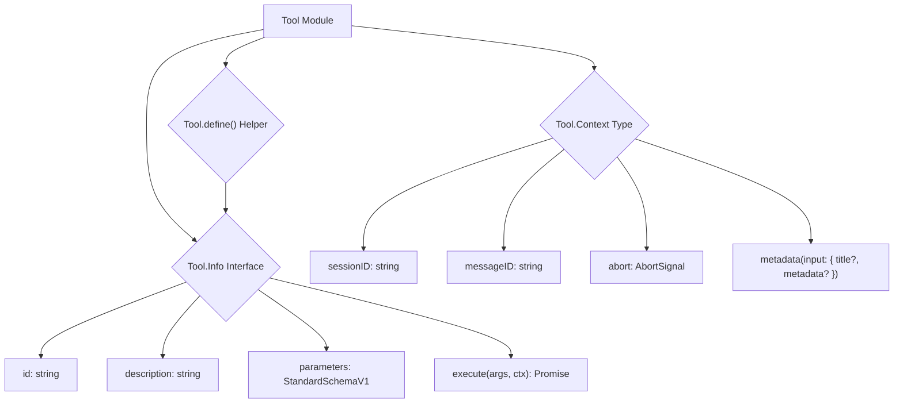

# Tool Module

## Overview

The `Tool` module (`packages/opencode/src/tool/tool.ts`) defines the fundamental interface and structure for all tools used within the OpenCode application. It provides a standardized way to describe a tool's capabilities, its input parameters, and the expected output, enabling seamless integration with language models and other parts of the system.

## Architecture

The `Tool` module establishes a common `Info` interface that all tools must implement. This interface includes properties for a tool's `id`, `description`, `parameters` (defined using `StandardSchemaV1` for type safety and OpenAPI compatibility), and an `execute` method. It also defines a `Context` type that is passed to the `execute` method, providing session-specific information and an `AbortSignal` for cancellation. The `define` helper function is provided to ensure that tool definitions conform to the `Info` interface.



## Data Models

### Tool.Context

Represents the context provided to a tool's `execute` method.

**Schema:**

```typescript
export type Context<M extends Metadata = Metadata> = {
  sessionID: string
  messageID: string
  abort: AbortSignal
  metadata(input: { title?: string; metadata?: M }): void
}
```

**Overview:**

- `sessionID`: The ID of the current session.
- `messageID`: The ID of the message that triggered the tool call.
- `abort`: An `AbortSignal` to allow for cancellation of the tool's execution.
- `metadata`: A function to update metadata about the tool's execution (e.g., title, additional data).

**Sources:** `packages/opencode/src/tool/tool.ts:7-12`

### Tool.Info

Represents the definition and capabilities of a tool.

**Schema:**

```typescript
export interface Info<Parameters extends StandardSchemaV1 = StandardSchemaV1, M extends Metadata = Metadata> {
  id: string
  description: string
  parameters: Parameters
  execute(
    args: StandardSchemaV1.InferOutput<Parameters>,
    ctx: Context,
  ): Promise<{
    title: string
    metadata: M
    output: string
  }>
}
```

**Overview:**

- `id`: A unique identifier for the tool.
- `description`: A brief description of what the tool does.
- `parameters`: A `StandardSchemaV1` schema defining the input arguments for the tool.
- `execute`: An asynchronous function that performs the tool's operation, taking `args` (validated against `parameters`) and a `Context` object. It returns a promise resolving to an object containing a `title`, `metadata`, and `output` string.

**Sources:** `packages/opencode/src/tool/tool.ts:13-24`

## Features

### Tool Definition (`Tool.define`)

A helper function that ensures a tool definition conforms to the `Tool.Info` interface, providing type checking and consistency.

**Code example:**

```typescript
// packages/opencode/src/tool/tool.ts:26-29
export function define<Parameters extends StandardSchemaV1, Result extends Metadata>(
  input: Info<Parameters, Result>,
): Info<Parameters, Result> {
  return input
}
```

**Sources:** `packages/opencode/src/tool/tool.ts:26-29`

## Dependencies

- `@standard-schema/spec`: For defining tool parameters using `StandardSchemaV1`.

**Sources:** `packages/opencode/src/tool/tool.ts:1`

## Consumers

The `Tool` module is a foundational component consumed by any module that defines or uses tools. This primarily includes the `Provider` module (which exposes tools to language models) and the `Session` module (which executes tools during chat interactions). Individual tool implementations (e.g., `bash.ts`, `edit.ts`) also consume this module by implementing the `Tool.Info` interface.

**Sources:** `packages/opencode/src/tool/tool.ts` (implicit from exports)
