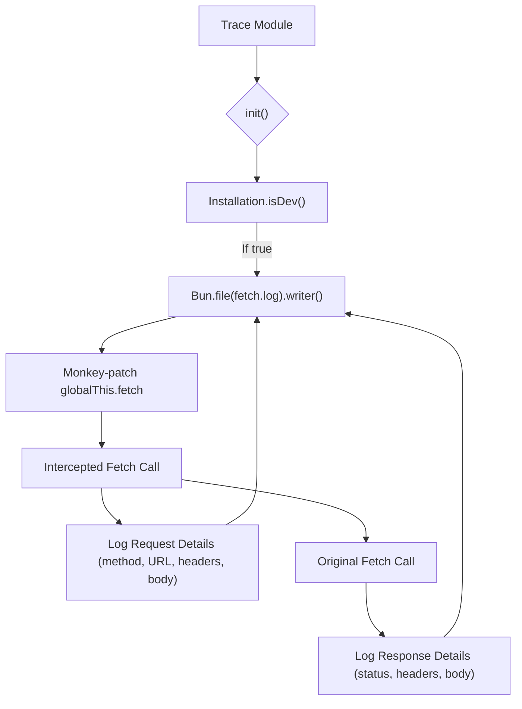

# Trace Module

## Overview

The `Trace` module (`packages/opencode/src/trace/index.ts`) provides a mechanism for tracing network requests (specifically `fetch` calls) within the OpenCode application. This is primarily intended for development and debugging purposes, allowing developers to inspect HTTP traffic.

## Architecture

The `Trace` module works by monkey-patching the global `fetch` function. When `Trace.init()` is called (only in development mode), it replaces the native `fetch` with a custom implementation. This custom `fetch` intercepts all outgoing requests, logs their details (method, URL, headers, body) to a file (`Global.Path.data/log/fetch.log`), and then proceeds with the original `fetch` call. It also logs the response status and headers. This provides a detailed record of all network interactions.



## Features

### Initialize Tracing (`Trace.init`)

Initializes the network request tracing mechanism. This function should only be called in development environments as it modifies the global `fetch` object.

**Call graph analysis:**

- `Trace.init` → `Installation.isDev()`
- `Trace.init` → `Bun.file().writer()`
- `Trace.init` → `globalThis.fetch` (overridden)

**Code example:**

```typescript
// packages/opencode/src/trace/index.ts:6-50
export namespace Trace {
  export function init() {
    if (!Installation.isDev()) return
    const writer = Bun.file(path.join(Global.Path.data, "log", "fetch.log")).writer()

    const originalFetch = globalThis.fetch
    // @ts-expect-error
    globalThis.fetch = async (input: RequestInfo | URL, init?: RequestInit) => {
      const url = typeof input === "string" ? input : input instanceof URL ? input.toString() : input.url
      const method = init?.method || "GET"

      const urlObj = new URL(url)

      writer.write(`\n${method} ${urlObj.pathname}${urlObj.search} HTTP/1.1\n`)
      writer.write(`Host: ${urlObj.host}\n`)

      if (init?.headers) {
        if (init.headers instanceof Headers) {
          init.headers.forEach((value, key) => {
            writer.write(`${key}: ${value}\n`)
          })
        } else {
          for (const [key, value] of Object.entries(init.headers)) {
            writer.write(`${key}: ${value}\n`)
          }
        }
      }

      if (init?.body) {
        writer.write(`\n${init.body}`)
      }
      writer.flush()
      const response = await originalFetch(input, init)
      const clonedResponse = response.clone()
      writer.write(`\nHTTP/1.1 ${response.status} ${response.statusText}\n`)
      response.headers.forEach((value, key) => {
        writer.write(`${key}: ${value}\n`)
      })
      if (clonedResponse.body) {
        clonedResponse.text().then(async (x) => {
          writer.write(`\n${x}\n`)
        })
      }
      writer.flush()

      return response
    }
  }
}
```

**Sources:** `packages/opencode/src/trace/index.ts:6-50`

## Dependencies

- `../global`: For accessing global path configurations (e.g., `Global.Path.data`).
- `../installation`: For checking if the application is running in development mode (`Installation.isDev()`).
- `path`: Node.js built-in module for path manipulation.
- `bun`: For file writing operations (`Bun.file().writer()`).

**Sources:** `packages/opencode/src/trace/index.ts:1-3`

## Consumers

The `Trace` module is intended to be consumed early in the application's lifecycle, typically during the bootstrapping process, to enable network tracing for debugging purposes. It is only active in development builds.

**Sources:** `packages/opencode/src/trace/index.ts` (implicit from exports)

```