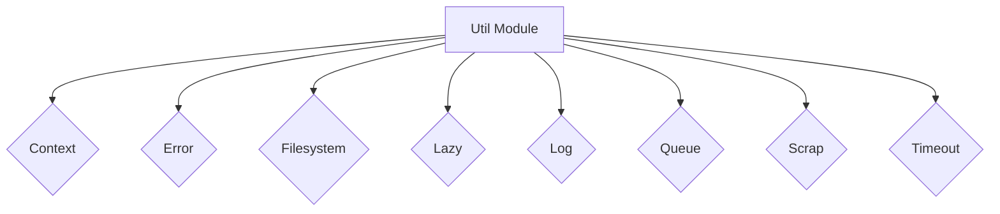

# Util Module

## Overview

The `Util` module (`packages/opencode/src/util`) is a collection of various utility functions and classes that provide common functionalities used across the OpenCode codebase. These utilities aim to simplify common programming tasks, improve code readability, and ensure consistency.

## Architecture

The `Util` module is structured as a set of independent namespaces or classes, each encapsulating a specific utility. These include:

- `Context`: For managing asynchronous contexts.
- `Error`: For creating custom named error types.
- `Filesystem`: For common filesystem operations.
- `Lazy`: For lazy initialization of values.
- `Log`: For structured logging.
- `Queue`: For asynchronous queues.
- `Scrap`: A placeholder for miscellaneous utilities.
- `Timeout`: For handling promise timeouts.

These utilities are designed to be loosely coupled and can be imported and used independently by other modules as needed.



## Data Models

### Log.Level

Represents the severity level of a log entry.

**Schema:**

```typescript
export const Level = z.enum(["DEBUG", "INFO", "WARN", "ERROR"]).openapi({ ref: "LogLevel", description: "Log level" })
export type Level = z.infer<typeof Level>
```

**Sources:** `packages/opencode/src/util/log.ts:6-7`

## Features

### Asynchronous Context Management (`Context`)

Provides a mechanism to create and manage asynchronous contexts, allowing values to be propagated across asynchronous operations without explicit passing. This is useful for managing request-scoped data or application-wide state.

**Code example:**

```typescript
// packages/opencode/src/util/context.ts:5-20
export namespace Context {
  export class NotFound extends Error {
    constructor(public readonly name: string) {
      super(`No context found for ${name}`)
    }
  }

  export function create<T>(name: string) {
    const storage = new AsyncLocalStorage<T>()
    return {
      use() {
        const result = storage.getStore()
        if (!result) {
          throw new NotFound(name)
        }
        return result
      },
      provide<R>(value: T, fn: () => R) {
        return storage.run<R>(value, fn)
      },
    }
  }
}
```

**Sources:** `packages/opencode/src/util/context.ts`

### Custom Named Errors (`NamedError`)

Provides a base class and a factory function (`NamedError.create`) for creating custom error types with associated Zod schemas for their data. This allows for structured error handling and serialization.

**Code example:**

```typescript
// packages/opencode/src/util/error.ts:7-45
export abstract class NamedError extends Error {
  abstract schema(): ZodSchema
  abstract toObject(): { name: string; data: any }

  static create<Name extends string, Data extends ZodSchema>(name: Name, data: Data) {
    const schema = z
      .object({
        name: z.literal(name),
        data,
      })
      .openapi({
        ref: name,
      })
    const result = class extends NamedError {
      public static readonly Schema = schema

      public readonly name = name as Name

      constructor(
        public readonly data: z.input<Data>,
        options?: ErrorOptions,
      ) {
        super(name, options)
        this.name = name
      }

      static isInstance(input: any): input is InstanceType<typeof result> {
        return "name" in input && input.name === name
      }

      schema() {
        return schema
      }

      toObject() {
        return {
          name: name,
          data: this.data,
        }
      }
    }
    Object.defineProperty(result, "name", { value: name })
    return result
  }

  public static readonly Unknown = NamedError.create(
    "UnknownError",
    z.object({
      message: z.string(),
    }),
  )
}
```

**Sources:** `packages/opencode/src/util/error.ts`

### Filesystem Utilities (`Filesystem`)

Provides helper functions for common filesystem operations, such as checking for overlapping paths, determining if a path contains another, and searching for files or directories upwards in the directory tree.

**Code example (`findUp`):**

```typescript
// packages/opencode/src/util/filesystem.ts:15-28
export async function findUp(target: string, start: string, stop?: string) {
  let current = start
  const result = []
  while (true) {
    const search = join(current, target)
    if (await exists(search)) result.push(search)
    if (stop === current) break
    const parent = dirname(current)
    if (parent === current) break
    current = parent
  }
  return result
}
```

**Sources:** `packages/opencode/src/util/filesystem.ts`

### Lazy Initialization (`lazy`)

Provides a utility function to lazily initialize a value. The provided function will only be executed once, upon the first access to the value.

**Code example:**

```typescript
// packages/opencode/src/util/lazy.ts:1-11
export function lazy<T>(fn: () => T) {
  let value: T | undefined
  let loaded = false

  return (): T => {
    if (loaded) return value as T
    loaded = true
    value = fn()
    return value as T
  }
}
```

**Sources:** `packages/opencode/src/util/lazy.ts`

### Structured Logging (`Log`)

Provides a structured logging mechanism with different log levels (DEBUG, INFO, WARN, ERROR), service tagging, and time tracking. It can log to stderr or a file and includes log rotation.

**Code example (`create`):**

```typescript
// packages/opencode/src/util/log.ts:79-139
export function create(tags?: Record<string, any>) {
  tags = tags || {}

  const service = tags["service"]
  if (service && typeof service === "string") {
    const cached = loggers.get(service)
    if (cached) {
      return cached
    }
  }

  function build(message: any, extra?: Record<string, any>) {
    const prefix = Object.entries({
      ...tags,
      ...extra,
    })
      .filter(([_, value]) => value !== undefined && value !== null)
      .map(([key, value]) => `${key}=${typeof value === "object" ? JSON.stringify(value) : value}`)
      .join(" ")
    const next = new Date()
    const diff = next.getTime() - last
    last = next.getTime()
    return [next.toISOString().split(".")[0], "+" + diff + "ms", prefix, message].filter(Boolean).join(" ") + "\n"
  }
  const result: Logger = {
    debug(message?: any, extra?: Record<string, any>) {
      if (shouldLog("DEBUG")) {
        process.stderr.write("DEBUG " + build(message, extra))
      }
    },
    info(message?: any, extra?: Record<string, any>) {
      if (shouldLog("INFO")) {
        process.stderr.write("INFO  " + build(message, extra))
      }
    },
    error(message?: any, extra?: Record<string, any>) {
      if (shouldLog("ERROR")) {
        process.stderr.write("ERROR " + build(message, extra))
      }
    },
    warn(message?: any, extra?: Record<string, any>) {
      if (shouldLog("WARN")) {
        process.stderr.write("WARN  " + build(message, extra))
      }
    },
    tag(key: string, value: string) {
      if (tags) tags[key] = value
      return result
    },
    clone() {
      return Log.create({ ...tags })
    },
    time(message: string, extra?: Record<string, any>) {
      const now = Date.now()
      result.info(message, { status: "started", ...extra })
      function stop() {
        result.info(message, {
          status: "completed",
          duration: Date.now() - now,
          ...extra,
        })
      }
      return {
        stop,
        [Symbol.dispose]() {
          stop()
        },
      }
    },
  }

  if (service && typeof service === "string") {
    loggers.set(service, result)
  }

  return result
}
```

**Sources:** `packages/opencode/src/util/log.ts`

### Asynchronous Queue (`AsyncQueue`)

Implements an asynchronous queue that allows producers to push items and consumers to await them. It supports both immediate consumption and waiting for future items.

**Code example:**

```typescript
// packages/opencode/src/util/queue.ts:1-16
export class AsyncQueue<T> implements AsyncIterable<T> {
  private queue: T[] = []
  private resolvers: ((value: T) => void)[] = []

  push(item: T) {
    const resolve = this.resolvers.shift()
    if (resolve) resolve(item)
    else this.queue.push(item)
  }

  async next(): Promise<T> {
    if (this.queue.length > 0) return this.queue.shift()!
    return new Promise((resolve) => this.resolvers.push(resolve))
  }

  async *[Symbol.asyncIterator]() {
    while (true) yield await this.next()
  }
}
```

**Sources:** `packages/opencode/src/util/queue.ts`

### Promise Timeout (`withTimeout`)

Wraps a promise with a timeout, rejecting the promise if it doesn't resolve within the specified time.

**Code example:**

```typescript
// packages/opencode/src/util/timeout.ts:1-12
export function withTimeout<T>(promise: Promise<T>, ms: number): Promise<T> {
  let timeout: NodeJS.Timeout
  return Promise.race([
    promise.then((result) => {
      clearTimeout(timeout)
      return result
    }),
    new Promise<never>((_, reject) => {
      timeout = setTimeout(() => {
        reject(new Error(`Operation timed out after ${ms}ms`))
      }, ms)
    }),
  ])
}
```

**Sources:** `packages/opencode/src/util/timeout.ts`

## Dependencies

- `async_hooks`: Node.js built-in module for `AsyncLocalStorage` (used by `Context`).
- `fs/promises`: Node.js built-in module for filesystem operations (used by `Filesystem`, `Log`).
- `path`: Node.js built-in module for path manipulation (used by `Filesystem`, `Log`).
- `zod`: For schema definition and validation (used by `Error`, `Log`).
- `bun`: For file operations (used by `Log`).
- `xdg-basedir`: For resolving XDG Base Directory Specification paths (used by `Log` indirectly via `Global`).

**Sources:** `packages/opencode/src/util/context.ts`, `packages/opencode/src/util/error.ts`, `packages/opencode/src/util/filesystem.ts`, `packages/opencode/src/util/lazy.ts`, `packages/opencode/src/util/log.ts`, `packages/opencode/src/util/queue.ts`, `packages/opencode/src/util/timeout.ts`

## Consumers

The `Util` module is a foundational component consumed by almost every other module in the OpenCode codebase. Its utilities provide essential building blocks for various functionalities, from error handling and logging to file system interactions and asynchronous programming patterns.

**Sources:** `packages/opencode/src/util/index.ts` (implicit from exports)
